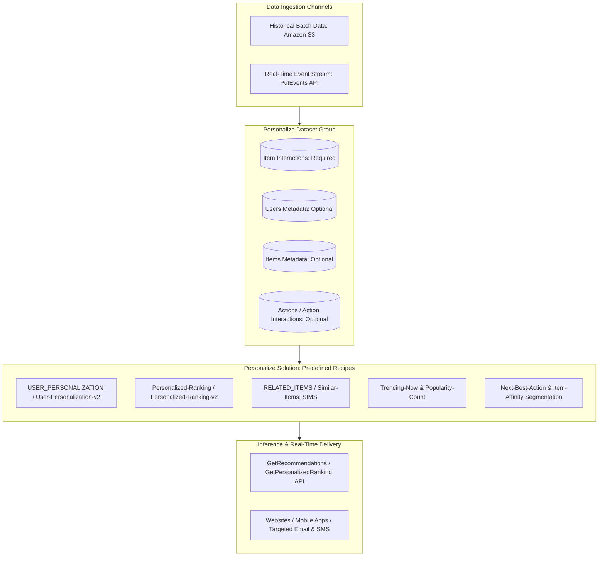
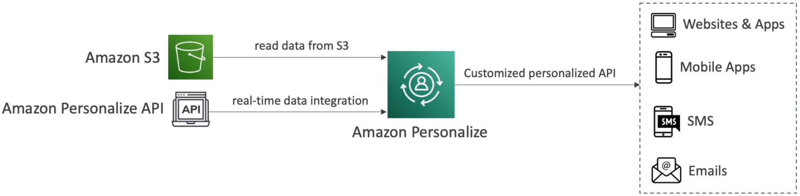
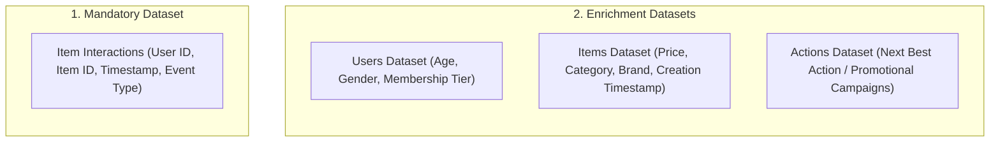
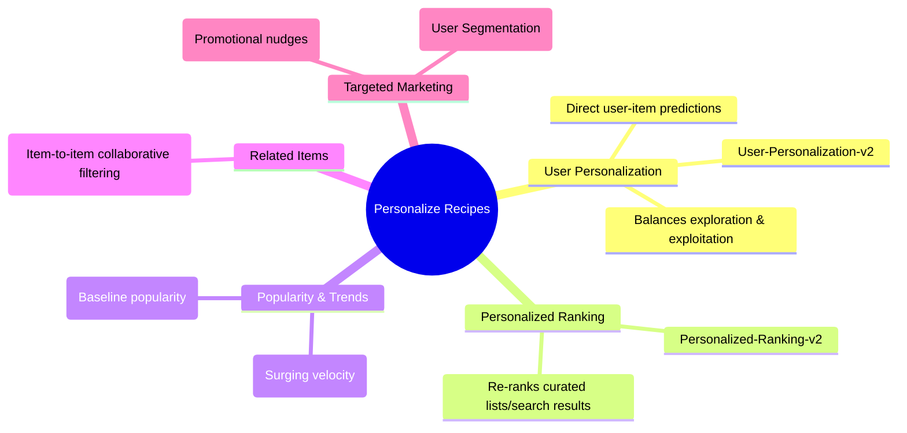
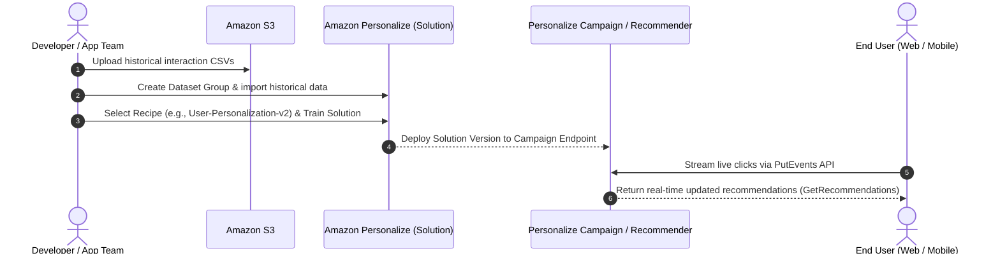

# Amazon Personalize: Real-Time Recommendation Engines, Datasets & Recipes

---

## Key Takeaways

**Amazon Personalize** is a fully managed machine learning service that allows developers to build individualized product recommendations, personalized search re-ranking, dynamic user segmentation, and customized direct marketing using the same underlying recommendation technology developed for Amazon.com.

Developers provide user interactions and metadata via **Amazon S3** or stream them in real time via the **`PutEvents` API**. Amazon Personalize trains models using purpose-built algorithms called **Recipes**, handling model training, feature extraction, and deployment without requiring manual ML pipeline engineering.

---

## Main Discussion

### Dataset Architecture & Ingestion

Amazon Personalize organizes data within a **Dataset Group** containing schema-defined Avro datasets:

- **Item Interactions Dataset (Required):** Contains historical records of user actions (clicks, views, purchases, ratings). This is the required baseline for training any recommendation solution.
- **Users Dataset (Optional):** Captures static user attributes (e.g., age, subscription tier, location) to improve cold-start user recommendations.
- **Items Dataset (Optional):** Stores item metadata (e.g., category, price, SKU type) to assist with item similarity and catalog exploration.
- **Dual Ingestion Paths:**
  - **Batch Imports:** Large historical datasets uploaded as CSV/Avro files into **Amazon S3**.
  - **Real-Time Event Ingestion:** Continuous live interaction streams ingested via the **`PutEvents` API**, allowing recommendations to update as user preferences shift during an active session.

---

### Amazon Personalize Recipe Taxonomy

A **Recipe** in Amazon Personalize is a managed algorithm optimized for a specific recommendation pattern:

| Recipe Category           | Specific Recipe Name                        | Core Mechanism                                                                                                                            | Target Business Use Case                                                                   |
| ------------------------- | ------------------------------------------- | ----------------------------------------------------------------------------------------------------------------------------------------- | ------------------------------------------------------------------------------------------ |
| **User Personalization**  | `aws-user-personalization-v2`               | Recommends items based on an individual user's historical interaction sequence, balancing familiar preferences with new item exploration. | Homepage _"Recommended for You"_ or _"Top Picks"_ carousels.                               |
| **Personalized Ranking**  | `aws-personalized-ranking-v2`               | Takes a designated list of item IDs and re-orders them specifically for a target user based on predicted affinity.                        | Re-ranking search results, promotional category pages, or curated email lists.             |
| **Trending & Popularity** | `aws-trending-now` / `aws-popularity-count` | Identifies items gaining engagement velocity faster than average, or calculates overall popularity counts.                                | _"Trending This Week"_ or _"Most Popular Movies"_ sections.                                |
| **Similar Items**         | `aws-similar-items` (SIMS)                  | Uses collaborative filtering to recommend items frequently interacted with in similar patterns across all users.                          | Product detail page _"Customers who viewed this also viewed..."_ sections.                 |
| **User Segmentation**     | `aws-item-affinity`                         | Generates segments of users who are likely to interact with specific items or categories.                                                 | Targeted marketing campaigns (e.g., finding all users likely to buy running shoes).        |
| **Next-Best-Action**      | `aws-next-best-action`                      | Evaluates user interaction history to determine the optimal non-item action to recommend.                                                 | Prompting premium subscription upgrades, loyalty program signups, or mobile app downloads. |

---

### End-to-End Operational Workflow

---

## Exam Guide

### Exam Tips

- **Primary Service Trigger:** Whenever an exam question asks to generate **personalized product recommendations, personalized search re-ranking, or targeted user affinity segments** with minimal operational effort, the answer is **Amazon Personalize**.
- **Disambiguation Rule (Personalize vs. Forecast):**
  - **Amazon Personalize** $\rightarrow$ Recommending items/actions to specific users.
  - **Amazon Forecast** $\rightarrow$ Time-series forecasting (e.g., predicting inventory volume, financial revenue, or server demand over time).
- **Recipe Disambiguation:**
  - **`User-Personalization`:** Direct item recommendations tailored to an individual.
  - **`Personalized-Ranking`:** Re-ordering an existing collection/list of items for an individual.
  - **`SIMS` / Similar Items:** Recommending items similar to a specific item based on co-interaction patterns.
  - **`Trending-Now`:** Recommending items experiencing rapid spikes in user engagement.
- **Dataset Requirements:** An **Item Interactions dataset** is the only strictly required dataset to train a Personalize model. Users and Items datasets are optional metadata enrichments.
- **Real-Time Updates:** Live user clicks and views are passed to Personalize using the **`PutEvents` API** to adapt recommendations without immediate full model retraining.

---

### Practice Test

#### Question 1

A streaming media platform wants to add a dynamic "Recommended Movies for You" row on its application homepage that reflects each user's unique viewing history and adapts as users watch new content throughout an active session. The development team wants a managed solution that does not require building custom deep learning architectures. Which AWS service and capability should they use?

- [ ] A. Amazon Forecast with DeepAR+
- [ ] B. Amazon Personalize with the User-Personalization recipe and the PutEvents API
- [ ] C. Amazon Comprehend Topic Modeling
- [ ] D. Amazon Rekognition Label Detection

Correct Answer

- [x] B. Amazon Personalize with the User-Personalization recipe and the PutEvents API
  - **Explanation:** **Amazon Personalize** is designed for individualized recommendations. The `User-Personalization` recipe generates personalized item suggestions based on historical user interactions, while the `PutEvents` API streams live user actions to update recommendations dynamically in real time.

---

#### Question 2

An e-commerce retailer wants to optimize its promotional campaign by re-ranking a curated list of 50 seasonal promotional items so that the items most relevant to each individual customer appear at the top of their marketing email. Which Amazon Personalize recipe is specifically built for this use case?

- [ ] A. `aws-similar-items` (SIMS)
- [ ] B. `aws-personalized-ranking`
- [ ] C. `aws-popularity-count`
- [ ] D. `aws-item-attribute-affinity`

Correct Answer

- [x] B. `aws-personalized-ranking`
  - **Explanation:** The **`aws-personalized-ranking`** recipe takes an existing input list of items and re-orders (re-ranks) them uniquely for a specific user based on their predicted preferences.

---
