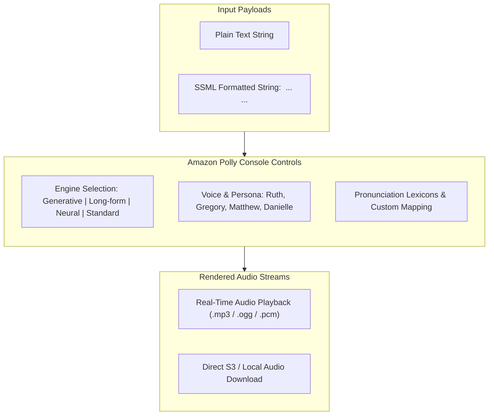
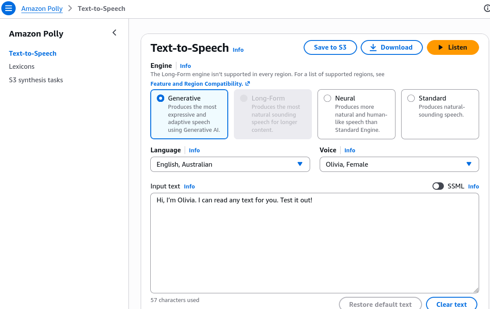

# Hands-On Lab: Amazon Polly Voice Synthesis, Engine Selection & SSML Markup

---

## Key Takeaways

**Amazon Polly** converts arbitrary text input into high-fidelity synthetic audio directly within the AWS Management Console using deep learning and generative foundation models.



The interactive console provides immediate hands-on controls for testing **Engine Tiers** (Generative, Long-form, Neural, Standard), selecting diverse regional voices/personas (such as _Ruth_ or _Gregory_), wrapping phrases in **SSML (Speech Synthesis Markup Language)** tags like `<speak>` and `<break time="..."/>` to introduce custom pauses, and adjusting pronunciation lexicons and audio export formats.

---

## Hands-On Workflow: Voice Synthesis, Engine Selection & SSML Pacing

1. **Open the Amazon Polly Text-to-Speech Console:**
   - Navigate to the **Amazon Polly Console** in your target AWS Region.
   - In the left navigation menu, click **Text-to-Speech** (or click **Try Polly** from the landing dashboard).
   - Locate the interactive input text area and the engine configuration panel on the right.
2. **Select and Compare Synthesis Engines & Voices:**
   - Evaluate different voice personalities and engine capabilities:
   - Select an **Engine**:
     - **Generative:** Highly expressive, adaptive tone driven by foundation model architectures.
     - **Long-form:** Optimized for natural breathing rhythm and pacing across multi-sentence text.
     - **Neural (NTTS):** Natural, conversational prosody.
     - **Standard:** Cost-effective parametric synthesis.
   - Choose a **Language** and **Voice persona** (e.g., _English, Australian_ $\rightarrow$ _Olivia_ or _Russell_).
   - Enter a test string: `Hi, I'm Olivia. I can read any text for you. Test it out!`
   - Click **Listen** to audition the voice in real time.  
     
3. **Enable Speech Synthesis Markup Language (SSML):**
   - Add fine-grained timing and cadence control to the synthesized voice:
   - Under the input editor, switch from **Plain text** mode to **SSML** mode.
   - Wrap the entire text payload inside opening and closing `<speak>` tags.
   - Insert an explicit break element (`<break time="..."/>` or self-closing `<break/>`) between words where a natural pause is required:

   ```xml
   <speak>
     Hi, I'm Rendy and I'm learning <break time="1s"/> AWS, it's awesome!
   </speak>
   ```

   - Click **Listen** and verify that the synthesis engine inserts an audible silence between _"learning"_ and _"AWS"_.

4. **Explore Additional Settings & Output Formats:**
   - Inspect production export and customization parameters:
   - Open **Additional settings** to adjust the output format (**MP3**, **OGG Vorbis**, or **PCM**).
   - Under **Custom pronunciation**, attach a configured **Pronunciation Lexicon (PLS XML)** to enforce custom brand or name pronunciations.
   - Click **Download** to save the generated audio file locally, or select **Synthesize to S3** for asynchronous long-form generation.

---

## Polly Synthesis Engines: Console Feature Matrix

| Engine Option     | Latency & Expressiveness Profile                                            | SSML Support           | Target Workload Demonstrated                                        |
| ----------------- | --------------------------------------------------------------------------- | ---------------------- | ------------------------------------------------------------------- |
| **Generative**    | Maximum emotional range, conversational adaptation, and inflection.         | Full SSML support      | Virtual assistants, dynamic character voiceovers, customer support. |
| **Long-form**     | Natural pacing, paragraph pauses, and consistent tone across extended text. | Full SSML support      | Audiobooks, long-form articles, training lectures, news summaries.  |
| **Neural (NTTS)** | High prosody and human-like naturalness.                                    | Extensive SSML support | IVR call centers, mobile applications, notifications.               |
| **Standard**      | Basic concatenative synthesis, lowest cost per character.                   | Standard SSML tags     | Legacy alerts, high-volume automated status messaging.              |

---

## Exam Guide

### Exam Tips

- **SSML Syntax Rules:** Every SSML payload sent to Amazon Polly must start with `<speak>` and end with `</speak>`. Individual modifier tags like `<break/>`, `<emphasis>`, or `<whisper>` reside within this root block.
- **Pause Insertion:** The tag to introduce explicit pauses or silences in Amazon Polly speech is `<break time="..."/>` (e.g., `<break time="2s"/>` or `<break strength="medium"/>`).
- **Long Content Generation:** For synthesizing large text documents that exceed synchronous API payload limits, use the **`StartSpeechSynthesisTask`** API to render speech asynchronously directly to an **Amazon S3** bucket.
- **Audio Format Types:** Amazon Polly can export audio in **MP3**, **OGG Vorbis**, and raw uncompressed **PCM** format for telephony/WAV encoding.

---

### Practice Test

#### Question 1

A developer is testing Amazon Polly in the AWS Management Console to create an automated prompt for a contact center. The prompt must pause for 1.5 seconds between reciting two separate instructions. Which configuration should the developer apply?

- [ ] A. Upload a Custom Language Model (CLM) with pause annotations
- [ ] B. Switch the console editor to SSML mode, wrap the text in `<speak>` tags, and insert `<break time="1.5s"/>` between the instructions
- [ ] C. Enable Automatic Multi-Language Identification
- [ ] D. Apply an Amazon Translate parallel data glossary

<details>
<summary>Correct Answer</summary>

- [x] B. Switch the console editor to SSML mode, wrap the text in `<speak>` tags, and insert `<break time="1.5s"/>` between the instructions
  - **Explanation:** In Amazon Polly, **Speech Synthesis Markup Language (SSML)** is used to adjust speech pacing and timing. The `<break time="1.5s"/>` tag inside a `<speak>` block instructs the synthesizer to pause for 1.5 seconds at that exact position.

</details>

---

#### Question 2

An online media publisher wants to automatically convert multi-page editorial articles and blog posts (averaging 3,000 words each) into high-quality spoken audio with natural breathing rhythms and conversational pacing. Which Amazon Polly engine is specifically tailored for this use case?

- [ ] A. Standard Engine
- [ ] B. Long-form Engine
- [ ] C. Amazon Transcribe ASR Engine
- [ ] D. Amazon Comprehend Syntax Engine

<details>
<summary>Correct Answer</summary>

- [x] B. Long-form Engine
  - **Explanation:** The **Amazon Polly Long-form Engine** is specifically designed for multi-paragraph articles, editorial content, and audiobooks, providing natural breathing rhythms and engaging pacing across long passages of text.

</details>

---
