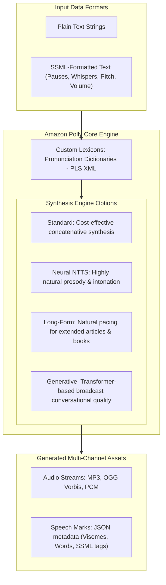
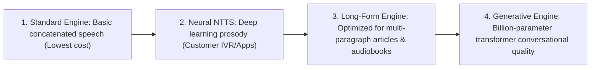
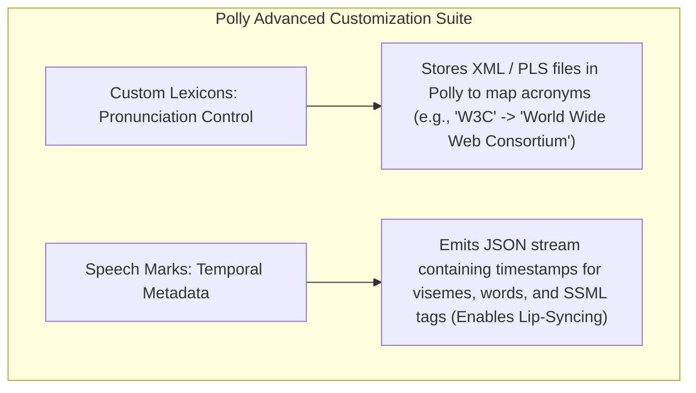

# Amazon Polly: Text-to-Speech (TTS), Engines, SSML & Custom Lexicons

---

## Key Takeaways

**Amazon Polly** is a fully managed, serverless **Text-to-Speech (TTS)** service that converts written text into lifelike spoken audio using advanced deep learning and generative AI voice synthesis engines.



Amazon Polly provides four distinct voice engines (**Standard**, **Neural**, **Long-Form**, and **Generative**), fine-grained speech control via **Speech Synthesis Markup Language (SSML)**, custom pronunciation rules via **Custom Lexicons**, and temporal synchronization metadata via **Speech Marks** for visual lip-syncing and word-highlighting animations.

---

## Main Discussion

### The Four Voice Engine Tiers



| Voice Engine Tier | Underlying Architecture                                                        | Distinctive Characteristics                                                            | Optimal Use Case                                                                     |
| ----------------- | ------------------------------------------------------------------------------ | -------------------------------------------------------------------------------------- | ------------------------------------------------------------------------------------ |
| **Standard**      | Concatenative and statistical parametric synthesis.                            | Clear, intelligible speech at the lowest per-character cost.                           | Low-priority system alerts, basic automated notifications.                           |
| **Neural (NTTS)** | Deep neural sequence-to-sequence networks.                                     | Significantly improves natural prosody, emotional inflection, and pitch contour.       | Customer service chatbots, interactive voice response (IVR), mobile apps.            |
| **Long-Form**     | Generative text embedding deep learning models.                                | Maintains engagement, natural pauses, and breath rhythm over long passages.            | Long-form journalism, educational lectures, eBook and audiobook narration.           |
| **Generative**    | Multi-billion parameter transformer models with convolutional neural decoders. | Emotionally dynamic, colloquial, and indistinguishable from professional voice actors. | High-profile conversational AI agents, marketing audio, interactive virtual avatars. |

---

### Speech Synthesis Markup Language (SSML)

SSML is an XML-based standard that allows fine-grained customization of generated audio pronunciation, volume, pacing, and tone:

```xml
<speak>
     Hello! <break time="1s"/> Welcome to the training course.
     <emphasis level="strong">Pay close attention</emphasis> to this section.
     <amazon:effect name="whispered">This is a confidential secret.</amazon:effect>
     I will spell this out: <say-as interpret-as="spell-out">AWS</say-as>.
</speak>

```

| SSML Tag / Attribute               | Operational Effect                                             | Practical Example                                                               |
| ---------------------------------- | -------------------------------------------------------------- | ------------------------------------------------------------------------------- |
| `<break time="Xs"/>`               | Inserts an explicit pause of specified duration.               | `<break time="500ms"/>` creates a natural half-second pause between sentences.  |
| `<emphasis level="...">`           | Adjusts acoustic volume and pitch to emphasize critical words. | `<emphasis level="strong">Crucial</emphasis>` renders louder with higher pitch. |
| `<amazon:effect name="whispered">` | Synthesizes whispered speech style.                            | Lowers pitch and removes vocal fold vibration for confidential prompts.         |
| `<say-as interpret-as="...">`      | Instructs the synthesizer how to parse ambiguous text strings. | Renders `10/12/2026` as a spoken date or `1234` as individual digits.           |
| `<prosody rate="..." pitch="...">` | Adjusts speech pacing (speed) and vocal pitch dynamically.     | `<prosody rate="fast" pitch="+10%">Hurry!</prosody>`                            |

---

### Custom Lexicons vs. Speech Marks



| Dimension              | Custom Lexicons                                                                                       | Speech Marks                                                                               |
| ---------------------- | ----------------------------------------------------------------------------------------------------- | ------------------------------------------------------------------------------------------ |
| **Purpose**            | Customize how specific out-of-vocabulary words, acronyms, or symbols are pronounced.                  | Provide time-synchronized metadata detailing exactly when words or phonemes occur.         |
| **File / Data Format** | W3C Pronunciation Lexicon Specification (**PLS XML** files).                                          | **JSON streams** (line-delimited JSON with time, type, start, and end offsets).            |
| **Scope of Impact**    | Modifies the audible sound of the generated waveform.                                                 | Does **not** change audio; outputs metadata alongside or in place of audio streams.        |
| **Typical Use Case**   | Expanding abbreviations (e.g., _"AWS"_ $\rightarrow$ _"Amazon Web Services"_), corporate brand names. | **Lip-sync animations** for virtual 3D avatars, real-time karaoke-style text highlighting. |

#### Speech Marks JSON Metadata Output Structure

```json
{"time": 450, "type": "word", "start": 12, "end": 19, "value": "Rendy"}
{"time": 450, "type": "viseme", "value": "s"}
{"time": 520, "type": "viseme", "value": "t"}
```

---

## Exam Guide

### Exam Tips

- **Core Service Direction:**
  - **Amazon Transcribe:** Spoken Audio $\rightarrow$ Written Text (Speech-to-Text).
  - **Amazon Polly:** Written Text $\rightarrow$ Spoken Audio (Text-to-Speech).
- **Pronunciation Customization:** If an exam question asks how to ensure Polly expands acronyms (e.g., "W3C" to "World Wide Web Consortium") or correctly pronounces unusual industry jargon, select **Custom Lexicons** (PLS format).
- **Fine-Grained Speech Tuning:** If the requirement is adding pauses, whispering, adjusting pitch, or emphasizing specific words, the answer is **SSML (Speech Synthesis Markup Language)**.
- **Lip-Syncing & Animations:** Any requirement for **lip-syncing 3D avatars**, animated mouth movements, or **highlighting spoken words in real time** maps directly to **Amazon Polly Speech Marks** (visemes).
- **Engine Selection Rules:**
  - Multi-chapter audiobooks / long articles $\rightarrow$ **Long-Form Engine**.
  - Highly conversational, emotionally engaging voice $\rightarrow$ **Generative Engine**.
  - Standard cost-effective alerts $\rightarrow$ **Standard / Neural Engine**.

---

### Sample AIF-C01 Questions

#### Question 1

An educational technology company is creating a 3D animated virtual teacher for a mobile learning app. The app converts written lesson scripts into spoken audio using Amazon Polly. The graphics team needs precise timestamp data indicating when specific facial and mouth shapes (visemes) occur in the synthesized audio to animate the avatar's lips in real time. Which Amazon Polly feature should the engineering team use?

- [ ] A. Amazon Polly Custom Lexicons
- [ ] B. Amazon Polly Speech Marks
- [ ] C. Amazon Transcribe Speaker Diarization
- [ ] D. Amazon Comprehend Syntax Tokenization

<details>
<summary>Correct Answer</summary>

- [x] B. Amazon Polly Speech Marks
  - **Explanation:** **Amazon Polly Speech Marks** generate time-stamped JSON metadata identifying the exact millisecond offsets for words, sentences, and mouth shapes (**visemes**), enabling synchronized lip-sync animations and text highlighting.

</details>

---

#### Question 2

A developer is configuring Amazon Polly for a telecommunications customer portal. The portal must convert written account alerts into audio messages. When the text contains the abbreviation "VoIP", the portal must pronounce it as "Voice over Internet Protocol" instead of reading the letters individually. Which configuration accomplishes this?

- [ ] A. Train an Amazon Comprehend Custom Classifier
- [ ] B. Define a Custom Lexicon using Pronunciation Lexicon Specification (PLS) XML and apply it to synthesis requests
- [ ] C. Enable Automatic Multi-Language Identification in Amazon Transcribe
- [ ] D. Apply an Amazon Translate parallel data file

<details>
<summary>Correct Answer</summary>

- [x] B. Define a Custom Lexicon using Pronunciation Lexicon Specification (PLS) XML and apply it to synthesis requests
  - **Explanation:** **Amazon Polly Custom Lexicons** allow you to specify custom pronunciation rules and acronym expansions (such as mapping "VoIP" to "Voice over Internet Protocol") using standard W3C PLS XML files.

</details>

---
