# Hands-On Lab: Amazon Textract Console, Structural Extraction, Natural Language Queries & Specialized Document APIs

---

## Key Takeaways

**Amazon Textract** provides an interactive evaluation suite in the AWS Management Console to demonstrate how deep-learning-based document models extract raw text, semantic layout structure, key-value form relationships, multi-column tables, natural language queries, and specialized domain schemas without writing custom OCR code.

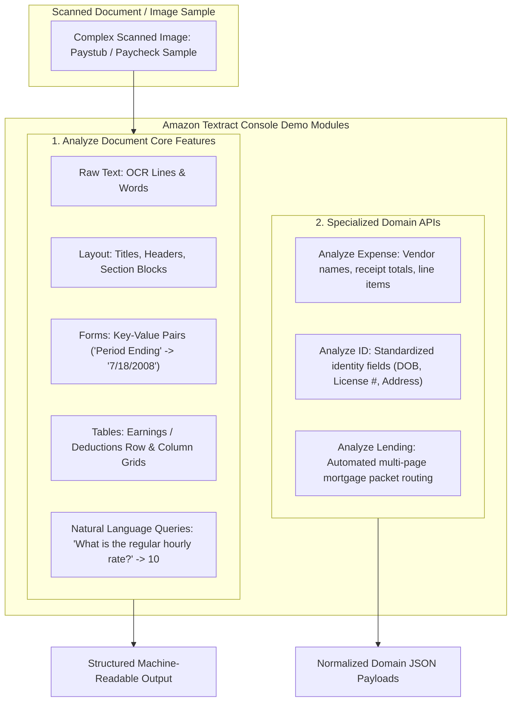

The hands-on console illustrates:

- **Layout Awareness:** Distinguishing between title banners (e.g., _"Earnings Statement"_), paragraph sections, and tabular regions.
- **Form Key-Value Pairs:** Automatically pairing labels with values (e.g., `Period Ending` $\rightarrow$ `7/18/2008`).
- **Table Extraction:** Preserving multi-row grids for earnings rates, hours, and deduction line items.
- **Natural Language Queries:** Asking plain-English questions (e.g., _"What is the regular hourly rate?"_) and retrieving exact targeted values.
- **Domain-Specific Analysis Modules:** Interactive testing for **Expenses** (invoices/receipts), **Identity Documents** (passports/driver's licenses), and **Lending Packages**.

---

## Hands-On Workflow: Evaluating Document Analysis in the Textract Console

1. **Open the Amazon Textract Console & Select a Document Demo:**
   - Navigate to the **Amazon Textract Console** in your target AWS Region.  
     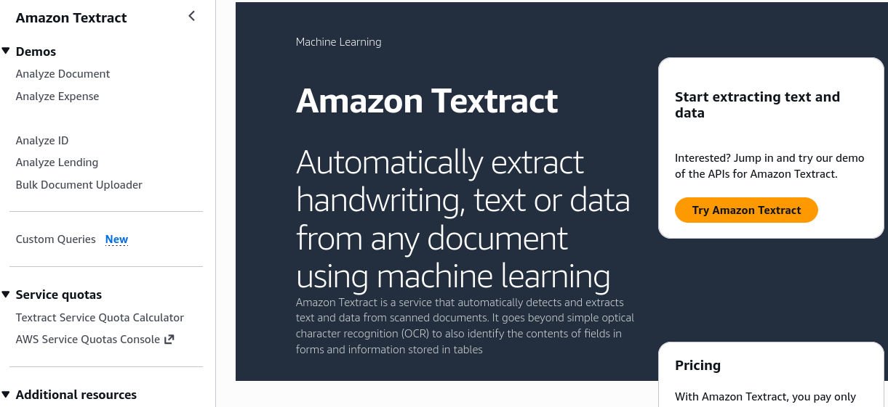
   - Click **Try Amazon Textract** from the landing dashboard.
     - In the left navigation menu, review the four built-in demo categories:
     - **Analyze Document** (general forms, tables, queries, layout)
     - **Analyze Expense** (invoices and receipts)
     - **Analyze ID** (driver's licenses and passports)
     - **Analyze Lending** (mortgage application loan packets)
   - Under **Analyze Document**, select the default **Paystub** sample image (or upload a custom scanned receipt/document).  
     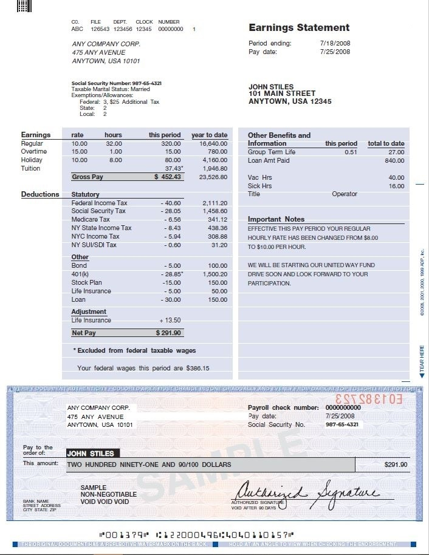
2. **Inspect Raw Text & Layout Hierarchy:**
   - Review the foundational OCR and document geometry:
   - **Raw Text:** Observe all detected printed and handwritten strings grouped into discrete `LINE` and `WORD` objects.  
     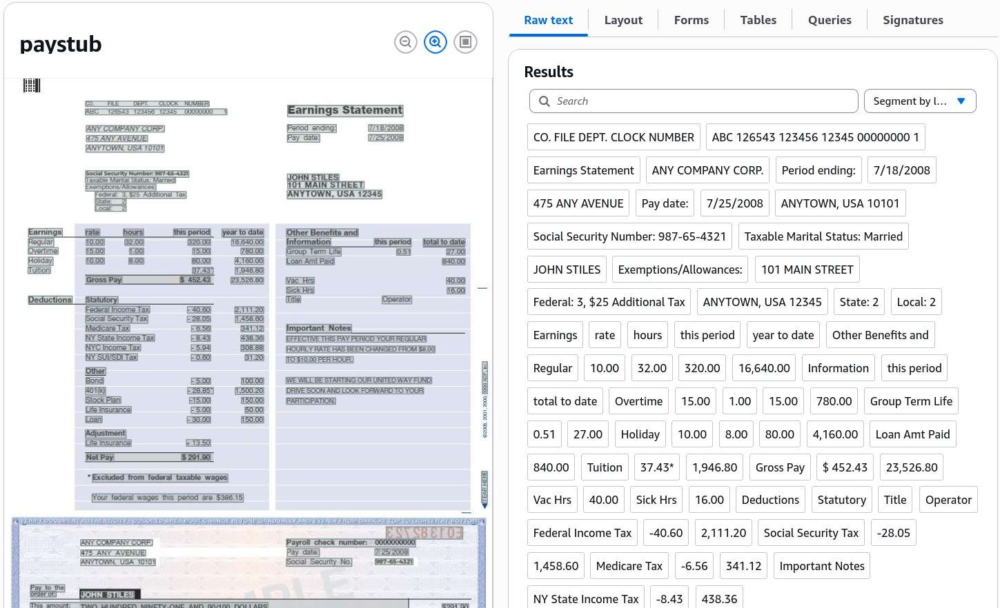
   - **Layout:** Note how Textract classifies high-level structural components, distinguishing the top header (_"Earnings Statement"_) from sub-headers and body text blocks.  
     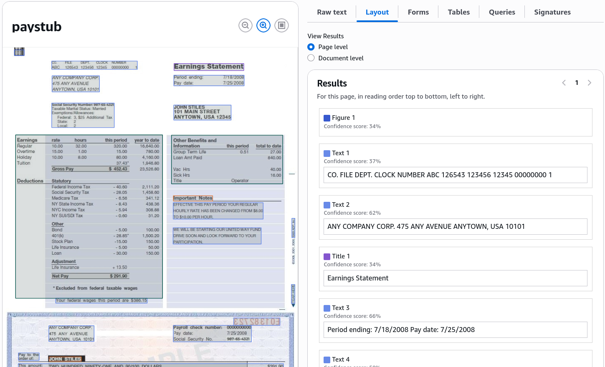
3. **Evaluate Form Extraction (Key-Value Pairs):**
   - Select the **Forms** tab to verify key-value extraction:
   - Locate the field mapping in the document (e.g., the `Period Ending` label linked directly to `7/18/2008`).
   - Check additional extracted pairs, such as `Pay Date`, `Gross Pay`, and `Social Security Number`.
   - Verify that the visual overlay draws bounding boxes connecting each **Key** (label) to its corresponding **Value** data field.  
     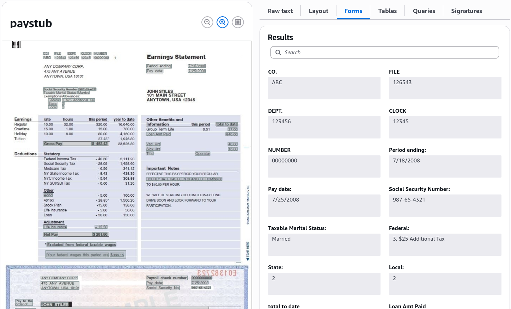
4. **Inspect Structured Table Grids:**
   - Select the **Tables** tab to review multi-column tabular parsing:
   - Inspect the **Earnings** table: verify that columns for `Earnings Rate`, `Hours`, `Period`, and `Year-To-Date` are captured in aligned rows and cells.  
     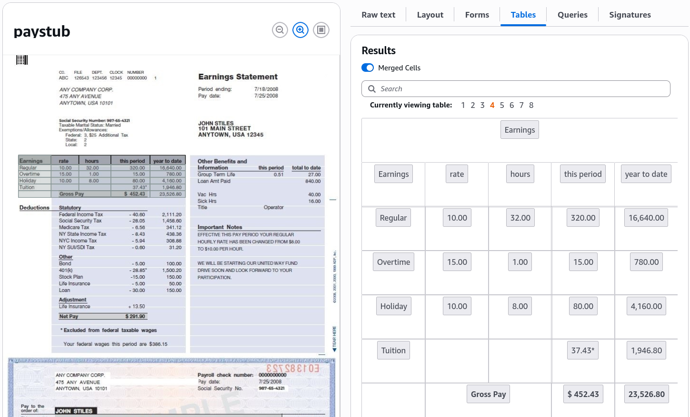
   - Inspect the **Deductions** table: confirm that individual line-item deductions are extracted without merging adjacent cell contents.  
     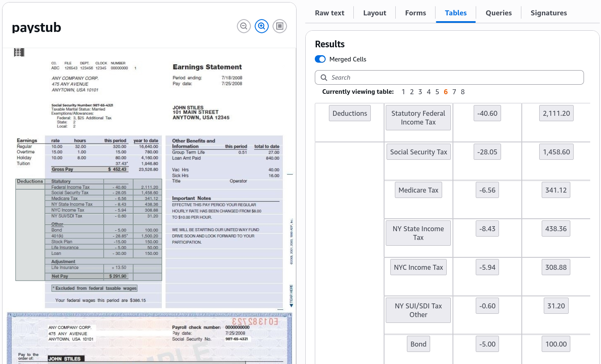
5. **Execute Natural Language Queries:**
   - Select the **Queries** tab to test targeted data extraction without predefined bounding boxes:
   - Review default pre-configured questions (e.g., _"What is the year to date gross pay?"_).
   - Enter a custom natural language query in the prompt box: `"What is the regular hourly rate?"`
   - Click **Submit query** and verify that Amazon Textract parses the document and returns the exact target answer (`10`) with its corresponding confidence score.  
     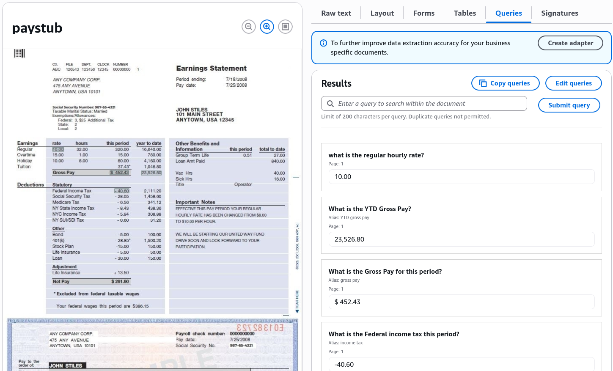
6. **Explore Analyze Expense, Analyze ID & Analyze Lending Demos:**
   - Test specialized domain parsers:
   - **Analyze Expense:** Switch to the Expense demo to extract normalized vendor names, line items, invoice totals, and sales tax.  
     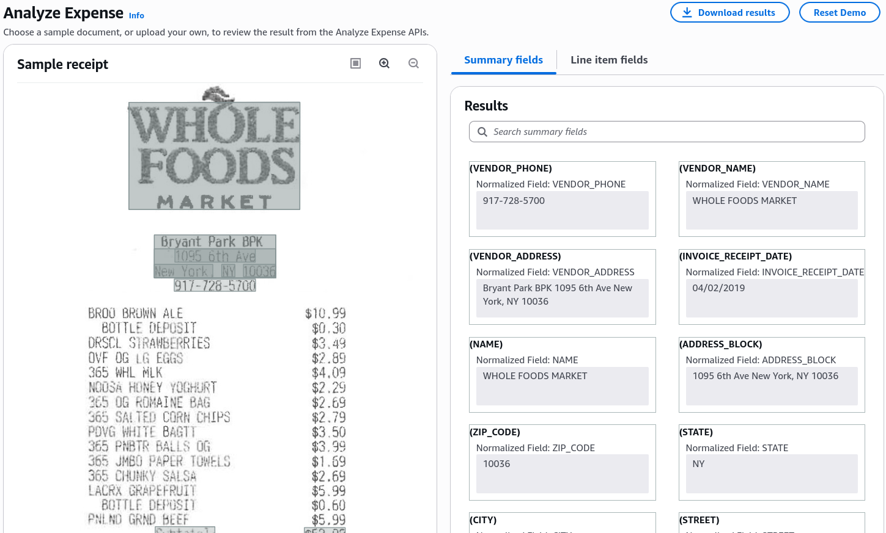
   - **Analyze ID:** Switch to the ID demo (e.g., a sample _Massachusetts Driver's License_) to extract standardized fields: `First Name`, `Last Name`, `Address`, `Date of Birth`, and `Document Number`.  
     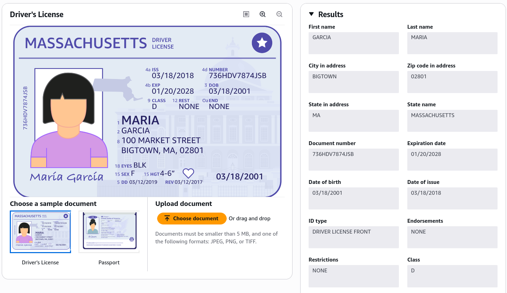
   - **Analyze Lending:** Review automated classification and routing of multi-page mortgage loan portfolios (W-2s, 1040s, paystubs, bank statements).  
     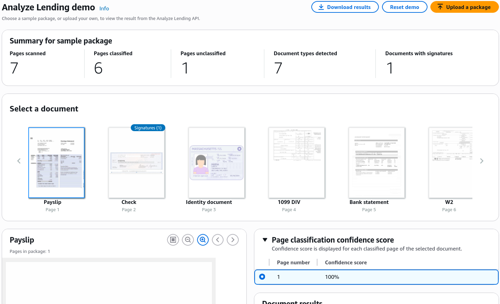

---

## Amazon Textract Feature & Specialized API Matrix

| Console Feature / API               | Primary Extraction Focus                             | Output Characteristics                                          | Target Workload Demonstrated                           |
| ----------------------------------- | ---------------------------------------------------- | --------------------------------------------------------------- | ------------------------------------------------------ |
| **Raw Text (`DetectDocumentText`)** | Basic OCR for printed and handwritten words.         | Unstructured lines and words with spatial geometry.             | Reading plain text articles, unstructured notes.       |
| **Forms (`AnalyzeDocument`)**       | Explicit and implied key-value pairs.                | `KEY_VALUE_SET` blocks linking label keys to values.            | Tax forms, job applications, insurance intake forms.   |
| **Tables (`AnalyzeDocument`)**      | Tabular rows, columns, merged cells, headers.        | `TABLE` and `CELL` blocks with row/column indices.              | Paystub earning breakdowns, financial spreadsheets.    |
| **Queries (`AnalyzeDocument`)**     | Target data retrieval using plain English questions. | Precise answer string + bounding box + confidence score.        | Dynamic extraction across shifting document templates. |
| **`AnalyzeExpense`**                | Invoices, restaurant receipts, sales receipts.       | Normalized vendor names, line items, taxes, totals.             | Automated expense reports, accounts payable.           |
| **`AnalyzeID`**                     | Passports and driver's licenses.                     | Standardized KYC identity fields (`DOB`, `EXPIRY_DATE`).        | Customer identity verification, automated onboarding.  |
| **`AnalyzeLending`**                | Complex mortgage and loan document packets.          | Automatic page classification, document splitting, and routing. | Mortgage origination and loan processing automation.   |

---

## 4. Exam Guide

### Exam Tips

- **Natural Language Queries:** Use the **Queries** feature within `AnalyzeDocument` when you need to extract specific data points (e.g., _"What is the policy deductible?"_) from documents whose layout or format varies across different providers.
- **Custom Queries:** You can customize the pre-trained Queries feature by uploading as few as **10 sample documents** to train a custom adapter for proprietary document formats.
- **Forms vs. Tables:**
  - If the goal is extracting **label-value associations** (e.g., _"Full Name: John Doe"_), select **Forms**.
  - If the goal is extracting **row-and-column grids** (e.g., line-item breakdown of hours and pay rates), select **Tables**.
- **Specialized Document APIs:** Always choose **`AnalyzeExpense`** for invoices/receipts, **`AnalyzeID`** for government identity cards/passports, and **`AnalyzeLending`** for multi-page mortgage packets.

---

### Practice Test

#### Question 1

A payroll automation platform processes scanned paystub images from hundreds of different third-party payroll providers. The layouts and formats vary widely, making template-based coordinate extraction unreliable. The engineering team needs to extract the specific numeric value representing the employee's regular hourly rate by asking a plain-English question. Which Amazon Textract capability should they use?

- [ ] A. Amazon Textract `DetectDocumentText`
- [ ] B. Amazon Textract `AnalyzeDocument` with the Queries feature
- [ ] C. Amazon Rekognition `DetectText`
- [ ] D. Amazon Comprehend Syntax Analysis

 Correct Answer

- [x] B. Amazon Textract `AnalyzeDocument` with the Queries feature
  - **Explanation:** The **Queries** feature inside Amazon Textract `AnalyzeDocument` allows developers to specify the exact information needed using natural language questions (e.g., _"What is the regular hourly rate?"_) and receive the extracted answer directly, regardless of layout variations across different document templates.

---

#### Question 2

A financial mortgage lender receives 50-page loan application packets containing a mix of W-2 forms, bank statements, tax returns, and paystubs. The lender needs an automated service that automatically classifies each page by document type and routes the page to the appropriate extraction model. Which AWS API provides this capability?

- [ ] A. Amazon Textract `AnalyzeLending`
- [ ] B. Amazon Textract `AnalyzeExpense`
- [ ] C. Amazon Comprehend `DetectPiiEntities`
- [ ] D. Amazon Polly `SynthesizeSpeech`

 Correct Answer

- [x] A. Amazon Textract `AnalyzeLending`
  - **Explanation:** The **Amazon Textract `AnalyzeLending` API** is purpose-built for mortgage and loan packages; it automatically classifies, splits, and routes mixed loan document pages to the appropriate extraction pipelines.

---
