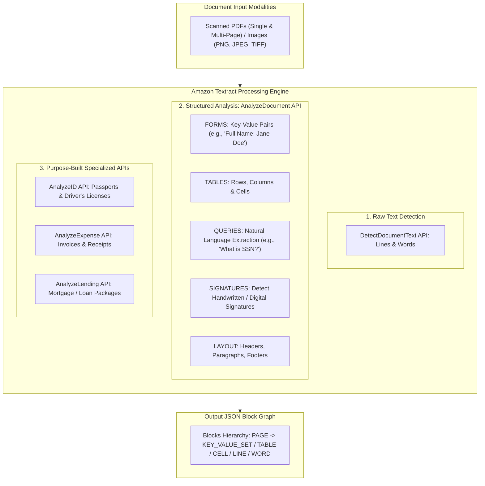
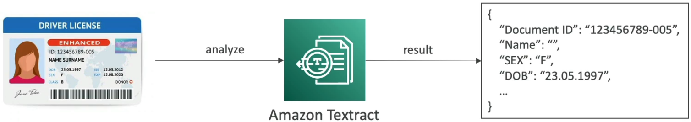
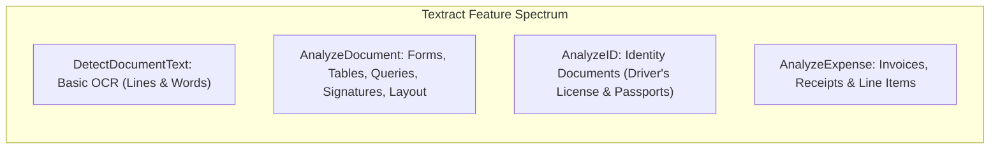
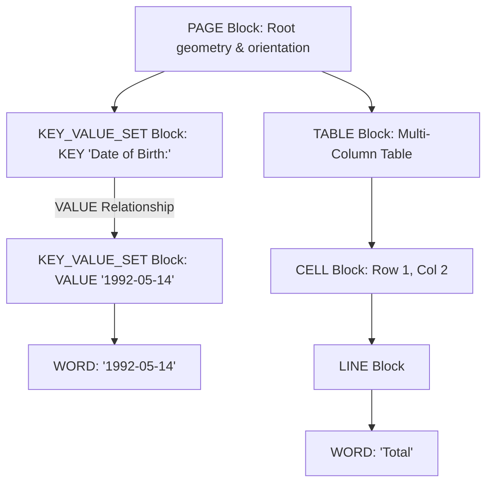
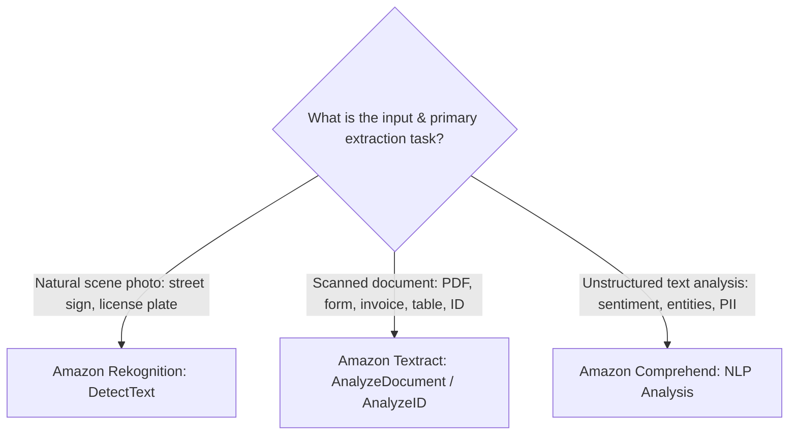

# Amazon Textract: Intelligent Document Processing (IDP), Forms, Tables & Specialized APIs

---

## Key Takeaways

**Amazon Textract** is a fully managed, serverless **Intelligent Document Processing (IDP)** service that goes beyond traditional Optical Character Recognition (OCR). It extracts printed text, handwriting, key-value pairs (forms), structured tables, signatures, and identity attributes from scanned documents and PDFs without requiring custom machine learning models.

Unlike basic OCR engines that produce flattened strings of text, Amazon Textract preserves the **structural context and spatial geometry** of documents. It provides specialized purpose-built APIs like **AnalyzeID** (driver's licenses and passports), **AnalyzeExpense** (invoices and receipts), and **AnalyzeLending** (mortgage packets).

---

## Main Discussion

### Amazon Textract API & Feature Breakdown

| API / Feature                        | Primary Capability                                                                             | Key Output Structures                                                      | Target Use Case                                                                           |
| ------------------------------------ | ---------------------------------------------------------------------------------------------- | -------------------------------------------------------------------------- | ----------------------------------------------------------------------------------------- |
| **`DetectDocumentText`**             | Basic OCR for printed and handwritten text.                                                    | `PAGE`, `LINE`, `WORD`                                                     | Transcribing unstructured articles, letters, or plain text books.                         |
| **`AnalyzeDocument` (`FORMS`)**      | Extracts form fields as semantic key-value relationships.                                      | `KEY_VALUE_SET` blocks linking label keys to their values                  | Processing tax forms, loan applications, and medical intake records.                      |
| **`AnalyzeDocument` (`TABLES`)**     | Extracts tabular data while preserving row, column, and cell relationships.                    | `TABLE`, `CELL` blocks with `RowIndex` and `ColumnIndex`                   | Extracting balance sheets, stock market reports, and multi-row inventory tables.          |
| **`AnalyzeDocument` (`QUERIES`)**    | Uses natural language questions to retrieve specific data points regardless of layout changes. | Specific answer text and confidence score                                  | Asking _"What is the policy expiration date?"_ without pre-defining bounding coordinates. |
| **`AnalyzeDocument` (`SIGNATURES`)** | Detects the presence and location of handwritten or electronic signatures.                     | Signature bounding box and confidence score                                | Verifying whether contracts, waivers, or consent forms have been signed.                  |
| **`AnalyzeID`**                      | Specialized pre-trained parser for identity credentials.                                       | Normalized fields: `FIRST_NAME`, `LAST_NAME`, `ID_TYPE`, `EXPIRATION_DATE` | KYC identity verification during bank onboarding or car rental checkouts.                 |
| **`AnalyzeExpense`**                 | Pre-trained extraction for financial receipts and invoices.                                    | `VendorName`, `InvoiceTotal`, `DueDate`, line-item tables                  | Automated accounts payable workflows and corporate expense reporting.                     |

---

### The Textract Block Graph Hierarchy

Amazon Textract does not output raw strings; it returns an array of structured **`Block` objects** connected as a directed graph:

- **Geometry & Bounding Box:** Every block contains coordinate geometry (`BoundingBox: Left, Top, Width, Height` and `Polygon` points) relative to the document page.
- **Confidence Score:** Each word, key-value pair, and table cell includes a machine learning confidence score ($0.0 - 100.0\%$) to assist with automated routing to human review via **Amazon Augmented AI (Amazon A2I)**.

---

### Synchronous vs. Asynchronous Processing Modes

| Mode             | API Calling Pattern                                                                                            | Supported Formats & File Limits                                                          | Ideal Workload                                                              |
| ---------------- | -------------------------------------------------------------------------------------------------------------- | ---------------------------------------------------------------------------------------- | --------------------------------------------------------------------------- |
| **Synchronous**  | `DetectDocumentText`  `AnalyzeDocument`  `AnalyzeExpense`  `AnalyzeID`                             | • Single-page PNG, JPEG, TIFF  • Direct base64 bytes or S3 object (up to 5 MB)       | Real-time user uploads, mobile document scanning, interactive web apps.     |
| **Asynchronous** | `StartDocumentAnalysis` / `GetDocumentAnalysis`  `StartDocumentTextDetection` / `GetDocumentTextDetection` | • Multi-page PDF, TIFF  • Documents stored in Amazon S3 (up to 500 MB / 3,000 pages) | Scheduled batch processing of mortgage portfolios, legal document archives. |

---

### Service Disambiguation: Textract vs. Rekognition vs. Comprehend

- **Amazon Textract:** Parses **scanned documents, PDFs, forms, and tables** to preserve document layout and relationships.
- **Amazon Rekognition:** Detects **text embedded in natural scene photographs** (e.g., street signs, race bibs, billboard photos).
- **Amazon Comprehend:** Performs **NLP comprehension** (sentiment, language, standard entities, PII) on digital text strings extracted by Textract.

---

## Exam Guide

### Exam Tips

- **Primary Service Purpose:** **Amazon Textract** is the default service for **Intelligent Document Processing (IDP)**, extracting text, forms, tables, and handwritten data from scanned documents and PDFs.
- **Feature Triggers:**
  - Extracting key-value form fields (e.g., _"Name: John"_) $\rightarrow$ **`AnalyzeDocument`** with **`FORMS`**.
  - Extracting multi-column tables and cell data $\rightarrow$ **`AnalyzeDocument`** with **`TABLES`**.
  - Parsing driver's licenses or passports $\rightarrow$ **`AnalyzeID` API**.
  - Extracting line items, vendor names, and totals from receipts/invoices $\rightarrow$ **`AnalyzeExpense` API**.
  - Asking specific questions about document contents regardless of layout shifts $\rightarrow$ **`AnalyzeDocument`** with **`QUERIES`**.
- **Multi-Page PDFs:** Processing multi-page PDFs requires **Asynchronous APIs** (`StartDocumentAnalysis` / `GetDocumentAnalysis`) with files stored in Amazon S3.
- **Human-in-the-Loop Integration:** Amazon Textract integrates with **Amazon Augmented AI (Amazon A2I)** to send low-confidence document extractions to human reviewers.

---

### Practice Test

#### Question 1

A loan origination company needs an automated solution to extract customer names, employment history, and financial table data from thousands of multi-page scanned PDF application forms. The solution must preserve the relationship between form labels and their associated values, as well as extract table cells into rows and columns with minimal operational overhead. Which AWS service should be used?

- [ ] A. Amazon Rekognition Text in Image
- [ ] B. Amazon Textract with Forms and Tables analysis features enabled
- [ ] C. Amazon Comprehend Syntax Tokenizer
- [ ] D. Amazon Polly Speech Marks

Correct Answer

- [x] B. Amazon Textract with Forms and Tables analysis features enabled
  - **Explanation:** **Amazon Textract** with the **Forms** and **Tables** features enabled (`AnalyzeDocument`) is specifically designed to extract structured key-value pairs from forms and preserve row-and-column structures from tabular data in scanned PDF documents.

---

#### Question 2

A fintech mobile application requires newly registered users to upload a photo of their government-issued driver's license or passport. The application must automatically extract the user's date of birth, document expiration date, and ID number as standardized, normalized fields. Which Amazon Textract API is designed for this use case?

- [ ] A. `DetectDocumentText`
- [ ] B. `AnalyzeID`
- [ ] C. `AnalyzeExpense`
- [ ] D. `DetectModerationLabels`

Correct Answer

- [x] B. `AnalyzeID`
  - **Explanation:** The **`AnalyzeID` API** in Amazon Textract is specialized for extracting normalized fields (such as document number, expiration date, and date of birth) from government-issued identity documents, including driver's licenses and passports.

---
