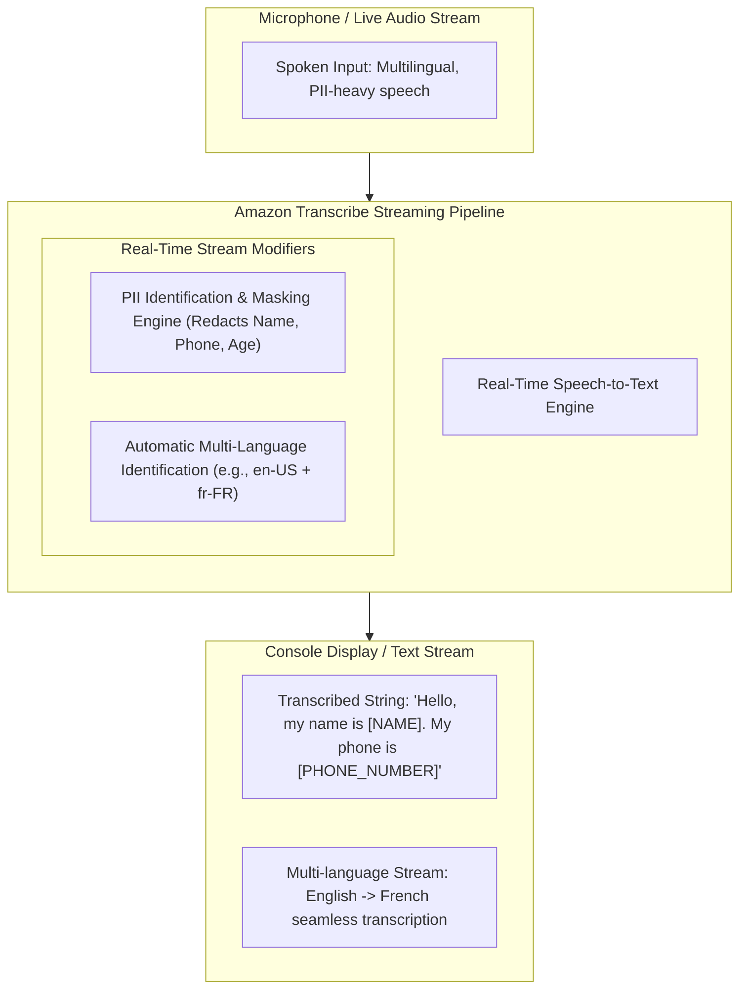
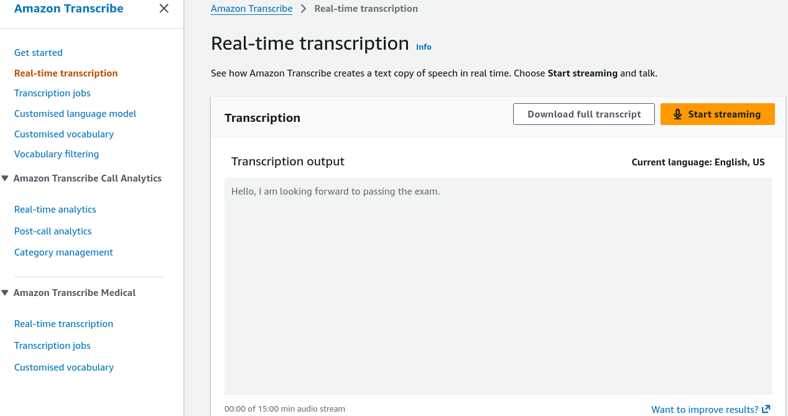
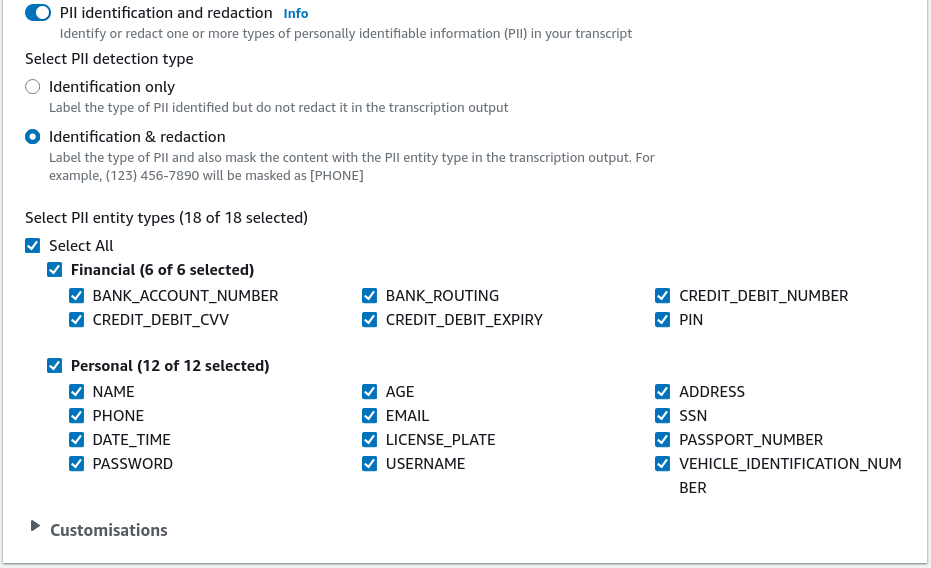
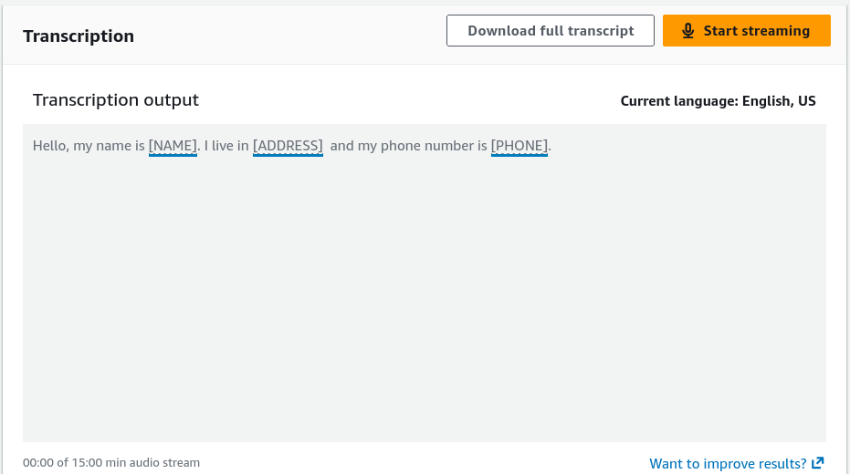
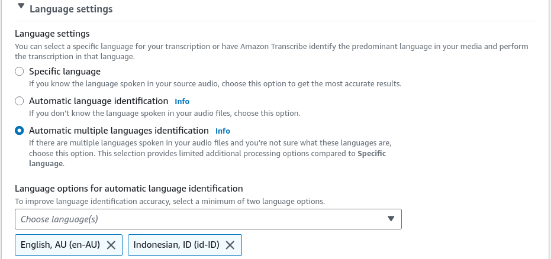
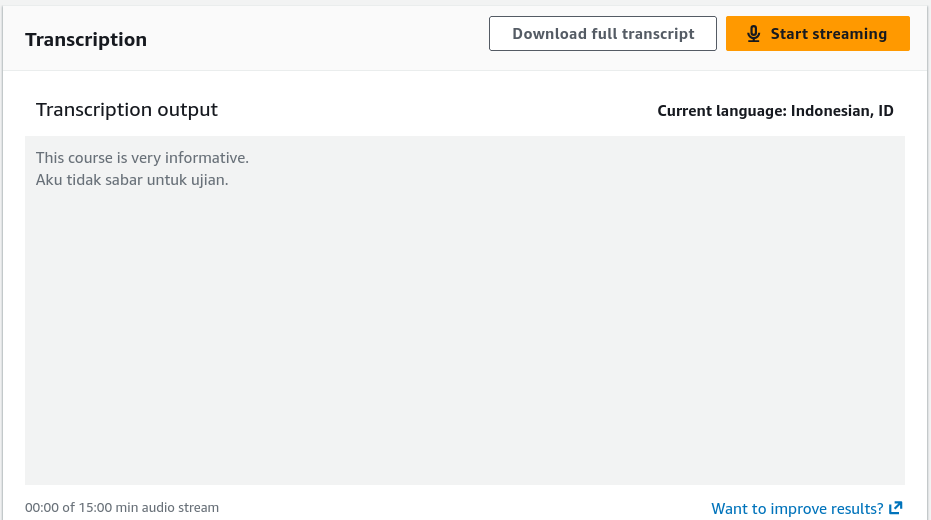

# Hands-On Lab: Amazon Transcribe Live Streaming, PII Redaction & Multi-Language Identification

---

## Key Takeaways

**Amazon Transcribe** provides low-latency streaming and batch **Automatic Speech Recognition (ASR)** directly from the AWS Management Console and via WebSocket / HTTP/2 streaming APIs.

Key real-time streaming capabilities demonstrated in the console include:

- **Live Audio Streaming:** Converting spoken microphone input into text with immediate visual feedback.
- **Personally Identifiable Information (PII) Redaction:** Automatically detecting and masking sensitive data (e.g., names, phone numbers, ages) in the resulting transcript.
- **Automatic Multi-Language Identification:** Seamlessly switching between configured language candidates (e.g., English and French) without requiring manual language toggling during a live session.

---

## Hands-On Workflow: Live Audio Streaming, Redaction & Language Detection

1. **Navigate to Real-Time Streaming in the Transcribe Console:**
   - Open the **Amazon Transcribe Console** in your target AWS Region.
   - In the left navigation pane, select **Real-time transcription**.
   - Ensure your browser has granted microphone permissions to the AWS Console.
   - Under **Language settings**, set the baseline language to **English, US (en-US)**.
2. **Execute Baseline Real-Time Speech-to-Text:**
   - Test real-time transcription:
   - Click **Start streaming**.
   - Speak clearly into your microphone: _"Hello, I am looking forward to passing the exam."_
   - Observe the incoming text rendered immediately in the console output pane as the deep learning ASR engine processes the audio packets.
   - Click **Stop streaming**.  
     
3. **Enable Automated PII Identification & Redaction:**
   - Configure privacy filters to protect sensitive customer data:
   - Under **Content removal / PII settings**, toggle **Identify and redact PII**.  
     
   - Select the target PII entity categories to redact (e.g., `NAME`, `PHONE_NUMBER`, `AGE`, `BANK_ROUTING`, `SSN`).
   - Click **Start streaming** and speak a phrase containing personal data:
     _"Hello, my name is Rendy. I live in Sydney, and my phone number is 0412-123-456."_
   - Verify that the rendered transcript automatically masks the sensitive tokens (e.g., replacing them with tags like `[NAME]` and `[PHONE_NUMBER]`).
   - Click **Stop streaming**.  
     
4. **Configure Automatic Multi-Language Identification:**
   - Enable dynamic language switching for multilingual environments:
   - Under **Language settings**, select **Automatic language identification**.
   - Choose two or more expected candidate languages (e.g., **English, AU (en-AU)** and **Indonesian (id-ID)**).  
     
   - Click **Start streaming** and alternate between languages in a single spoken stream:
     - Speak in English: _"This course is very informative."_
     - Transition immediately into Indonesian.
   - Observe Amazon Transcribe detecting the language transition dynamically and generating the correct Indonesian orthography and accents in real time.
   - Click **Stop streaming** to finalize the session.  
     

---

## Streaming vs. Batch Transcription Comparison

| Architectural Aspect        | Streaming Transcription (Live API)                                       | Batch Transcription Jobs                                                     |
| --------------------------- | ------------------------------------------------------------------------ | ---------------------------------------------------------------------------- |
| **Protocol / Ingestion**    | HTTP/2 or WebSockets streaming raw audio chunks                          | Audio/Video files uploaded to **Amazon S3** (MP3, WAV, FLAC, MP4)            |
| **Latency Profile**         | Sub-second, word-by-word streaming updates                               | Asynchronous processing (minutes depending on file size)                     |
| **PII Handling**            | Masks or redacts tokens inline in the text stream                        | Generates redacted text transcripts **plus an optional redacted audio file** |
| **Language Identification** | Evaluates multi-language streams dynamically                             | Identifies the dominant language across the entire uploaded recording        |
| **Typical Use Cases**       | Live call center agent assist, video conferences, interactive voice bots | Archival call analysis, podcast indexing, regulatory compliance reviews      |

---

## Exam Guide

### Exam Tips

- **PII Redaction Options:** In batch transcription, Amazon Transcribe can produce **both** a redacted text transcript and a **redacted audio file** (where the spoken PII is physically muted or bleeped out).
- **Automatic Multi-Language Identification:** When an audio stream contains multiple languages, Transcribe can identify candidate languages automatically without requiring the caller or developer to specify the language code beforehand.
- **Streaming Protocols:** Real-time streaming with Amazon Transcribe uses **HTTP/2 streams** or **WebSockets** for bi-directional audio packet transmission.
- **Output Format:** Batch transcription outputs structured **JSON files** containing word-level timestamps, confidence scores, speaker labels, and alternative transcript options.

---

### Practice Test

#### Question 1

A financial services contact center needs a real-time compliance solution that listens to live customer service phone conversations, transcribes the dialog into text, and prevents sensitive customer credit card numbers and phone numbers from being displayed on agent support screens. Which configuration meets this requirement?

- [ ] A. Stream live audio to Amazon Transcribe with PII Identification and Redaction enabled
- [ ] B. Upload audio recordings to Amazon S3 and run Amazon Textract Key-Value extraction
- [ ] C. Use Amazon Polly Neural TTS to mask inbound caller audio
- [ ] D. Deploy an Amazon Lex bot with custom regular expression slots

Correct Answer

- [x] A. Stream live audio to Amazon Transcribe with PII Identification and Redaction enabled
  - **Explanation:** **Amazon Transcribe** supports real-time streaming with built-in **PII Identification and Redaction**, automatically masking sensitive entities like credit card numbers and phone numbers in the generated text transcript.

---

#### Question 2

A media company operates an international live news broadcast where reporters frequently switch between English and French mid-broadcast. The production team needs live captions generated automatically without manual operator intervention to switch language profiles. Which feature of Amazon Transcribe should be enabled?

- [ ] A. Custom Vocabularies
- [ ] B. Automatic Language Identification with candidate language selection
- [ ] C. Amazon Comprehend Syntax Parsing
- [ ] D. Amazon Translate Custom Terminology

Correct Answer

- [x] B. Automatic Language Identification with candidate language selection
  - **Explanation:** **Automatic Language Identification** in Amazon Transcribe detects the spoken language dynamically from a list of candidate languages (e.g., English and French) and transcribes the speech accurately without manual language switching.

---
