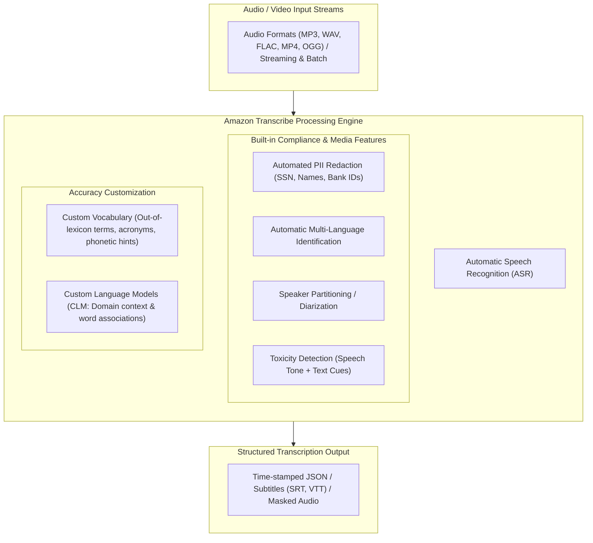
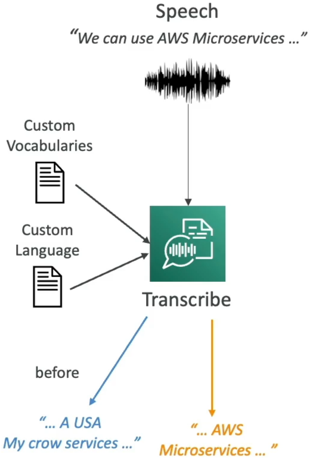
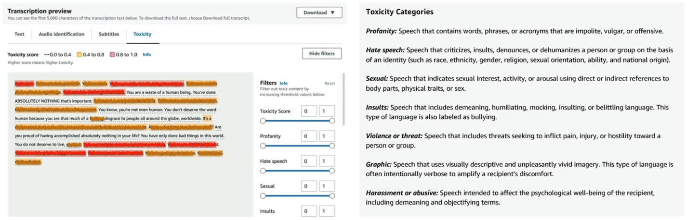

# Amazon Transcribe: Automatic Speech Recognition (ASR), Customizations & Toxicity Detection

---

## Key Takeaways

**Amazon Transcribe** is a fully managed, serverless **Automatic Speech Recognition (ASR)** service that converts spoken audio and video files into accurate, time-stamped text transcripts using deep learning models.



Amazon Transcribe provides essential enterprise features including **Automated PII Redaction**, **Automatic Language Identification**, **Speaker Diarization**, and **Toxicity Detection**. To handle industry-specific jargon, Transcribe offers two customization mechanisms: **Custom Vocabularies** for individual specialized terms and acronyms, and **Custom Language Models (CLM)** for broader linguistic and contextual understanding.

---

## Main Discussion

### Core Capabilities Matrix

| Feature                                  | Primary Function                                                                                                                                                    | Business Application                                                                           |
| ---------------------------------------- | ------------------------------------------------------------------------------------------------------------------------------------------------------------------- | ---------------------------------------------------------------------------------------------- |
| **Automatic Speech Recognition (ASR)**   | Converts continuous raw audio waveforms into written text transcripts with word-level time stamps.                                                                  | Generating video subtitles (SRT/VTT), transcribing podcast episodes, indexing call recordings. |
| **Automatic Language Identification**    | Automatically identifies dominant spoken languages in multi-lingual audio streams without pre-configured language codes.                                            | Processing global customer support calls and multi-regional media broadcasts.                  |
| **Speaker Diarization / Identification** | Separates and labels distinct speakers in mono-channel audio recordings (e.g., `spk_0`, `spk_1`).                                                                   | Call center quality audits distinguishing customer statements from agent responses.            |
| **Automated PII Redaction**              | Automatically identifies, masks, or redacts sensitive personal data (names, social security numbers, bank details) in both output text transcripts and audio files. | Compliance enforcement with PCI-DSS, HIPAA, and GDPR standards in contact center recordings.   |
| **Toxicity Detection**                   | Combines **acoustic speech cues** (tone, pitch, loudness) with **text-based transcripts** to flag harmful, threatening, or offensive content across 7 categories.   | In-game voice chat moderation, live customer escalation alerting, social platform safety.      |

---

### Accuracy Optimization: Custom Vocabulary vs. Custom Language Models (CLM)

When transcribing technical jargon, standard pre-trained speech models may produce phonetic misinterpretations (e.g., transcribing _"AWS Microservices"_ as _"USA my crow services"_).

<div className="grid grid-cols-1 md:grid-cols-3 gap-4 mb-2">

<div className="col-span-1 md:col-span-2">
```mermaid
flowchart TD
    subgraph CustomizationChoice [Transcription Accuracy Optimization]
        Challenge{What needs optimization?}

        Challenge -->|Specific words, brand names, unique acronyms| CV[Custom Vocabulary: Specific Terms]
        Challenge -->|Contextual syntax, domain phrasing, co-occurrence| CLM[Custom Language Model: Context & Corpus]
    end

    subgraph CV_Details [Custom Vocabulary Details]
        CV1["List of explicit words, brand names, or technical terms"]
        CV2["Supports phonetic DisplayAs & Pronunciation IPA/SoundsLike hints"]
    end

    subgraph CLM_Details [Custom Language Model Details]
        CLM1["Ingests large domain text corpora (e.g., medical whitepapers, IT docs)"]
        CLM2["Teaches the statistical likelihood of adjacent words in context"]
    end

    CV --> CV_Details
    CLM --> CLM_Details

````
</div>



</div>

| Dimension              | Custom Vocabulary                                                                                                             | Custom Language Model (CLM)                                                                                                           |
| ---------------------- | ----------------------------------------------------------------------------------------------------------------------------- | ------------------------------------------------------------------------------------------------------------------------------------- |
| **Target Level**       | Individual **words**, specific **acronyms**, and unique **brand names**.                                                      | Broader **context**, grammatical patterns, and domain terminology usage.                                                              |
| **Training Input**     | A structured list/table of individual terms with optional phonetic spelling hints.                                            | Large collections of domain-specific text documents (e.g., IT documentation, legal briefs).                                           |
| **Operational Impact** | Ensures specific out-of-lexicon words are recognized and spelled correctly.                                                   | Helps the model disambiguate phonetically identical words based on sentence context (e.g., _"microservice"_ vs. _"my crow service"_). |
| **Best Practice**      | Combine both Custom Vocabularies and a Custom Language Model for the highest transcription accuracy on specialized workloads. |                                                                                                                                       |

---

### Amazon Transcribe Toxicity Detection

Amazon Transcribe Toxicity Detection provides multi-modal content moderation by analyzing both what is spoken and how it is delivered:

```mermaid
flowchart LR
    AudioStream[Spoken Voice Sample] --> FeatureSplit{Dual-Signal Analysis}

    FeatureSplit -->|Acoustic Analysis| SpeechCues["Speech Cues: Pitch, tone, loudness, aggressive inflection"]
    FeatureSplit -->|Lexical Analysis| TextCues["Textual Cues: Profanity, slurs, explicit threat keywords"]

    SpeechCues & TextCues --> ToxEngine[Toxicity Detection Classifier]
    ToxEngine --> CategoryScores["Categorical Confidence Scores (0.0 to 1.0)"]

````

```mermaid
mindmap
  root((7 Toxicity Categories))
    Profanity
    Hate Speech
    Sexual Content
    Insults
    Violence or Threats
    Graphic Content
    Harassment or Abuse
```

1. **Dual Signal Ingestion:** Analyzes raw audio waveforms for aggressive acoustic inflections (tone, pitch) alongside transcribed lexical tokens.
2. **Categorical Scoring:** Outputs confidence scores ($0.0$ to $1.0$) across seven distinct toxicity categories.



---

## Exam Guide

### Exam Tips

- **Primary Service Purpose:** Choose **Amazon Transcribe** whenever a scenario requires converting spoken speech, phone calls, podcasts, or video audio into text transcripts with minimal operational overhead.
- **Toxicity Detection Architecture:** Transcribe Toxicity Detection analyzes **both voice tone/pitch (acoustic cues) and text transcription (lexical cues)** to detect harmful language.
- **Disambiguating Custom Vocabulary vs. CLM:**
  - If the requirement is adding **specific missing words, brand names, or phonetic pronunciations** $\rightarrow$ Use **Custom Vocabulary**.
  - If the requirement is training the model on **large volumes of domain text to understand sentence context and industry phrasing** $\rightarrow$ Use **Custom Language Models (CLM)**.
- **Speaker Separation:** The feature that identifies and labels who is speaking in a recording is called **Speaker Diarization** (or Speaker Partitioning).
- **Call Analytics Integration:** **Amazon Transcribe Call Analytics** provides turn-by-turn conversational insights, agent sentiment tracking, non-talk time metrics, and automated PII redaction for contact centers.

---

### Practice Test

#### Question 1

A telecommunications contact center uses Amazon Transcribe to automatically transcribe customer support phone calls into text. The company notices that specialized technical acronyms and newly released product model names are consistently misspelled in output transcripts. The data science team wants to fix these spelling errors without training a full custom neural network. Which feature should they configure?

- [ ] A. Amazon Transcribe Custom Language Model (CLM)
- [ ] B. Amazon Transcribe Custom Vocabulary
- [ ] C. Amazon Comprehend Custom Entity Recognition
- [ ] D. Amazon Polly Pronunciation Lexicon

<details>
<summary>Correct Answer</summary>

- [x] B. Amazon Transcribe Custom Vocabulary
  - **Explanation:** An **Amazon Transcribe Custom Vocabulary** allows you to provide a specific list of terms, brand names, acronyms, and phonetic pronunciation hints so that Transcribe recognizes and correctly spells out-of-lexicon words.

</details>

---

#### Question 2

An online multiplayer gaming platform wants to implement automated voice chat moderation to flag abusive player interactions. The moderation system needs to evaluate both the actual words spoken as well as the acoustic tone and pitch of the voice to assess whether an interaction constitutes harassment or threats. Which AWS managed service feature provides this capability?

- [ ] A. Amazon Rekognition Content Moderation
- [ ] B. Amazon Transcribe Toxicity Detection
- [ ] C. Amazon Comprehend Targeted Sentiment
- [ ] D. Amazon Lex Utterance Analysis

<details>
<summary>Correct Answer</summary>

- [x] B. Amazon Transcribe Toxicity Detection
  - **Explanation:** **Amazon Transcribe Toxicity Detection** uses both text-based cues (the transcribed words) and speech cues (acoustic tone and pitch) to evaluate and flag voice chat across seven toxicity categories, including harassment and threats.

</details>

---
