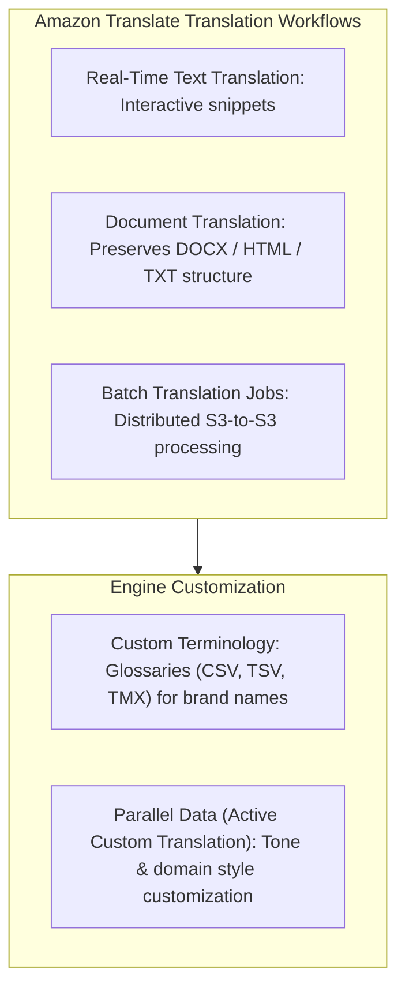
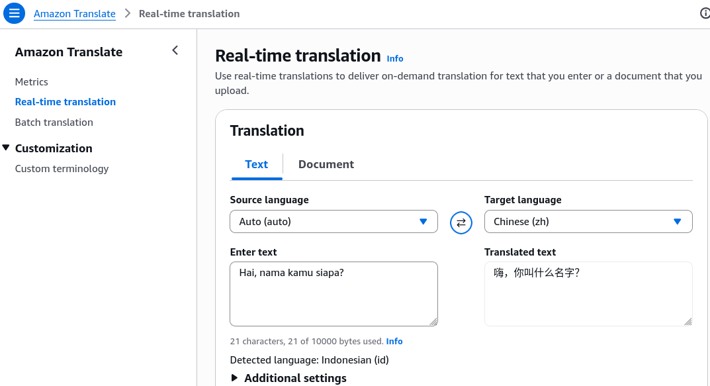
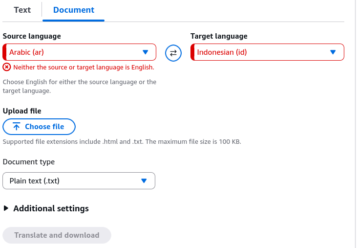
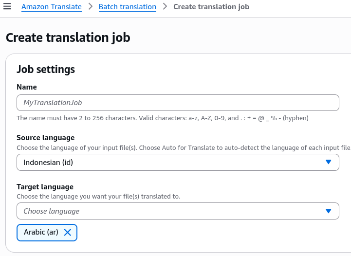

# Hands-On Lab: Amazon Translate Console, Document Translation & Customization

---

## Key Takeaways

**Amazon Translate** provides real-time, document-level, and asynchronous batch translation powered by context-aware Neural Machine Translation (NMT).

The service supports translation across dozens of languages with automatic source language detection. Workloads can be customized using **Custom Terminology** (dictionaries in CSV, TSV, or TMX format to preserve brand and character names) and **Parallel Data** (Active Custom Translation via example translation pairs to enforce domain-specific tone, such as formal vs. informal phrasing).

---

## Hands-On Workflow: Translation Console, Batch Jobs & Customization

1. **Access Real-Time Text Translation in the Console:**
   - Open the **Amazon Translate Console** in your target AWS Region.
   - Select **Real-time translation** from the left navigation panel.
   - Set the **Source language** (e.g., _English_ or choose _Auto (auto-detect)_).
   - Choose the **Target language** (e.g., _Mandarin_).
   - Enter your text in the input box to view the real-time neural translation output.  
     
2. **Execute Document Translation with Layout Preservation:**
   - Translate formatted files directly without losing formatting:
   - Select the **Document translation** tab.
   - Choose the **Source language** and **Target language**.
   - Upload a local file (`.docx`, `.html`, or `.txt`).
   - Run the translation and download the translated document with its structural layout and formatting preserved.  
     
3. **Configure an Asynchronous Batch Translation Job:**
   - For large-scale or multi-file workloads:
   - Navigate to **Batch translation** and click **Create job**.  
     
   - Specify the translation parameters, including the **Source language** and **Target language**.
   - Set the **Input S3 location** pointing to the bucket containing the raw document corpus.
   - Define the **Output S3 location** where Amazon Translate writes the completed files.
   - Assign an IAM role with read/write permissions to the target S3 buckets.
4. **Configure Custom Terminology for Brand Protection:**
   - To ensure proprietary names and domain terms do not get translated literally:
   - Navigate to **Custom terminology** under **Customization**.
   - Click **Create terminology**.
   - Upload a glossary file in **CSV**, **TSV**, or **TMX** format.
   - Define exact mappings (e.g., mapping source term `"Amazon Aurora"` to target `"Amazon Aurora"` so the database name is not translated as a mythical dawn).
   - Attach this terminology file to your real-time or batch translation requests.
5. **Apply Parallel Data for Active Custom Translation (ACT):**
   - To adjust translation tone and domain-specific phrasing:
   - Navigate to **Parallel data** under **Customization**.
   - Click **Create parallel data** and upload bilingual translation examples in **TMX**, **CSV**, or **TSV** format from Amazon S3.
   - Supply paired examples demonstrating preferred tone (e.g., casual `"Comment ça va ?"` vs. formal legal/office `"Comment allez-vous ?"`).
   - Apply the parallel data resource to your batch translation jobs to adapt the output style dynamically.

---

## Custom Terminology vs. Parallel Data (Active Custom Translation)

| Feature                 | Primary Purpose                                                                                                                               | Supported File Formats   | Scope & Application                                                      |
| ----------------------- | --------------------------------------------------------------------------------------------------------------------------------------------- | ------------------------ | ------------------------------------------------------------------------ |
| **Custom Terminology**  | Ensures specific words, brand names, model IDs, or acronyms are translated to designated target terms or left untouched.                      | **CSV, TSV, TMX**        | Real-time text translation, document translation, and batch translation. |
| **Parallel Data (ACT)** | Adapts the overall style, phrasing, tone (formal vs. informal), and domain context of the neural model using sample bilingual sentence pairs. | **TMX (1.4b), CSV, TSV** | **Batch translation jobs** (provides dynamic runtime model adaptation).  |

---

## Exam Guide

### Exam Tips

- **Console Capabilities:** Amazon Translate provides real-time single-string translation, single-document translation (`.docx`, `.html`, `.txt`), and asynchronous batch jobs for large collections in S3.
- **Format Requirements for Custom Glossaries:** Both **Custom Terminology** and **Parallel Data** accept **CSV**, **TSV**, and **TMX** (Translation Memory eXchange) file formats.
- **Tone & Style Customization:** When an exam scenario describes adjusting the output to a specific tone (e.g., casual customer support vs. formal legal filings) without retraining a base model, the correct answer is **Parallel Data (Active Custom Translation)**.
- **Brand Name Integrity:** When an exam scenario asks how to prevent proprietary product names or trademarks from being translated into generic foreign words, the correct answer is **Custom Terminology**.

---

### Practice Test

#### Question 1

A multinational law firm wants to use Amazon Translate to batch-translate confidential contracts from English to French. The legal team requires the output to strictly reflect formal corporate phrasing (e.g., using "Comment allez-vous ?" rather than informal phrasing) based on historical firm translation archives. Which feature should the firm use?

- [ ] A. Amazon Translate Custom Terminology
- [ ] B. Amazon Translate Parallel Data (Active Custom Translation)
- [ ] C. Amazon Comprehend Syntax Parsing
- [ ] D. Amazon Rekognition Custom Labels

Correct Answer

- [x] B. Amazon Translate Parallel Data (Active Custom Translation)
  - **Explanation:** **Parallel Data (Active Custom Translation)** allows you to provide bilingual sentence pairs in CSV, TSV, or TMX format to customize the style, tone, and domain phrasing of machine translation output during batch translation jobs.

---

#### Question 2

An e-commerce company uses Amazon Translate to localize its product catalog into multiple languages. The company needs to upload a dictionary file that prevents the proprietary brand name "CloudPulse" from being translated into other languages. Which file formats are supported for uploading this Custom Terminology file?

- [ ] A. JSON, YAML, and XML
- [ ] B. CSV, TSV, and TMX
- [ ] C. PDF, DOCX, and XLSX
- [ ] D. PNG, JPEG, and TIFF

Correct Answer

- [x] B. CSV, TSV, and TMX - **Explanation:** Amazon Translate supports **CSV**, **TSV**, and **TMX** (Translation Memory eXchange) file formats for Custom Terminology glossaries.

---
