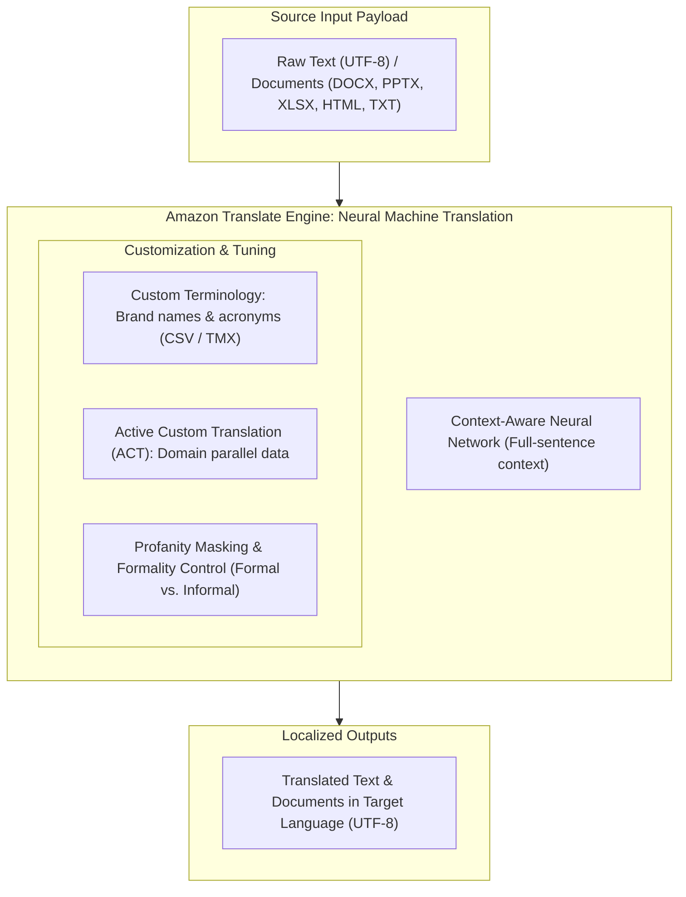
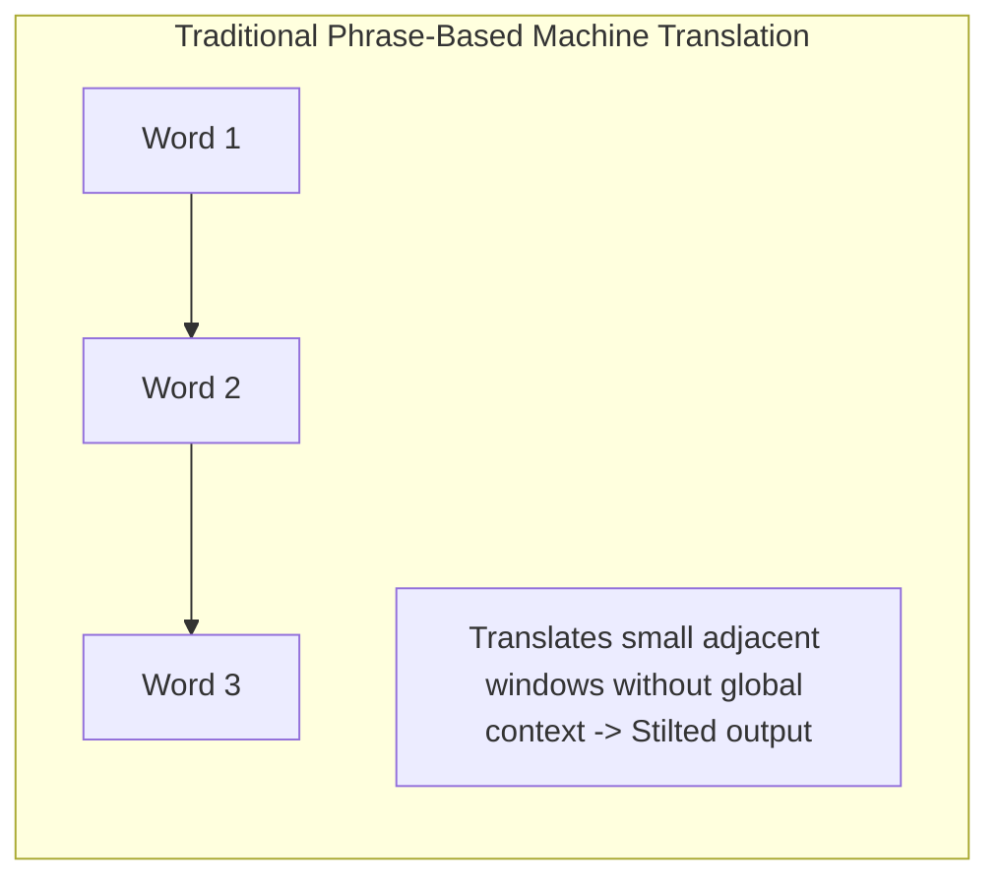
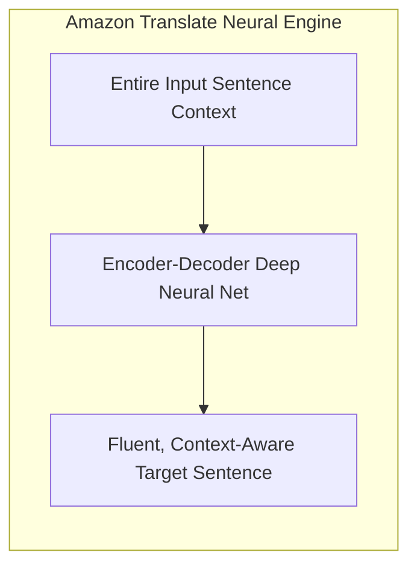
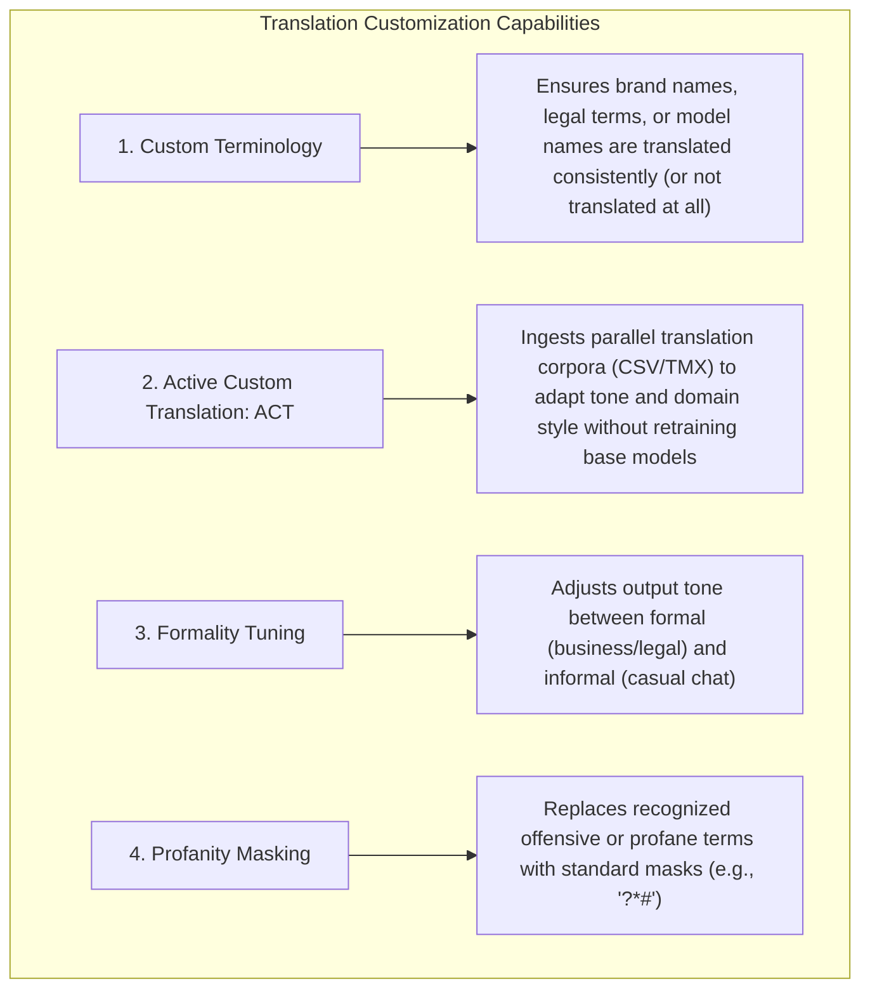
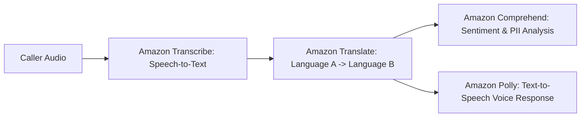

# Amazon Translate: Neural Machine Translation (NMT) & Customization

---

## Key Takeaways

**Amazon Translate** is a fully managed, serverless **Neural Machine Translation (NMT)** service that provides fast, natural-sounding, and accurate language translation across dozens of supported languages.

Unlike legacy statistical or word-by-word translation engines, Amazon Translate evaluates the **full context of an entire sentence** to produce grammatically coherent translations. Beyond out-of-the-box translation, it provides enterprise features including **Automatic Source Language Detection**, **Custom Terminology** (preserving brand names), **Active Custom Translation (ACT)**, and **Formality Customization**.

---

## Main Discussion

### Neural Machine Translation (NMT) vs. Legacy Phrase-Based Translation

- **Full-Sentence Semantic Encoding:** Neural Machine Translation uses deep learning encoder-decoder architectures that analyze the semantic intent and grammar of the entire passage, avoiding awkward literal translations.
- **Automatic Source Language Detection:** If the source language code is unknown (e.g., user comments on an international forum), Amazon Translate detects the source language automatically before translating into the target language.

---

### Key Customization Features

| Feature                             | Mechanism & Format                                                                                       | Enterprise Use Case                                                                                                            |
| ----------------------------------- | -------------------------------------------------------------------------------------------------------- | ------------------------------------------------------------------------------------------------------------------------------ |
| **Custom Terminology**              | Defined via CSV or TMX (Translation Memory eXchange) files mapping source terms to desired target terms. | Preventing brand or product names (e.g., _"Amazon Aurora"_ or _"Elastic Beanstalk"_) from being translated into generic words. |
| **Active Custom Translation (ACT)** | Ingests parallel domain data (bilingual sentence pairs) to adapt translations to industry jargon.        | Translating complex medical, financial, or engineering documents in specific institutional styles.                             |
| **Formality Control**               | Configurable toggle (`FORMAL` vs. `INFORMAL`) for supported language pairs.                              | Delivering polite phrasing for corporate statements and casual phrasing for gaming or social apps.                             |
| **Profanity Masking**               | Automated regex/token filter integrated into the translation pipeline.                                   | Sanitizing user-generated reviews or public live chat before display.                                                          |

---

### Real-Time vs. Asynchronous Batch Processing Modes

| Mode                                 | API Invocations                      | Supported Formats                               | Typical Workload                                                                       |
| ------------------------------------ | ------------------------------------ | ----------------------------------------------- | -------------------------------------------------------------------------------------- |
| **Real-Time Translation**            | `TranslateText`, `TranslateDocument` | Plain text strings, HTML, DOCX                  | Live chat translation in customer support, interactive e-commerce browsing.            |
| **Batch Translation (Asynchronous)** | `StartTextTranslationJob`            | TXT, HTML, DOCX, PPTX, XLSX stored in Amazon S3 | Localizing large enterprise document repositories, corporate wikis, or legal archives. |

---

### Typical Multi-Service Architecture Pattern

Amazon Translate is frequently chained with other AWS Managed AI services:

- **Global Customer Service:** Audio from a non-English speaking customer is transcribed to text via **Amazon Transcribe**, translated into English via **Amazon Translate**, analyzed for sentiment via **Amazon Comprehend**, and translated back into speech via **Amazon Polly**.

---

## Exam Guide

### Exam Tips

- **Primary Trigger:** When an exam scenario describes **multilingual localization**, **real-time chat translation**, or **translating large volumes of office documents (Word, Excel, PPT)** with minimal operational effort, select **Amazon Translate**.
- **Preserving Brand Names:** If the question specifically asks how to ensure brand names, product SKUs, or trademarked words **remain untranslated or strictly mapped**, choose **Custom Terminology**.
- **Domain Adaptation without Model Training:** When asked how to tailor translation output to specialized industry jargon (medical, legal) using sample sentence pairs, select **Active Custom Translation (ACT)**.
- **Input/Output Format:** Amazon Translate operates on UTF-8 encoded text and structured document formats.

---

### Practice Test

#### Question 1

A global software company is expanding its website to French, German, and Japanese markets. The marketing team notices that during automated translation, their proprietary database product name "Amazon Neptune" is being incorrectly translated into literal names of mythical gods in target languages. Which Amazon Translate feature should the team configure to resolve this issue?

- [ ] A. Amazon Translate Active Custom Translation (ACT)
- [ ] B. Amazon Translate Custom Terminology
- [ ] C. Amazon Comprehend Custom Entity Recognition
- [ ] D. Amazon Polly SSML Phrasing

Correct Answer

- [x] B. Amazon Translate Custom Terminology
  - **Explanation:** **Custom Terminology** in Amazon Translate allows organizations to define custom term mappings (via CSV or TMX files) to ensure brand names, trademarks, and model codes remain untouched or translate into exact designated terms.

---

#### Question 2

An international e-commerce application needs to ingest customer reviews written in various unknown foreign languages, detect the language automatically, translate the text into English in real time, and analyze the resulting text for positive or negative sentiment. Which combination of AWS managed services provides this workflow with the least operational overhead?

- [ ] A. Amazon Rekognition and Amazon Lex
- [ ] B. Amazon Translate and Amazon Comprehend
- [ ] C. Amazon SageMaker JumpStart and AWS Glue
- [ ] D. Amazon Transcribe and Amazon Polly

Correct Answer

- [x] B. Amazon Translate and Amazon Comprehend
  - **Explanation:** **Amazon Translate** automatically detects the source language and translates foreign customer reviews into English in real time. The translated English text is then passed to **Amazon Comprehend** for automated sentiment analysis.

---
