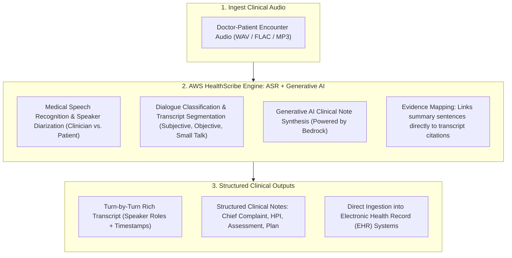
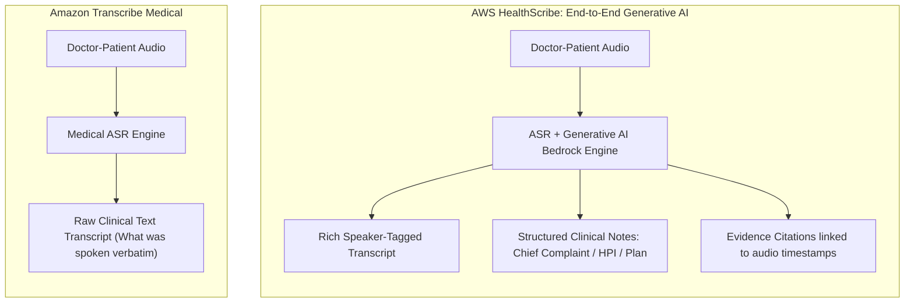
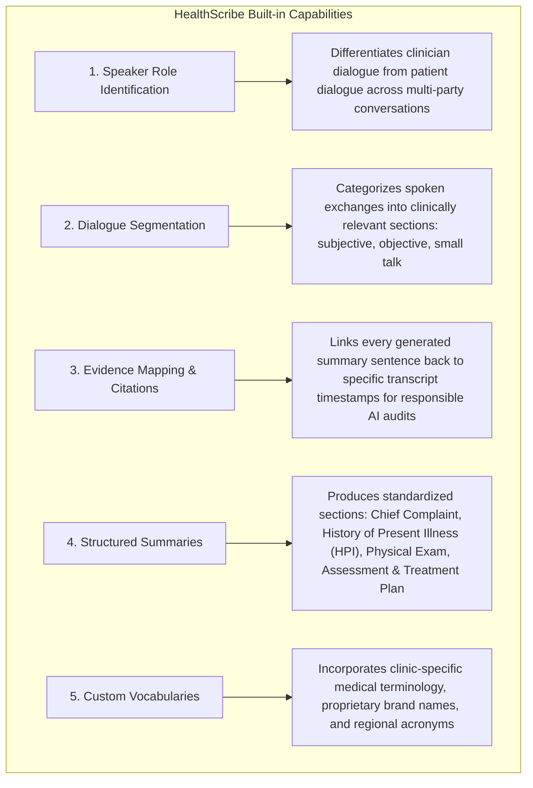
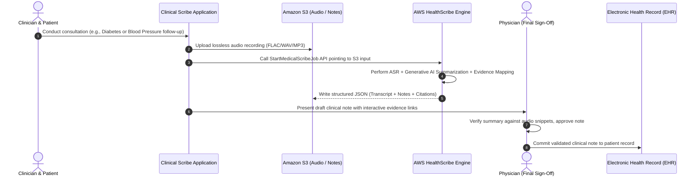
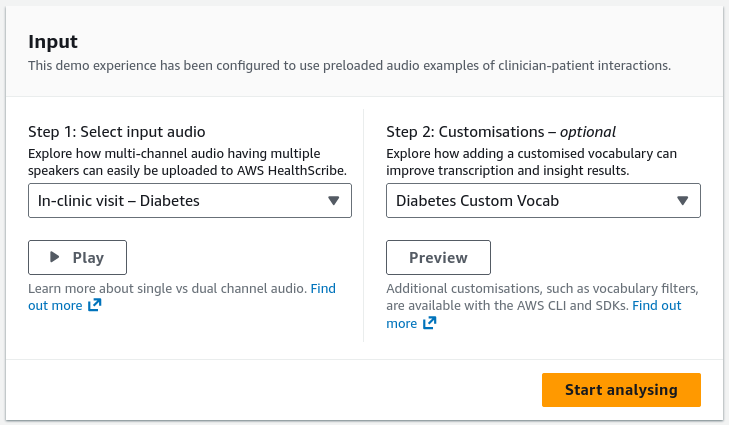
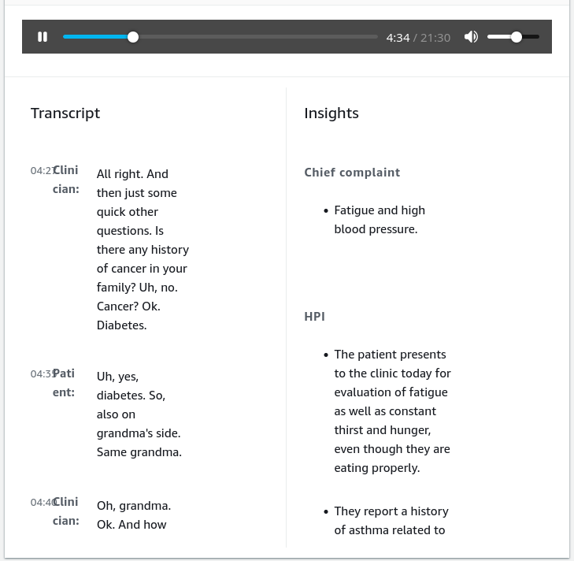

# AWS HealthScribe: Generative AI Clinical Documentation & Consultation Summarization

---

## Key Takeaways

**AWS HealthScribe** is a HIPAA-eligible service that combines **speech recognition (ASR)** and **generative artificial intelligence (GenAI)** to transcribe patient-clinician conversations and automatically generate structured, preliminary clinical notes from a single API call.

Integrated directly within the **Amazon Transcribe** console and API surface (`Transcribe::StartMedicalScribeJob`), HealthScribe identifies speaker roles, classifies dialogue types, extracts medical terms, and generates standardized clinical sections (e.g., **Chief Complaint**, **History of Present Illness (HPI)**, **Assessment**, and **Plan**) with built-in **Evidence Mapping** for clinician verification.

---

## Main Discussion

### The Healthcare AI Evolution: Transcribe Medical vs. HealthScribe

| Dimension                 | Amazon Transcribe Medical                                               | AWS HealthScribe                                                                                                                     |
| ------------------------- | ----------------------------------------------------------------------- | ------------------------------------------------------------------------------------------------------------------------------------ |
| **Primary Technology**    | Deep learning Automatic Speech Recognition (ASR).                       | Speech Recognition combined with **Generative AI Foundation Models**.                                                                |
| **Output Type**           | Verbatim transcript text with timestamps.                               | **Rich speaker transcript + AI-generated structured clinical notes**.                                                                |
| **Clinical Structuring**  | Outputs raw text; requires secondary NLP (Comprehend Medical) to parse. | Automatically generates standardized clinical note sections (**Chief Complaint**, **HPI**, **Assessment**, **Plan**) out of the box. |
| **Evidence Traceability** | No built-in cross-referencing to summary text.                          | **Evidence Mapping:** Cites the exact dialogue transcript lines used to generate each clinical note sentence.                        |
| **Target Use Case**       | Medical dictation, voicemail, transcription.                            | **End-to-end clinical consultation documentation** for EHR integration.                                                              |

---

### Core Architectural Features of AWS HealthScribe

| Feature                         | Operational Mechanism                                                                                                          | Clinical Value                                                                                                           |
| ------------------------------- | ------------------------------------------------------------------------------------------------------------------------------ | ------------------------------------------------------------------------------------------------------------------------ |
| **Speaker Role Identification** | Identifies participant roles (distinguishing clinicians from patients) for up to four speakers in the conversation.            | Accurately assigns symptoms to the patient and medical advice to the clinician.                                          |
| **Dialogue Classification**     | Filters conversational chit-chat / small talk while extracting clinically relevant subjective and objective findings.          | Eliminates conversational noise, creating concise clinical records.                                                      |
| **Evidence Mapping**            | Provides clickable source citations linking every generated summary sentence to its exact location in the original transcript. | Supports responsible AI governance, allowing clinicians to verify draft notes quickly before committing them to the EHR. |
| **Structured Summarization**    | Organizes insights into clinical note formats: Chief Complaint, History of Present Illness (HPI), Assessment, and Plan.        | Saves clinicians hours of manual administrative documentation every day.                                                 |

---

### End-to-End EHR Integration Workflow

#### Input

#### Output

---

## Exam Guide

### Exam Tips

- **Core Trigger:** Choose **AWS HealthScribe** whenever an exam question asks for a HIPAA-eligible service that uses **Generative AI to automatically generate structured clinical notes (Chief Complaint, Assessment, Plan) and consultation transcripts from patient-clinician audio**.
- **Console Location:** HealthScribe is accessed within the **Amazon Transcribe Console**.
- **Evidence Mapping:** If a question asks how clinicians can **verify and audit AI-generated summary sentences by linking them back to the original transcript dialogue**, the answer is **Evidence Mapping**.
- **Service Disambiguation Matrix:**
  - **Amazon Transcribe Medical:** ASR speech-to-text for clinical audio without generative note synthesis.
  - **Amazon Comprehend Medical:** NLP extraction of medical entities (medications, conditions, ICD-10) from pre-existing text.
  - **AWS HealthScribe:** **Unified speech-to-text + Generative AI summarization** producing full clinical visit notes and evidence links from audio in a single workflow.
- **Privacy & Governance:** HealthScribe does **not** use customer audio or transcripts to train base foundation models, encrypts data in transit and at rest, and is fully **HIPAA-eligible**.

---

### Practice Test

#### Question 1

A healthtech provider wants to build an application for primary care clinics that listens to doctor-patient consultations, generates draft clinical notes categorized into Chief Complaint, Assessment, and Plan, and links every generated statement back to the source transcript for doctor verification. The solution must be HIPAA-eligible and require minimal custom machine learning model development. Which AWS service should they use?

- [ ] A. Amazon Rekognition Custom Labels
- [ ] B. AWS HealthScribe
- [ ] C. Amazon Polly Generative Engine
- [ ] D. Amazon Kendra Relevance Tuning

Correct Answer

- [x] B. AWS HealthScribe
  - **Explanation:** **AWS HealthScribe** is a HIPAA-eligible service that combines speech recognition and generative AI to automatically transcribe consultations, generate categorized clinical notes (Chief Complaint, Assessment, Plan), and provide evidence mapping linking summary sentences back to the source transcript.

---

#### Question 2

How does AWS HealthScribe support responsible AI deployment and enable clinicians to verify the accuracy of auto-generated clinical summaries before entering them into an Electronic Health Record (EHR) system?

- [ ] A. By deleting the original audio files immediately after transcription
- [ ] B. Through Evidence Mapping, which provides source citations linking each generated sentence to the corresponding dialogue in the original consultation transcript
- [ ] C. By routing all transcripts to Amazon Mechanical Turk for public crowdsourced review
- [ ] D. By requiring all consultations to be pre-translated using Amazon Translate

Correct Answer

- [x] B. Through Evidence Mapping, which provides source citations linking each generated sentence to the corresponding dialogue in the original consultation transcript
  - **Explanation:** AWS HealthScribe includes **Evidence Mapping**, which provides source citations linking every line of AI-generated clinical summary text back to the exact phrases in the consultation transcript, allowing clinicians to review and verify facts before committing them to the EHR.

---
