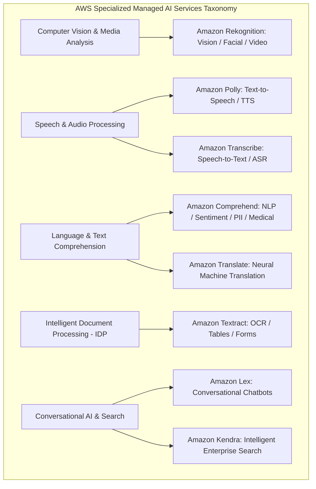
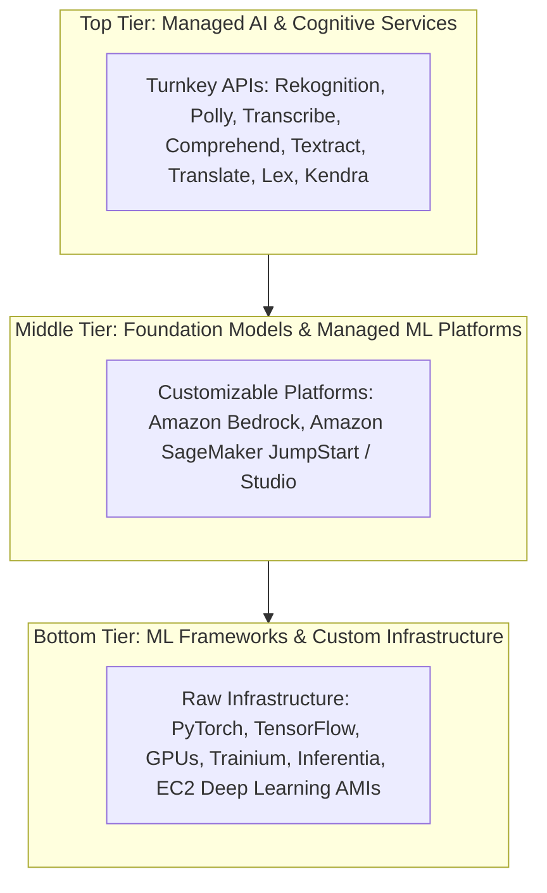
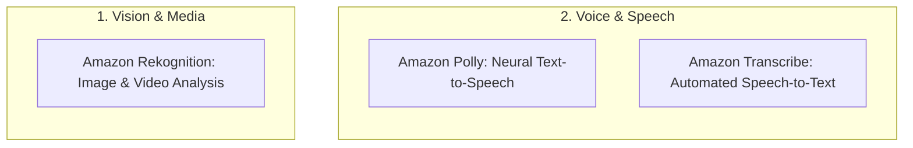
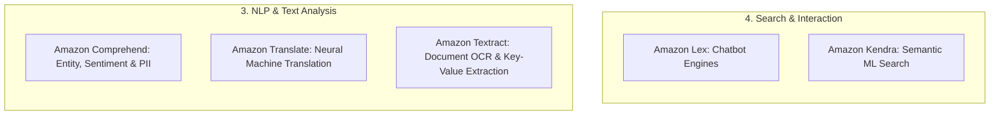

# Section Introduction: AWS Managed AI & Specialized Cognitive Services

---

## Key Takeaways

AWS provides a comprehensive suite of **Managed AI Services** (also called specialized cognitive or higher-level AI services) that predate generative AI foundation model services like Amazon Bedrock.

These services offer **pre-trained, production-ready machine learning capabilities via direct API calls**, requiring **zero machine learning expertise, model training, or infrastructure provisioning**.

On the **AWS Certified AI Practitioner (AIF-C01)** exam, mastering these purpose-built cognitive APIs is critical. Exam questions frequently test your ability to select the right managed service for specific vision, speech, document, or natural language processing requirements rather than building custom models from scratch.

---

## Main Discussion

### The AWS AI/ML Layer Cake: Where Managed AI Services Fit

AWS structures its machine learning ecosystem into three distinct architectural tiers:

| Layer                                 | Target Persona                                     | Operational Responsibility                                                                    | Example AWS Services                                                                                          |
| ------------------------------------- | -------------------------------------------------- | --------------------------------------------------------------------------------------------- | ------------------------------------------------------------------------------------------------------------- |
| **Top Tier: Managed AI Services**     | Application Developers, Software Engineers         | **Zero ML Ops:** Direct REST API integration via AWS SDKs (`boto3`, JavaScript, Java).        | **Amazon Rekognition, Amazon Polly, Amazon Transcribe, Amazon Comprehend, Amazon Textract, Amazon Translate** |
| **Middle Tier: Managed ML Platforms** | Data Scientists, ML Engineers                      | Data labeling, custom model training, hyperparameter optimization, and endpoint hosting.      | **Amazon SageMaker, Amazon Bedrock**                                                                          |
| **Bottom Tier: ML Infrastructure**    | Advanced ML Researchers, Infrastructure Architects | Managing raw compute instances, distributed cluster networking, CUDA drivers, and frameworks. | **EC2 P5/Trn1 instances, Deep Learning Containers (DLC), PyTorch, TensorFlow**                                |

---

### Upcoming Section Roadmap: Domain Breakdown

| Service                | Modality                  | Primary Core Capability                                                                 | Key Business Trigger Words                                                       |
| ---------------------- | ------------------------- | --------------------------------------------------------------------------------------- | -------------------------------------------------------------------------------- |
| **Amazon Rekognition** | Vision / Video            | Image classification, facial recognition, content moderation, PPE detection.            | _"Detect objects in images, inappropriate content, custom visual labels"_        |
| **Amazon Transcribe**  | Speech $\rightarrow$ Text | Automatic Speech Recognition (ASR), speaker diarization, real-time audio transcription. | _"Convert audio recordings to text, identify speakers, transcribe calls"_        |
| **Amazon Polly**       | Text $\rightarrow$ Speech | Synthesizes lifelike speech from text with SSML and Neural TTS voices.                  | _"Convert text articles into natural sounding audio, voice avatars"_             |
| **Amazon Comprehend**  | Text Analytics / NLP      | Extracts entities, key phrases, sentiment, language, and redacts PII.                   | _"Analyze customer review sentiment, extract medical terms, detect PII in text"_ |
| **Amazon Textract**    | Document AI / OCR         | Extracts text, forms, tables, and key-value pairs from scanned PDFs and images.         | _"Extract structured tabular data from invoices, forms, identity cards"_         |
| **Amazon Translate**   | Language Translation      | Fast, high-quality neural machine translation across hundreds of languages.             | _"Translate website content or user queries across multiple languages"_          |
| **Amazon Lex**         | Conversational AI         | Builds conversational interfaces and chatbots using speech-to-text and NLP.             | _"Build a voice/text chatbot, intents, utterances, slots"_                       |
| **Amazon Kendra**      | Enterprise Search         | Highly accurate intelligent enterprise search service powered by machine learning.      | _"Natural language document search across corporate wikis and databases"_        |

---

## Exam Guide

### Exam Tips

- **Managed Services First Strategy:** On the AIF-C01 exam, if a scenario asks to add image recognition, text-to-speech, translation, or document extraction with **minimal operational effort, no ML model training, and fastest time to market**, prioritize **AWS Managed AI Services** over custom Amazon SageMaker models.
- **Service Boundary Disambiguation:**
  - Audio to text $\rightarrow$ **Amazon Transcribe**
  - Text to audio $\rightarrow$ **Amazon Polly**
  - Scanned forms/tables to structured text $\rightarrow$ **Amazon Textract**
  - Text sentiment/entities/PII $\rightarrow$ **Amazon Comprehend**
  - Visual images/videos $\rightarrow$ **Amazon Rekognition**
  - Language-to-language conversion $\rightarrow$ **Amazon Translate**
  - Natural language voice/text bots $\rightarrow$ **Amazon Lex**
- **Custom Labels Capability:** Several of these managed services (e.g., Rekognition Custom Labels, Comprehend Custom Classification) allow lightweight customization using transfer learning without requiring full SageMaker pipeline engineering.

---

### Practice Test

#### Question 1

A media company needs an automated solution to transcribe audio from thousands of recorded customer service phone calls into text transcripts, identify individual speakers in each recording, and redact sensitive personal information. The development team has no data science experience and wants a managed API solution. Which AWS service should they use?

- [ ] A. Amazon SageMaker Training Jobs with PyTorch
- [ ] B. Amazon Transcribe
- [ ] C. Amazon Polly
- [ ] D. Amazon Rekognition

Correct Answer

- [x] B. Amazon Transcribe
  - **Explanation:** **Amazon Transcribe** is a fully managed Automatic Speech Recognition (ASR) service that converts speech to text, includes speaker identification (diarization), and supports automated PII redaction without requiring machine learning model development.

---

#### Question 2

An enterprise architecture team is evaluating options for extracting structured invoice tables and key-value receipt pairs from scanned PDF documents stored in Amazon S3. Which approach adheres to the AWS principle of using purpose-built AI services for lowest operational overhead?

- [ ] A. Train a custom convolutional neural network from scratch on Amazon EC2 GPU instances
- [ ] B. Deploy Amazon Textract to extract tables and key-value forms directly using its pre-trained document analysis APIs
- [ ] C. Use Amazon Comprehend to convert PDF binary files into vector embeddings
- [ ] D. Write custom image edge-detection scripts using Amazon Athena

Correct Answer

- [x] B. Deploy Amazon Textract to extract tables and key-value forms directly using its pre-trained document analysis APIs
  - **Explanation:** **Amazon Textract** is specifically designed for Intelligent Document Processing (IDP), automatically extracting text, tables, and structured form key-value pairs from scanned PDFs and images via pre-trained APIs.

---
