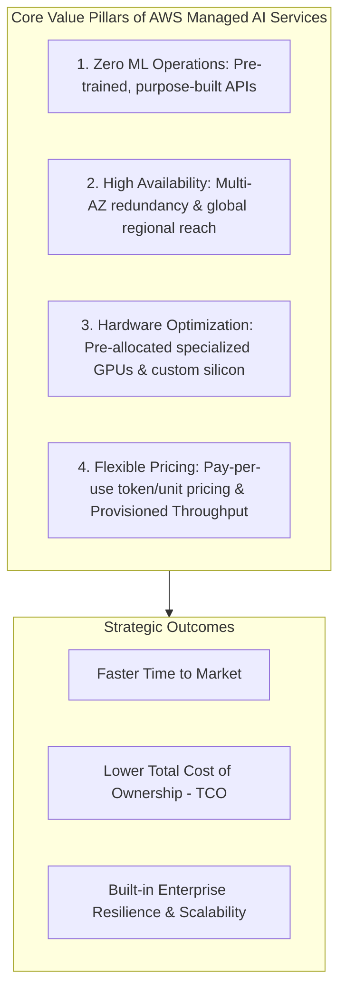
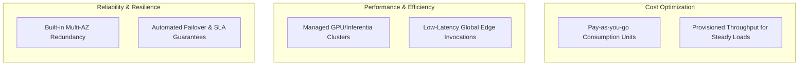
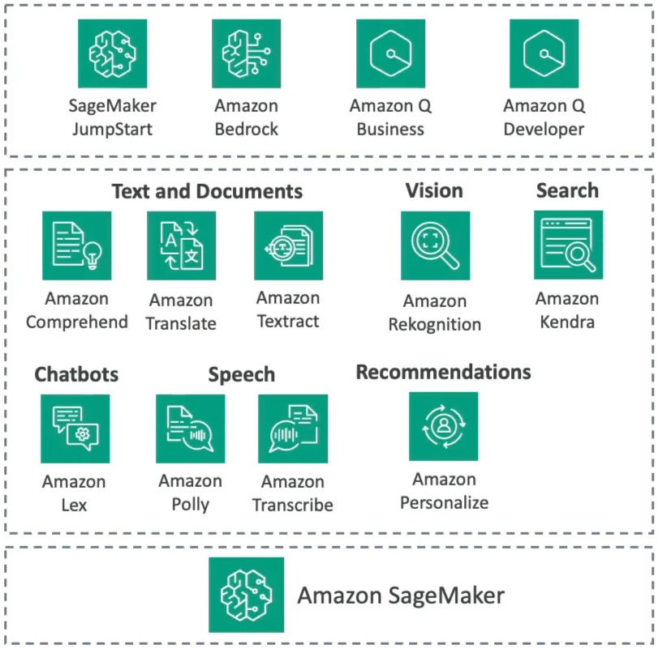

# Architectural Benefits & Business Value of AWS Managed AI Services

---

## Key Takeaways

**AWS Managed AI Services** provide pre-trained, production-ready machine learning capabilities across vision, speech, language, search, and document intelligence. They allow engineering teams to integrate specialized AI capabilities without managing raw compute infrastructure, building training pipelines, or collecting massive training datasets.



Choosing managed services over custom infrastructure on Amazon EC2 or Amazon SageMaker reduces operational complexity, mitigates infrastructure maintenance overhead, and ensures compliance with the **AWS Well-Architected Framework**.

---

## Main Discussion

### The Four Architectural Pillars of AWS Managed AI Services



| Value Dimension                       | Technical Architecture & Implementation                                                                                                                      | Business & Operational Impact                                                                                     |
| ------------------------------------- | ------------------------------------------------------------------------------------------------------------------------------------------------------------ | ----------------------------------------------------------------------------------------------------------------- |
| **High Availability & Redundancy**    | Deployed across multiple Availability Zones (Multi-AZ) within AWS Regions automatically. Handled entirely by AWS without manual load balancer configuration. | Eliminates single points of failure (SPOFs) and provides high SLA availability for production workloads.          |
| **Specialized Hardware Optimization** | Managed endpoints execute on optimized hardware topologies (custom CPUs, NVIDIA Tensor Core GPUs, AWS Inferentia) maintained and patched by AWS.             | Eliminates manual CUDA driver management, host patching, and GPU server provisioning overhead.                    |
| **Pay-Per-Use Unit Pricing**          | Billed strictly per transaction unit (e.g., characters analyzed, audio minutes processed, images scanned, or tokens generated).                              | Zero upfront capital expense (CapEx) and zero idle infrastructure costs during off-peak periods.                  |
| **Provisioned Throughput Option**     | Guarantees dedicated transaction capacity (e.g., transactions per second) under committed provisioned units.                                                 | Provides consistent sub-second latency for predictable enterprise traffic while delivering volume cost discounts. |

---

### Managed Services Ecosystem Map

<div className="grid grid-cols-1 md:grid-cols-3">

<div className="col-span-1 md:col-span-2">
```mermaid
flowchart TD
    subgraph CoreCapabilities [Specialized Cognitive Domains]
        Doc[Document & Text Processing] --> Txt[Amazon Textract: OCR / Forms / Tables]
        Doc --> Comp[Amazon Comprehend: NLP / Sentiment / PII]
        Doc --> Trns[Amazon Translate: Language Translation]

        Vis[Computer Vision] --> Rek[Amazon Rekognition: Objects / Faces / PPE]

        Aud[Speech & Audio] --> Pol[Amazon Polly: Text-to-Speech]
        Aud --> Tra[Amazon Transcribe: Speech-to-Text]

        Int[Search, Chat & Personalization] --> Ken[Amazon Kendra: ML Enterprise Search]
        Int --> Lex[Amazon Lex: Conversational Chatbots]
        Int --> Per[Amazon Personalize: Recommendation Engines]
    end

````
</div>



</div>

---

### Self-Hosted Custom ML vs. Managed AI Services

```mermaid
flowchart TD
    Choice{Evaluate ML Strategy}
    Choice -->|Custom domain-specific logic, bespoke neural architecture| Custom[Amazon SageMaker / EC2 GPU Instances]
    Choice -->|Standard cognitive task: OCR, Speech, Vision, Translation| Managed[AWS Managed AI Services APIs]
````

| Decision Factor          | Self-Hosted / Custom ML (EC2 / SageMaker)                                  | AWS Managed AI Services                                          |
| ------------------------ | -------------------------------------------------------------------------- | ---------------------------------------------------------------- |
| **Operational Overhead** | High (Managing instance pools, autoscaling policies, Docker containers).   | **Zero** (Direct REST API / SDK calls with serverless scaling).  |
| **Data Requirements**    | Requires massive labeled datasets to train and tune custom models.         | **None** (Pre-trained models ready out of the box).              |
| **Billing Structure**    | Continuous hourly instance costs for running instances, plus storage fees. | Pay-per-call consumption (per character, per second, per image). |
| **Time to Market**       | Weeks to months for data prep, training, validation, and deployment.       | **Hours to days** for standard application API integration.      |

---

## Exam Guide

### Exam Tips

- **Default Exam Strategy:** If a scenario describes a standard computer vision, audio processing, document extraction, translation, or search workload and asks for the solution with **least operational overhead, fastest implementation, and lowest maintenance cost**, choose the specialized **AWS Managed AI Service**.
- **Billing Models to Differentiate:**
  - **Pay-as-you-go (Consumption/Token-based):** Best for variable, bursty, or unpredictable workloads to eliminate idle server costs.
  - **Provisioned Throughput:** Best for **steady-state, mission-critical production workloads** that require guaranteed throughput and predictable low latency.
- **Resilience Built-in:** Managed services are natively **Multi-AZ**; you do not need to configure VPC peering, autoscaling groups, or secondary failover instances for services like Rekognition, Polly, or Textract.

---

### Practice Test

#### Question 1

A media startup wants to build a mobile application that automatically generates audio voiceovers from written blog posts. The startup has no machine learning engineers, requires rapid time-to-market, and experiences unpredictable traffic spikes throughout the day. Which approach aligns with AWS best practices for cost and operational efficiency?

- [ ] A. Provision a multi-node Amazon EC2 GPU cluster running a custom open-source speech synthesis model
- [ ] B. Use Amazon Polly with standard pay-as-you-go API calls
- [ ] C. Train a custom diffusion neural network on Amazon SageMaker Training Jobs
- [ ] D. Deploy an Amazon Bedrock custom model import using dedicated Provisioned Throughput

<details>
<summary>Correct Answer</summary>

- [x] B. Use Amazon Polly with standard pay-as-you-go API calls -**Explanation:** **Amazon Polly** is a fully managed, pre-trained Text-to-Speech (TTS) service available via simple API calls. It scales automatically, charges only for characters synthesized without idle instance fees, and requires zero machine learning maintenance.

</details>

---

#### Question 2

An enterprise operates a high-volume customer portal that processes thousands of scanned identity documents per minute during peak business hours. The architecture team needs guaranteed transaction capacity and consistent response times for document text extraction without experiencing throttling. Which purchasing and capacity model meets this requirement?

- [ ] A. Amazon EC2 Spot Instances with custom OCR scripts
- [ ] B. Managed AI Services with Provisioned Throughput
- [ ] C. Amazon S3 Glacier Flexible Retrieval
- [ ] D. AWS Lambda Provisioned Concurrency with local SQLite storage

<details>
<summary>Correct Answer</summary>

- [x] B. Managed AI Services with Provisioned Throughput
  - **Explanation:** For specialized managed AI services (like Amazon Textract or Amazon Bedrock), configuring **Provisioned Throughput** reserves dedicated capacity to ensure consistent performance, prevent rate throttling, and handle steady, high-volume workloads.

</details>

---
