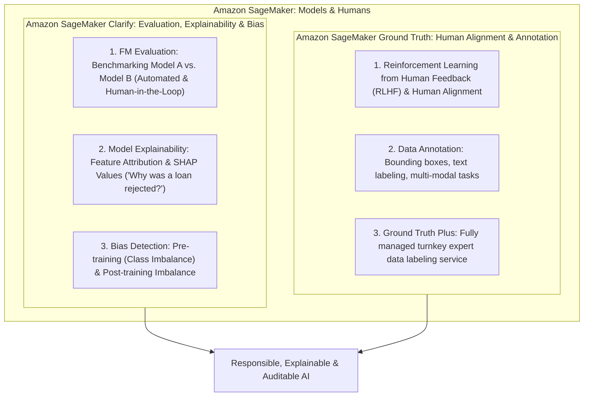
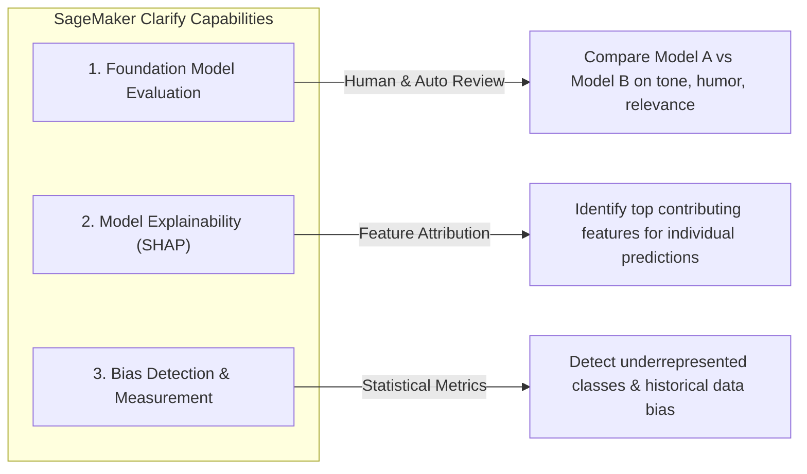
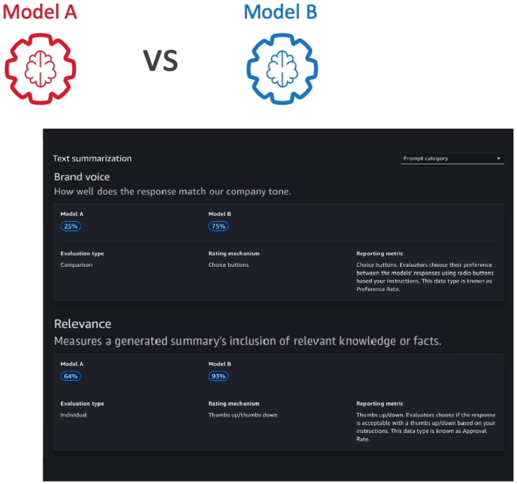
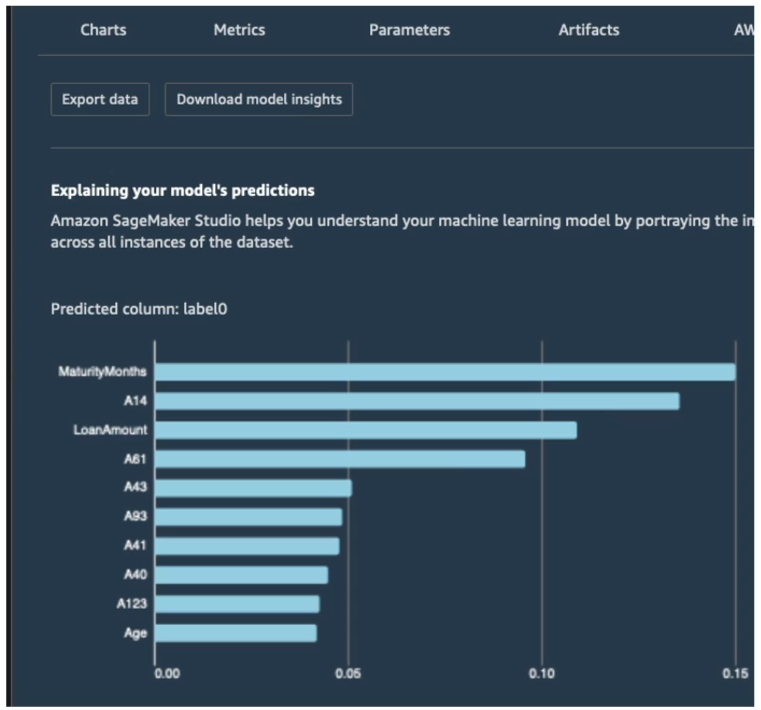
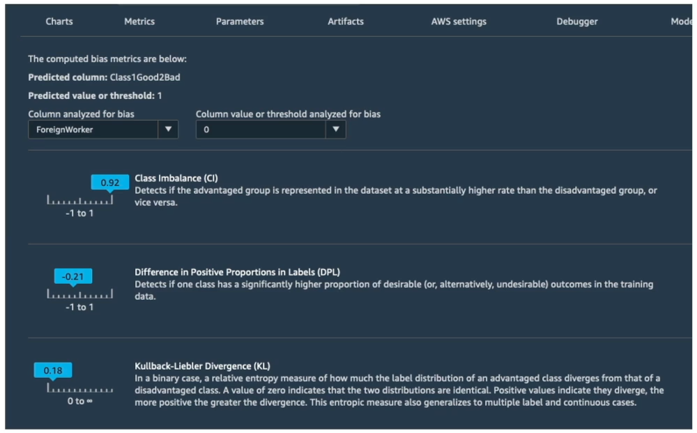
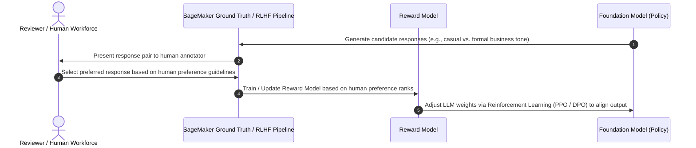
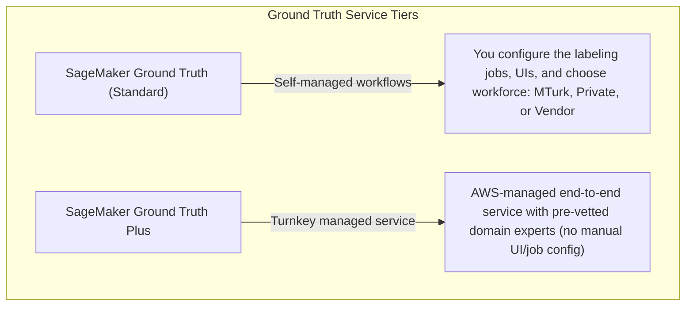
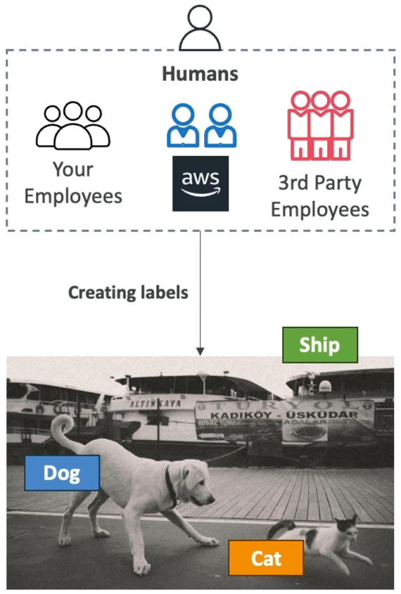

# Amazon SageMaker AI: Models & Humans (SageMaker Clarify & Ground Truth)

---

## Key Takeaways

Integrating human judgment and governance into the AI/ML lifecycle is critical for building trustworthy, aligned, and compliant models. AWS provides two specialized capabilities in **Amazon SageMaker AI** to evaluate models, explain predictions, mitigate bias, and align systems to human preferences: **Amazon SageMaker Clarify** and **Amazon SageMaker Ground Truth**.



- **Amazon SageMaker Clarify:** Provides **Foundation Model (FM) Evaluation** (benchmarking factors like brand voice, friendliness, and relevance with automated metrics or human review teams), **Model Explainability** (feature attribution showing why specific predictions or loan rejections occurred), and **Bias Detection** (measuring class imbalance and statistical disparities across demographic groups).
- **Amazon SageMaker Ground Truth:** Provides data labeling and human alignment workflows, including **Reinforcement Learning from Human Feedback (RLHF)** to align models with human values, and **SageMaker Ground Truth Plus** for a fully managed turnkey labeling service managed by AWS data labeling experts.

---

## Main Discussion

### Amazon SageMaker Clarify: Three Pillars of Responsible AI



#### 1. Foundation Model Evaluation

- **Model vs. Model Comparison:** Evaluates and compares multiple candidate foundation models (e.g., Model A vs. Model B) against standardized or custom datasets.
- **Human-in-the-Loop Evaluation:** When evaluating subjective criteria that cannot be calculated mathematically—such as **brand voice alignment, humor, conversational tone, or friendliness**—Clarify routes evaluation tasks to humans (an AWS-managed review team or your own internal employees).
- **Built-in & Custom Metrics:** Measures automated metrics (accuracy, toxicity, robustness) alongside human evaluations.  
  

#### 2. Model Explainability (Feature Attribution)

- **Demystifying "Black Box" Models:** Clarify uses **Shapley Additive Explanations (SHAP)** to calculate the exact contribution of each input feature to a model's prediction.
- **Auditing Specific Decisions:** Enables organizations to explain individual outcomes (e.g., explaining why an applicant's loan was rejected by highlighting top contributing features like debt-to-income ratio, loan amount, and repayment history).
- **Pre-Deployment & Post-Deployment:** Used during development to debug logic and in production to monitor inference behavior.  
  

#### 3. Bias Detection & Fairness

- **Pre-Training Bias:** Detects disparities and **class imbalances** in historical training datasets before training begins (e.g., substantial underrepresentation of specific age, gender, or geographic groups).
- **Post-Training Bias:** Measures disparities in model predictions across different sub-populations to identify if the trained model disproportionately favors or disadvantages specific groups.  
  

---

### Amazon SageMaker Ground Truth & RLHF

High-quality training data and human preference alignment are essential for generative AI and deep learning architectures:



<div className="grid grid-cols-1 md:grid-cols-3">

<div className="col-span-1 md:col-span-2">


</div>



</div>

| Dimension             | SageMaker Ground Truth (Standard)                                                                                                                                                    | SageMaker Ground Truth Plus                                                                                      |
| --------------------- | ------------------------------------------------------------------------------------------------------------------------------------------------------------------------------------ | ---------------------------------------------------------------------------------------------------------------- |
| **Operational Model** | **Self-Managed:** You create labeling jobs, select/build UI templates, and manage job queues.                                                                                        | **Fully Managed / Turnkey:** AWS ML experts manage the end-to-end labeling workflow and quality assurance.       |
| **Workforce Options** | • **Amazon Mechanical Turk** (500k+ global crowd for public data)<br/>• **Private Workforce** (internal employees for PII/PHI)<br/>• **Vendor Workforce** (AWS Marketplace agencies) | Professional, AWS-managed, pre-vetted domain specialists (e.g., legal, medical, linguistic experts).             |
| **Key Use Cases**     | Bounding box labeling, semantic segmentation, text classification, **RLHF preference ranking**.                                                                                      | High-complexity multi-turn LLM evaluation, custom fine-tuning dataset generation, specialized domain annotation. |

---

### Feature Comparison Matrix

| Capability                      | Primary Tool                    | Core Mechanism                                                                                                 | Target Persona / Scenario                                                                 |
| ------------------------------- | ------------------------------- | -------------------------------------------------------------------------------------------------------------- | ----------------------------------------------------------------------------------------- |
| **Model Explainability**        | **SageMaker Clarify**           | Feature attribution (SHAP values) indicating which variables influenced a specific decision.                   | Compliance officers, risk analysts explaining credit, insurance, or hiring model outputs. |
| **Bias Mitigation**             | **SageMaker Clarify**           | Statistical metrics measuring data representation imbalance and prediction variance across demographic groups. | ML engineers validating dataset fairness before and after model training.                 |
| **Foundation Model Evaluation** | **SageMaker Clarify**           | Automated benchmarks combined with human-in-the-loop review teams for subjective qualities.                    | GenAI teams benchmarking LLM candidates on brand voice and friendliness.                  |
| **Data Annotation**             | **SageMaker Ground Truth**      | Multi-modal human labeling (bounding boxes, keypoints, text classification) with active learning.              | Computer vision and NLP teams preparing raw datasets for initial training.                |
| **Human Preference Alignment**  | **SageMaker Ground Truth**      | Reinforcement Learning from Human Feedback (**RLHF**) ranking pairs to align model behavior.                   | Generative AI engineers steering LLM tone toward enterprise-appropriate responses.        |
| **Managed Data Labeling**       | **SageMaker Ground Truth Plus** | End-to-end turnkey service staffed by AWS-managed subject matter experts.                                      | Enterprise teams needing high-quality labeled data without managing labeling pipelines.   |

---

## Exam Guide

### Exam Tips

- **Explainability Trigger:** Whenever an exam scenario asks how to **explain why a model made a specific prediction (feature attribution / SHAP values)** or audit a rejected loan application, choose **Amazon SageMaker Clarify**.
- **Bias Detection Trigger:** When a question describes detecting **class imbalance in training datasets** or monitoring demographic bias in predictions, choose **Amazon SageMaker Clarify**.
- **Foundation Model Subjective Evaluation:** If a company needs to evaluate foundation models on **human-centric, subjective factors like brand voice, humor, or friendliness**, the answer is **SageMaker Clarify using human review teams**.
- **RLHF & Human Alignment:** When an exam question mentions **Reinforcement Learning from Human Feedback (RLHF)** to align an LLM with human preferences and enterprise tone, select **Amazon SageMaker Ground Truth**.
- **Ground Truth vs. Ground Truth Plus:**
    - **SageMaker Ground Truth:** Self-managed labeling jobs using MTurk, Private, or Vendor teams.
    - **SageMaker Ground Truth Plus:** Fully managed, turnkey data labeling service staffed by AWS-managed domain experts.

---

### Practice Test

#### Question 1

A financial institution develops an automated credit risk scoring model on Amazon SageMaker. Regulatory compliance mandates that the bank provide loan applicants with clear explanations detailing the primary input features that contributed to an adverse lending decision. Which Amazon SageMaker capability should the bank implement?

- [ ] A. Amazon SageMaker Feature Store
- [ ] B. Amazon SageMaker Clarify (Model Explainability)
- [ ] C. Amazon SageMaker Ground Truth Plus
- [ ] D. Amazon SageMaker Data Wrangler

<details>
<summary>Correct Answer</summary>

- [x] B. Amazon SageMaker Clarify (Model Explainability)
  - **Explanation:** **Amazon SageMaker Clarify** provides **model explainability** using feature attribution (SHAP values) to identify and quantify the impact of individual features on specific predictions (such as loan approvals or rejections).

</details>

---

#### Question 2

An enterprise is evaluating three foundation models to power a corporate customer service assistant. The team needs to evaluate subjective qualities—such as whether each model's tone matches the company's formal brand voice—using feedback from internal customer support staff. Which AWS service capability supports this evaluation?

- [ ] A. Amazon Rekognition Custom Labels
- [ ] B. Amazon SageMaker Clarify Foundation Model Evaluation with a human review workforce
- [ ] C. Amazon Textract AnalyzeID
- [ ] D. Amazon Polly Speech Marks

<details>
<summary>Correct Answer</summary>

- [x] B. Amazon SageMaker Clarify Foundation Model Evaluation with a human review workforce
  - **Explanation:** **Amazon SageMaker Clarify** supports **Foundation Model Evaluation with human-in-the-loop workforces** (such as internal employees), allowing teams to evaluate qualitative, subjective factors like brand voice, friendliness, and tone.

</details>

---

```
