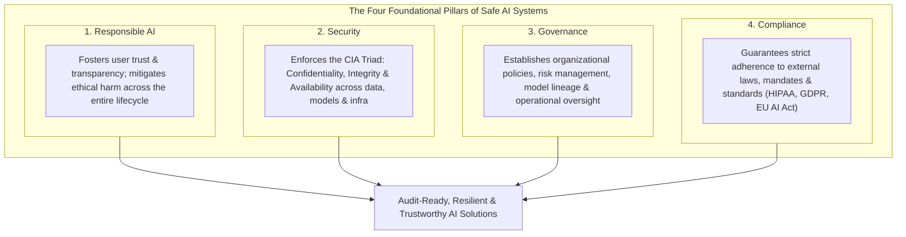
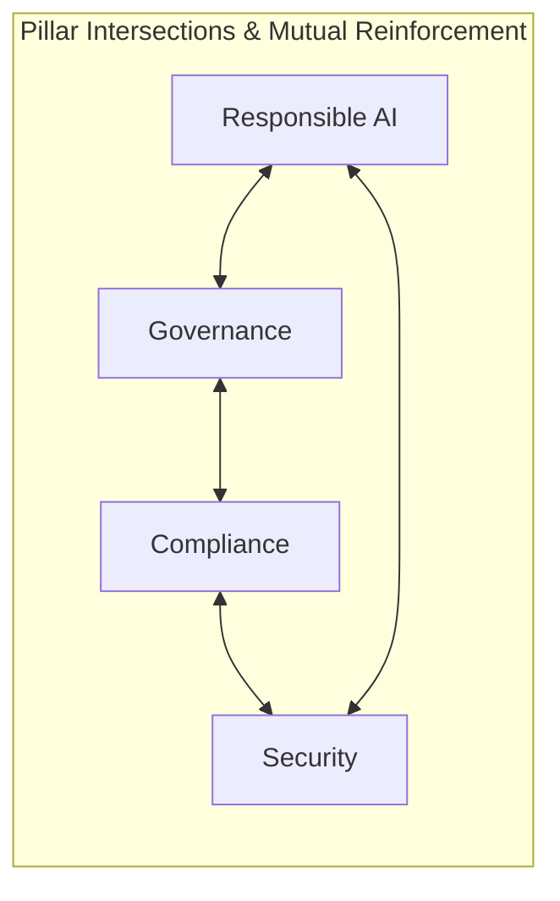
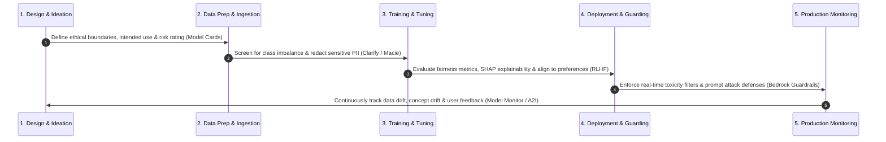
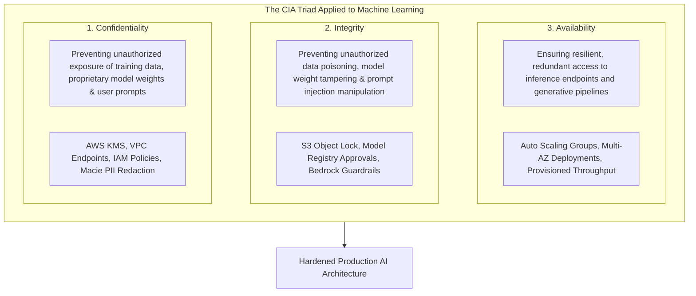

# AI Challenges and Responsibilities: Responsible AI, Security, Governance & Compliance Overview

---

## Key Takeaways

Enterprise AI deployments require a multi-layered framework balancing innovation with safety, regulatory alignment, and risk management. This section synthesizes four foundational pillars: **Responsible AI**, **Security**, **Governance**, and **Compliance**.

While these domains have distinct formal definitions, they exhibit substantial operational overlap. Together, they form the core of **Domain 4 (Guidelines for Responsible AI)** and **Domain 5 (Security, Compliance, and Governance for AI Solutions)** on the **AWS Certified AI Practitioner (AIF-C01)** exam.

---

## Main Discussion

### The Four Pillars of Trustworthy AI

| Pillar                | Strategic Objective                                                                                                  | Core Scope & Lifecycle Focus                                                                                             | Key AWS Implementation Mechanisms                                                                                                                |
| --------------------- | -------------------------------------------------------------------------------------------------------------------- | ------------------------------------------------------------------------------------------------------------------------ | ------------------------------------------------------------------------------------------------------------------------------------------------ |
| **1. Responsible AI** | Fosters transparency and trust while preventing bias, toxicity, and unintended societal harm.                        | Applied continuously across **design, development, deployment, monitoring, and evaluation**.                             | **Amazon SageMaker Clarify** (bias/explainability), **Guardrails for Amazon Bedrock** (content safety), **SageMaker Model Evaluation**.          |
| **2. Security**       | Protects AI infrastructure, model weights, training pipelines, and data stores from unauthorized access and attacks. | Enforces the **CIA Triad** (Confidentiality, Integrity, Availability) on data at rest, in transit, and during inference. | **AWS KMS** (encryption), **AWS IAM** (least-privilege access), **Amazon VPC / PrivateLink**, **SageMaker Network Isolation**.                   |
| **3. Governance**     | Manages business risk, establishes accountability, defines approval gates, and ensures operational value.            | Establishes organizational policies, model factsheets, operational monitoring, and persona-based access controls.        | **SageMaker Model Cards** (documentation), **SageMaker Model Dashboard**, **SageMaker Model Registry** (approvals), **SageMaker Role Manager**.  |
| **4. Compliance**     | Adheres to legal statutes, industry standards, and regulatory frameworks governing sensitive data.                   | Audits workloads against requirements in regulated industries (healthcare, banking, government).                         | **AWS Artifact** (compliance reports), **AWS CloudTrail** (auditing), **Amazon Macie** (PII discovery), **HIPAA / SOC / ISO** eligible services. |

---

### Responsible AI Throughout the End-to-End ML Lifecycle

Responsible AI is not a single post-deployment gate; it requires continuous controls throughout every phase:

1. **Design & Scope:** Define acceptable use boundaries, business goals, and document potential failure modes in **SageMaker Model Cards**.
2. **Data Preparation:** Audit datasets for demographic imbalances and historical disparities; identify and sanitize sensitive PII/PHI.
3. **Training & Validation:** Run algorithmic fairness metrics, generate SHAP feature attribution explainability reports, and align model outputs with human preferences via **Reinforcement Learning from Human Feedback (RLHF)**.
4. **Deployment & Runtime:** Place real-time safety guardrails to intercept prompt injections, jailbreaks, and sensitive data leakage.
5. **Production Monitoring:** Continuously audit live inference logs for model degradation, concept drift, and data distribution shifts over time via **SageMaker Model Monitor**.

---

### Understanding the CIA Triad in AI Architectures

- **Confidentiality:** Ensures proprietary training datasets, customer prompts, and embeddings are accessible only to authorized identities using encryption at rest (KMS) and in transit (TLS).
- **Integrity:** Guarantees that datasets remain untampered with (preventing training data poisoning) and that outputs cannot be manipulated through adversarial jailbreaking.
- **Availability:** Ensures that inference endpoints and foundation model APIs remain operational and resilient under heavy traffic bursts using auto-scaling and multi-Availability Zone configurations.

---

## Exam Guide

### Exam Tips

- **Domain Overview Mapping:**
  - **Responsible AI:** Fairness, bias mitigation, explainability, safety guardrails, and transparency across the entire lifecycle.
  - **Security:** Enforcing **Confidentiality, Integrity, and Availability (CIA Triad)** across data, models, and cloud infrastructure.
  - **Governance:** Organizational policies, risk management, model documentation (Model Cards), and approval workflows.
  - **Compliance:** Conforming to external legal statutes and industry standards (e.g., HIPAA for healthcare, PCI-DSS for finance, GDPR for privacy).
- **Lifecycle Breadth:** Responsible AI must be practiced across **all five stages**: Design $\rightarrow$ Development $\rightarrow$ Deployment $\rightarrow$ Monitoring $\rightarrow$ Evaluation.
- **Shared Responsibility Context:** In AI, AWS manages the security and compliance of the underlying cloud and managed service infrastructure, while the customer is responsible for configuring access permissions, protecting their data, and ensuring responsible use of models.

---

### Practice Test

#### Question 1

An enterprise is designing a corporate Generative AI policy. The leadership team wants to ensure that all AI initiatives adhere to ethical guidelines, maintain transparency with customers, mitigate potential demographic biases, and evaluate risks across design, development, and production monitoring. Which core domain does this framework represent?

- [ ] A. Infrastructure Virtualization
- [ ] B. Guidelines for Responsible AI
- [ ] C. Hyperparameter Optimization
- [ ] D. High Performance Computing (HPC)

Correct Answer

- [x] B. Guidelines for Responsible AI
  - **Explanation:** **Responsible AI** encompasses the ethical frameworks, transparency practices, bias mitigation, and risk management strategies applied across the entire AI lifecycle (design, build, deploy, monitor, and evaluate).

---

#### Question 2

A financial institution is deploying a credit evaluation model on AWS. The security team must ensure that unauthorized users cannot inspect customer financial records (Confidentiality), malicious actors cannot modify training labels in Amazon S3 (Integrity), and loan officers experience zero downtime when querying live endpoints (Availability). Which foundational security framework are they applying?

- [ ] A. The CRISP-DM Process
- [ ] B. The CIA Triad
- [ ] C. The Pareto Principle
- [ ] D. The ROC Curve

Correct Answer

- [x] B. The CIA Triad
  - **Explanation:** The **CIA Triad** is a foundational security model that ensures **Confidentiality** (preventing unauthorized access), **Integrity** (preventing unauthorized alteration), and **Availability** (ensuring reliable access to systems).

---
