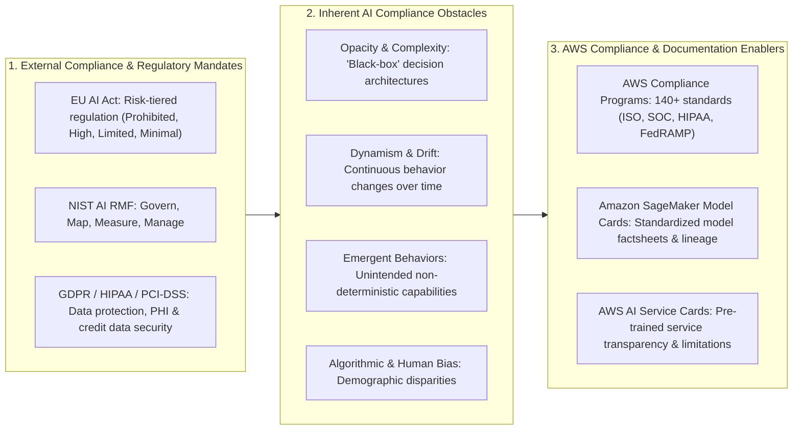
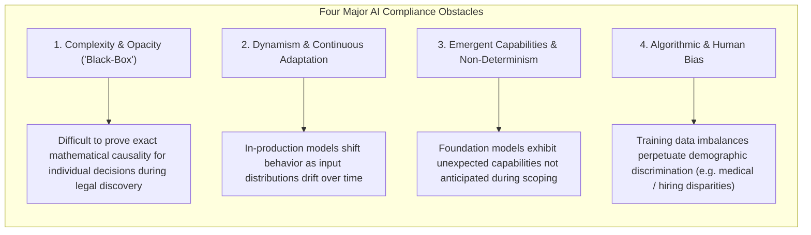
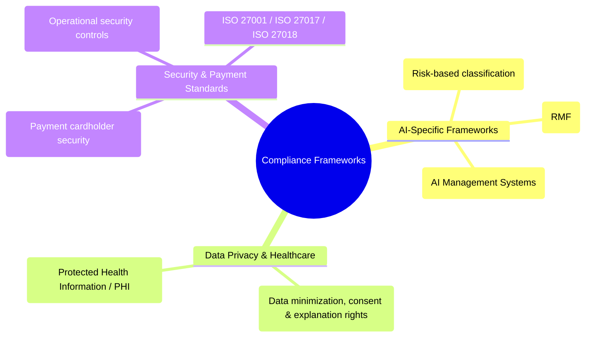
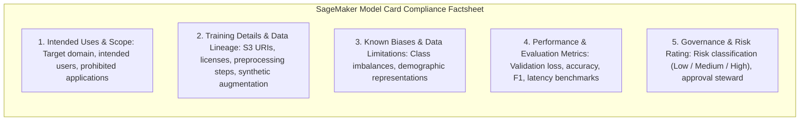
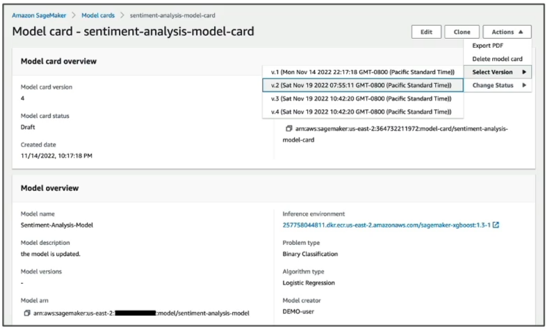

# Compliance for AI: Regulatory Frameworks, Audit Challenges & Lineage Documentation

---

## Key Takeaways

**AI Compliance** requires organizations in regulated industries (such as financial services, healthcare, aerospace, and public sector) to ensure that machine learning systems adhere to legal statutes, regulatory requirements, and international security standards.

- **Core AI Compliance Challenges:** Auditing AI systems is uniquely difficult due to **opacity/complexity** (black-box neural networks), **dynamism/drift** (models changing over time), **emergent capabilities**, and **systemic bias** (both historical data bias and developer bias).
- **Global Regulatory Landscapes:** Prominent frameworks include the **EU Artificial Intelligence Act (EU AI Act)**, the **NIST AI Risk Management Framework (NIST AI RMF)**, **ISO/IEC 42001**, **GDPR**, **HIPAA**, and **PCI-DSS**.
- **Compliance on AWS:** AWS maintains over 140 compliance accreditations for underlying infrastructure, while offering **Amazon SageMaker Model Cards** (for customer model lineage and training factsheets) and **AWS AI Service Cards** (for AWS-managed service transparency) to satisfy audit requirements.

---

## Main Discussion

### The Inherent Challenges of AI Compliance

Traditional software validation relies on deterministic code paths and predictable execution rules. Machine learning compliance introduces distinct verification hurdles:

| Challenge                    | Root Cause                                                                                                                                          | Regulatory Consequence                                                                                                  |
| ---------------------------- | --------------------------------------------------------------------------------------------------------------------------------------------------- | ----------------------------------------------------------------------------------------------------------------------- |
| **Opacity & Complexity**     | Multi-billion parameter weights make internal tracing impractical.                                                                                  | Violates transparency and "right to explanation" mandates in credit, insurance, and judicial scoring.                   |
| **Dynamism & Drift**         | Real-world consumer behavior evolves, causing input data to diverge from training baselines.                                                        | A model deemed compliant at launch may violate accuracy or fairness thresholds months later.                            |
| **Emergent Capabilities**    | Foundation models trained on vast web corpora exhibit unforeseen functional capabilities.                                                           | Exposes organizations to unauthorized tasks, safety risks, or accidental policy violations.                             |
| **Algorithmic & Human Bias** | Historical training data reflects historical human bias or class underrepresentation (e.g., medical imagery predominantly featuring male subjects). | Violates anti-discrimination laws and equal protection mandates (e.g., Fair Housing Act, Equal Credit Opportunity Act). |

---

### Global Regulatory Standards & Compliance Frameworks

| Compliance Framework                           | Jurisdiction / Scope                     | Primary AI Relevance                                                                                                                                                                                                                                                                                                                                  |
| ---------------------------------------------- | ---------------------------------------- | ----------------------------------------------------------------------------------------------------------------------------------------------------------------------------------------------------------------------------------------------------------------------------------------------------------------------------------------------------- |
| **EU Artificial Intelligence Act (EU AI Act)** | European Union (Extraterritorial impact) | Establishes a **risk-based regulatory framework**: • _Unacceptable Risk:_ Prohibited (e.g., social scoring). • _High Risk:_ Strict compliance, logging, risk management, and human oversight (e.g., hiring, medical devices, critical infrastructure). • _Limited/Minimal Risk:_ Transparency obligations (e.g., disclosing AI chatbots). |
| **NIST AI Risk Management Framework (AI RMF)** | United States / Global Standard          | A voluntary guidance framework organized into four core functions: **Govern, Map, Measure, and Manage** AI risks.                                                                                                                                                                                                                                     |
| **ISO/IEC 42001**                              | International Standard                   | The certifiable international standard establishing requirements for an **Artificial Intelligence Management System (AIMS)**.                                                                                                                                                                                                                         |
| **GDPR**                                       | European Union                           | Enforces data minimization, purpose limitation, the right to erasure ("right to be forgotten"), and restrictions on automated profiling without human intervention.                                                                                                                                                                                   |
| **HIPAA**                                      | United States (Healthcare)               | Governs the handling, storage, and processing of Protected Health Information (PHI).                                                                                                                                                                                                                                                                  |
| **PCI-DSS**                                    | Global (Financial Transactions)          | Governs the secure processing and transmission of credit card and cardholder account data.                                                                                                                                                                                                                                                            |

---

### Compliance Implementation: Shared Responsibility & Model Cards

Under the **AWS Shared Responsibility Model for Compliance**, AWS provides compliance certifications for its physical data centers, networking, and managed AI services, while customers must ensure that their custom datasets, training pipelines, and applications meet industry regulations.

#### Documenting AI Lineage for Audits

- **Amazon SageMaker Model Cards:** Standardized digital artifacts that capture model lineage, training datasets, license compliance, evaluation metrics, and risk ratings into an auditable document.  
  
- **AWS AI Service Cards:** Public documentation provided by AWS for pre-trained AI services (e.g., Amazon Rekognition, Amazon Textract) that outline intended use cases, operating boundaries, and fairness design choices.
- **AWS Artifact:** A centralized AWS console portal providing on-demand access to AWS security and compliance reports (e.g., SOC reports, ISO certifications, BAA agreements).

---

## Exam Guide

### Exam Tips

- **AI Audit Challenges:** Be prepared to identify why AI compliance is unique: **algorithmic opacity ("black box"), temporal drift, emergent capabilities, and historical data bias**.
- **Model Cards vs. Service Cards:**
  - **Amazon SageMaker Model Cards:** Customer-created compliance factsheets documenting custom ML model details (intended use, training datasets, licenses, evaluation metrics, and risk ratings).
  - **AWS AI Service Cards:** AWS-published transparency factsheets detailing the scope, limitations, and responsible design of AWS-managed AI services.
- **Major Framework Identification:**
  - **EU AI Act:** Landmark European legislation categorizing AI applications by risk tiers (Unacceptable, High, Limited, Minimal).
  - **NIST AI RMF:** US framework centered on Govern, Map, Measure, and Manage functions.
  - **HIPAA:** US healthcare standard for Protected Health Information (PHI).
  - **PCI-DSS:** Global security standard for credit cardholder data.
- **Shared Responsibility for AI Compliance:** AWS certifies its cloud infrastructure and managed AI services; the customer is responsible for auditing custom training data, model outputs, and end-user compliance.

---

### Practice Test

#### Question 1

A multinational enterprise is building a credit scoring machine learning model and must prepare for an external regulatory compliance audit. The compliance officers require a single, standardized document containing details on the model's intended use, training dataset origins, data licensing, risk level, and quantitative evaluation metrics. Which AWS feature directly provides this standardized documentation?

- [ ] A. Amazon SageMaker Model Cards
- [ ] B. AWS HealthScribe
- [ ] C. Amazon Polly Speech Marks
- [ ] D. Amazon Comprehend Custom Lexicons

Correct Answer

- [x] A. Amazon SageMaker Model Cards
  - **Explanation:** **Amazon SageMaker Model Cards** are standardized, centralized governance documents that record critical details about a machine learning model—including intended use, data lineage, licenses, risk ratings, and evaluation metrics—to support auditing and compliance requirements.

---

#### Question 2

An AI governance lead is reviewing global regulatory standards for high-risk generative AI applications. Which framework is a comprehensive, risk-tiered European Union regulation that categorizes AI systems into distinct risk levels (such as Unacceptable Risk and High Risk) and enforces strict transparency and oversight mandates?

- [ ] A. PCI-DSS
- [ ] B. EU Artificial Intelligence Act (EU AI Act)
- [ ] C. Amazon EC2 Service Level Agreement (SLA)
- [ ] D. AWS Acceptable Use Policy

Correct Answer

- [x] B. EU Artificial Intelligence Act (EU AI Act)
  - **Explanation:** The **EU Artificial Intelligence Act (EU AI Act)** is the landmark European Union regulation that classifies AI systems by risk tier (Unacceptable, High, Limited, Minimal Risk) and establishes strict transparency, documentation, and compliance obligations.

---
