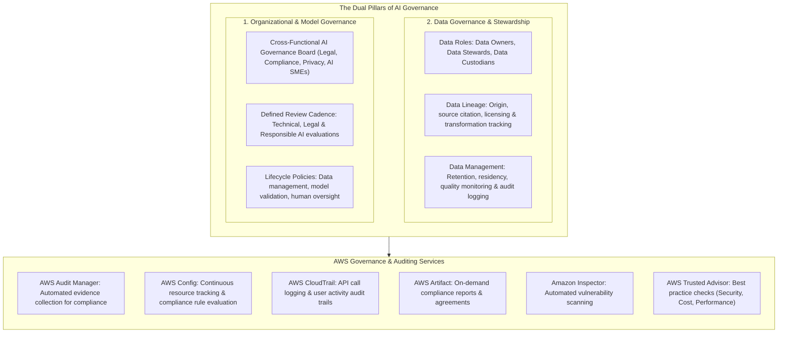
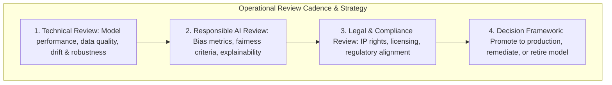
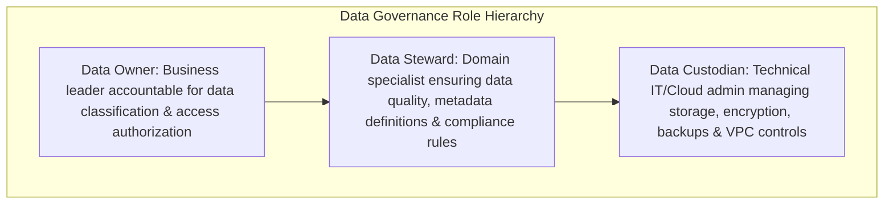
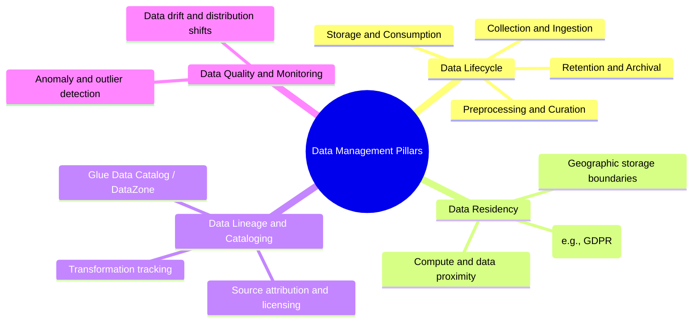
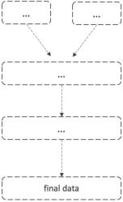
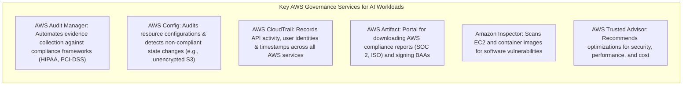

# AI Governance & Data Governance Strategies: Frameworks, Roles, Data Lineage & AWS Services

---

## Key Takeaways

**AI Governance** establishes organizational structures, policies, accountability mechanisms, and operational controls to manage risk, ensure regulatory alignment, and maintain public trust across the entire AI lifecycle.

- **Organizational Structures:** Establishes cross-functional governance committees involving legal, privacy, compliance, and AI subject matter experts (SMEs).
- **Data Governance & Roles:** Assigns explicit data responsibilities across **Data Owners** (business accountability), **Data Stewards** (quality and policies), and **Data Custodians** (technical implementation).
- **Data Lineage & Provenance:** Tracks data origin, source attribution, licenses, transformations, and feature cataloging.
- **AWS Governance Tooling:** Core services including **AWS Audit Manager**, **AWS Config**, **AWS CloudTrail**, **AWS Artifact**, **Amazon Inspector**, and **AWS Trusted Advisor** automate evidence collection, resource auditing, and compliance verification.

---

## Main Discussion

### Organizational AI Governance Framework

1. **AI Governance Board:** A multidisciplinary steering committee composed of legal counsel, compliance officers, data privacy leaders, and AI engineers responsible for policy enforcement, risk tiering, and sign-offs.
2. **Review Cadence:** Scheduled reviews (e.g., monthly or quarterly) combining technical validation (accuracy, latency, drift), ethical assessments (fairness, bias, explainability), and legal checks (copyright, licensing terms).
3. **Transparency & Feedback Channels:** Publishing model documentation (Model Cards) and establishing direct mechanisms for users and stakeholders to report inaccuracies or ethical concerns.
4. **Workforce Enablement:** Continuous training programs on bias mitigation, prompt security, and regulatory policies.

---

### Data Governance Strategy & Stewardship Roles

| Governance Role    | Primary Function & Responsibility                                                                                                                | Example Actions                                                                                                                |
| ------------------ | ------------------------------------------------------------------------------------------------------------------------------------------------ | ------------------------------------------------------------------------------------------------------------------------------ |
| **Data Owner**     | High-level business accountability for a specific data domain. Determines data classification, sensitivity levels, and approves access policies. | Defines whether customer transaction data can be used for foundation model fine-tuning.                                        |
| **Data Steward**   | Operational custodian of data quality, metadata cataloging, and policy adherence. Bridges business rules and technical implementation.           | Catalogs feature definitions in **SageMaker Feature Store**; audits training datasets for missing values and class imbalances. |
| **Data Custodian** | Technical administrator responsible for the physical storage, transmission, encryption, and operational maintenance of datasets.                 | Configures **AWS KMS** encryption keys, S3 lifecycle policies, and VPC endpoint access controls.                               |

---

### Core Data Management Concepts for AI

- **Data Lineage & Provenance:** Documenting where datasets originate, how they were transformed, what licenses apply (e.g., open-source vs. commercial), and how they flow into training pipelines.  
  
- **Data Residency:** Storing and processing data within specific geographic boundaries to satisfy sovereign regulatory laws (e.g., GDPR data localization mandates) and reducing latency by co-locating compute and storage.
- **Data Retention & Archival:** Balancing compliance audit requirements (retaining training sets for reproducibility) against cloud storage costs and "right to be forgotten" regulations.
- **Data Logging & Auditability:** Capturing input payloads, prediction outputs, and system invocations for ongoing compliance reviews.

---

### AWS Governance & Compliance Toolset

| AWS Service             | Primary Governance Role                                                                                  | AI / ML Specific Use Case                                                                          |
| ----------------------- | -------------------------------------------------------------------------------------------------------- | -------------------------------------------------------------------------------------------------- |
| **AWS Audit Manager**   | Automates continuous evidence collection to assess compliance with regulations.                          | Gathers audit evidence for HIPAA or NIST AI RMF compliance on SageMaker pipelines.                 |
| **AWS Config**          | Evaluates resource configurations against defined compliance rules and tracks configuration history.     | Flags S3 buckets holding training data if encryption is disabled or public access is granted.      |
| **AWS CloudTrail**      | Records API calls, user identities, source IPs, and timestamps across an AWS account.                    | Audits who invoked a SageMaker endpoint, modified a Model Card, or launched a training job.        |
| **AWS Artifact**        | Self-service portal for accessing AWS compliance reports, certifications, and agreements.                | Downloads SOC/ISO reports or signs a Business Associate Addendum (BAA) for HIPAA compliance.       |
| **Amazon Inspector**    | Automated vulnerability management that scans compute instances and container images for software flaws. | Scans custom SageMaker training and inference Docker containers for known CVE vulnerabilities.     |
| **AWS Trusted Advisor** | Provides best practice recommendations across security, fault tolerance, cost, and performance.          | Identifies idle SageMaker endpoints or unattached EBS volumes to optimize AI infrastructure spend. |

---

## Exam Guide

### Exam Tips

- **Data Governance Roles (High Probability):**
  - **Data Owner:** Accountable for business value, data classification, and access authorization.
  - **Data Steward:** Responsible for data quality, business metadata, and compliance enforcement.
  - **Data Custodian:** Technical admin managing storage, encryption, backups, and networking.
- **Data Lineage & Provenance:** Identifying where data came from, which licenses apply, and how transformations altered features before model training.
- **AWS Governance Service Mapping:**
  - **AWS Audit Manager:** Continuous, automated compliance evidence collection.
  - **AWS Config:** Tracking resource configurations, historical changes, and policy compliance.
  - **AWS CloudTrail:** Logging _who did what, when, and from where_ via API call records.
  - **AWS Artifact:** Accessing official AWS audit reports and executing legal compliance agreements (e.g., HIPAA BAA).
  - **AWS Trusted Advisor:** Guidance for cost optimization, security posture, performance, and service limits.
- **Data Residency:** Storing and processing data in specific AWS Regions to comply with local geographic and legal restrictions.

---

### Practice Test

#### Question 1

An enterprise is preparing for an external regulatory compliance audit of its automated underwriting system on AWS. The compliance officer needs to continuously collect evidence showing that Amazon S3 storage buckets containing training data are encrypted and that model deployment pipelines adhere to internal security controls. Which AWS service automates this evidence collection process?

- [ ] A. AWS Audit Manager
- [ ] B. Amazon Polly Speech Marks
- [ ] C. Amazon Rekognition Custom Labels
- [ ] D. AWS HealthScribe Evidence Mapping

Correct Answer

- [x] A. AWS Audit Manager
  - **Explanation:** **AWS Audit Manager** continuously and automatically collects evidence across AWS resources to help organizations assess compliance with industry standards, regulations, and internal governance policies.

---

#### Question 2

In an enterprise data governance framework for machine learning, which role is primarily responsible for ensuring data quality, defining business metadata, auditing dataset class balances, and ensuring that datasets adhere to organizational data policies?

- [ ] A. Data Custodian
- [ ] B. Data Steward
- [ ] C. Network Administrator
- [ ] D. Cloud Financial Analyst

Correct Answer

- [x] B. Data Steward
  - **Explanation:** The **Data Steward** is responsible for day-to-day data governance operations, including managing data quality, metadata definitions, dataset profiling, and enforcing data compliance standards across business and AI use cases.

---
