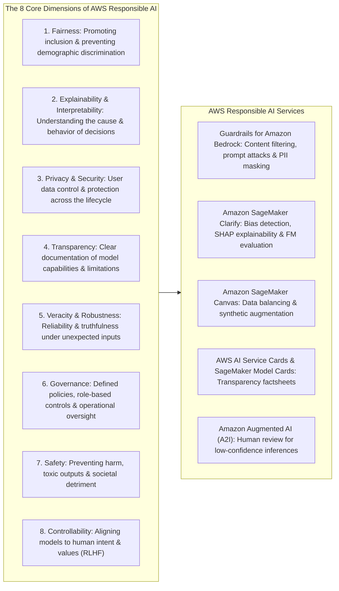
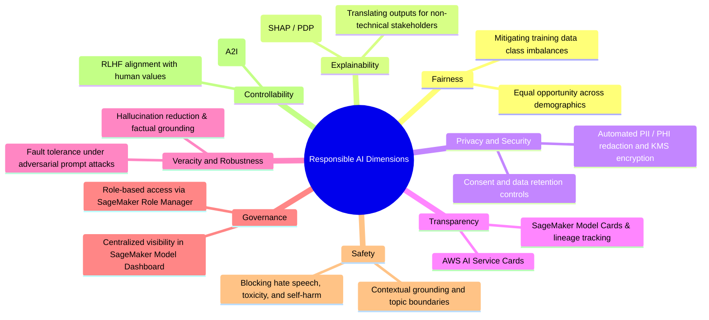
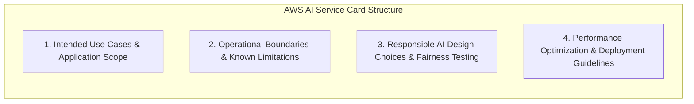
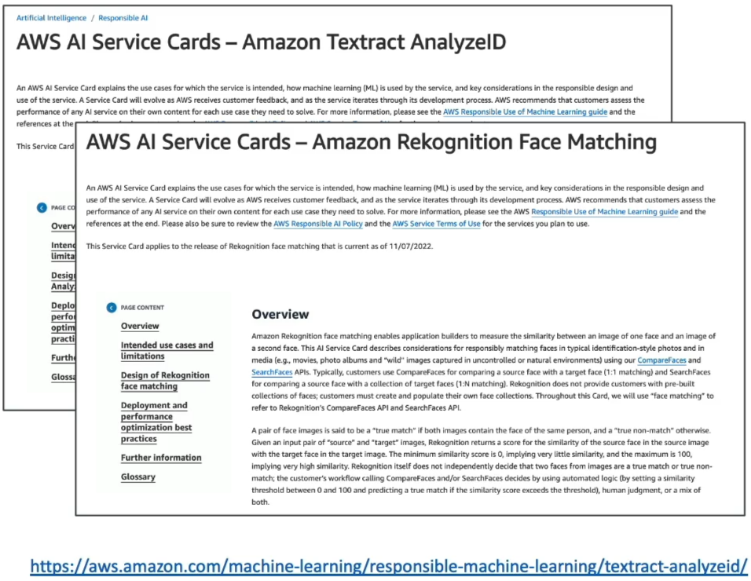
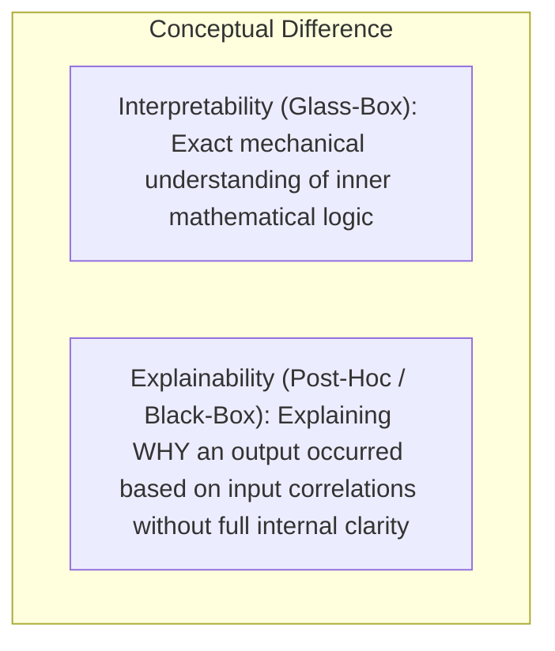
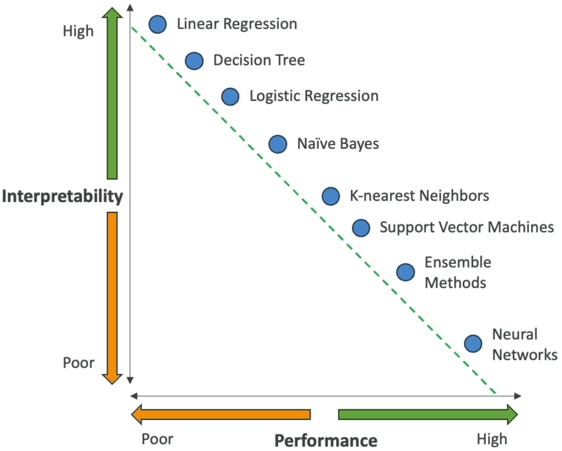
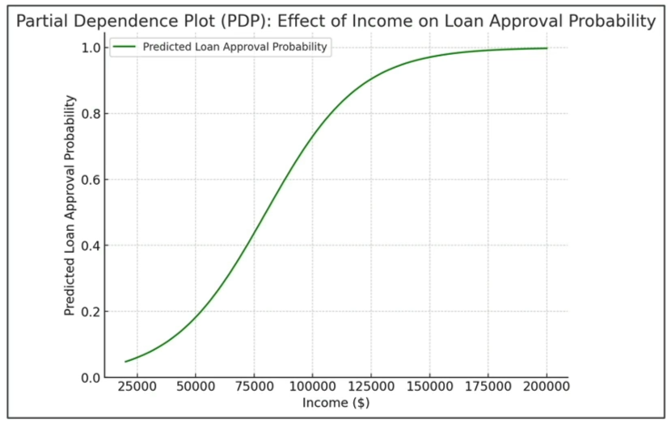
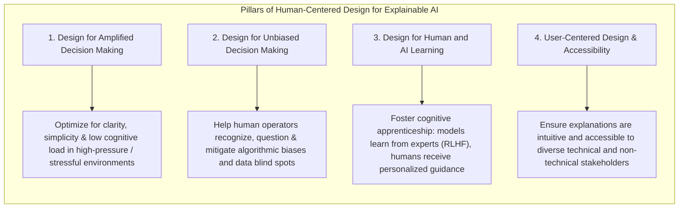

# Guidelines for Responsible AI: Core Dimensions, Interpretability vs. Explainability & Human-Centered Design

---

## Key Takeaways

**Responsible AI** is a systematic approach to designing, developing, deploying, and operating artificial intelligence systems in a manner that is ethical, fair, transparent, secure, and beneficial to individuals and society.



The AWS Responsible AI framework establishes eight core pillars: **Fairness**, **Explainability**, **Privacy & Security**, **Transparency**, **Veracity & Robustness**, **Governance**, **Safety**, and **Controllability**. Implementing these dimensions relies on targeted tools—such as **Guardrails for Amazon Bedrock** (runtime filtering), **SageMaker Clarify** (bias and feature attribution), **AWS AI Service Cards** (transparency documentation), and **Human-Centered Design for Explainable AI (HCD-XAI)** principles.

---

## Main Discussion

### The 8 Core Dimensions of Responsible AI



| Dimension                 | Definition & Ethical Objective                                                                                          | AWS Implementation / Service                                                                                       |
| ------------------------- | ----------------------------------------------------------------------------------------------------------------------- | ------------------------------------------------------------------------------------------------------------------ |
| **Fairness**              | Ensuring systems treat all individuals equitably, mitigating algorithmic discrimination and group disparities.          | **SageMaker Clarify** (pre/post-training bias metrics); **SageMaker Canvas** (data augmentation and rebalancing).  |
| **Explainability**        | Providing clear, understandable reasons for why a model reached a specific output or classification.                    | **SageMaker Clarify** (SHAP values), **Partial Dependence Plots (PDP)**.                                           |
| **Privacy & Security**    | Giving users control over their data while safeguarding systems against unauthorized leakage and tampering.             | **Guardrails for Amazon Bedrock** (PII redaction), **AWS KMS**, **Amazon Macie**, **SageMaker Network Isolation**. |
| **Transparency**          | Documenting model capabilities, intended use cases, operating boundaries, and testing limitations.                      | **AWS AI Service Cards** (for AWS managed AI services), **SageMaker Model Cards** (for custom models).             |
| **Veracity & Robustness** | Guaranteeing that outputs are factually accurate, reproducible, and resilient against unexpected or adversarial inputs. | **RAG architectures**, **Bedrock Model Evaluation**, **SageMaker Model Monitor**.                                  |
| **Governance**            | Defining organizational accountability, compliance approval gates, and persona-based access controls.                   | **SageMaker Role Manager**, **SageMaker Model Dashboard**, **SageMaker Model Registry**.                           |
| **Safety**                | Ensuring AI outputs are harmless, non-toxic, and beneficial to users and society.                                       | **Guardrails for Amazon Bedrock** (content filters, word filters, prompt attack shields).                          |
| **Controllability**       | Empowering human operators to steer, guide, and override model behaviors to align with organizational intent.           | **SageMaker Ground Truth** (RLHF), **Amazon Augmented AI (A2I)**.                                                  |

---

### AWS AI Service Cards: Transparency Factsheets

AWS publishes public **AWS AI Service Cards** for pre-trained AI services (e.g., Amazon Rekognition, Amazon Textract, Amazon Polly, Amazon Nova):



- **Purpose:** Provides enterprise transparency into how AWS builds, evaluates, and tests its pre-trained services.
- **Core Content:** Summarizes intended applications, data limitations, ethical boundaries, performance optimization practices, and responsible design trade-offs.
- **Disambiguation:** **AWS AI Service Cards** are created by AWS for _AWS-managed AI services_, while **Amazon SageMaker Model Cards** are created by _customers to document their own custom-built models_.



---

### Interpretability vs. Explainability & The Trade-off Spectrum



<div className="grid grid-cols-1 md:grid-cols-3 gap-x-3">
<div className="md:col-span-2">
```mermaid
flowchart LR
    subgraph TradeoffSpectrum [The Interpretability vs. Performance Trade-off]
        direction LR
        L1["Linear / Logistic Regression"] --> L2["Decision Trees"]
        L2 --> L3["Random Forests / SVMs"]
        L3 --> L4["Deep Neural Networks / LLMs"]
    end

    subgraph Axes [Trade-off Direction]
        direction TB
        HighInt["High Interpretability / Lower Predictive Capacity on Complex Patterns"]
        HighPerf["High Predictive Performance / Black-Box Complexity (Low Interpretability)"]
    end

````
</div>


</div>

| Model Architecture              | Interpretability Level    | Performance Complexity                      | Practical Understanding                                                                                                                           |
| ------------------------------- | ------------------------- | ------------------------------------------- | ------------------------------------------------------------------------------------------------------------------------------------------------- |
| **Linear Regression**           | **Very High (Glass Box)** | Low (Assumes linearity)                     | Predictions follow a direct linear formula: $y = mx + b$. High transparency.                                                                      |
| **Decision Trees**              | **High**                  | Moderate (Prone to overfitting if unpruned) | Follows explicit conditional if-then branching rules (e.g., `Income > $50k AND Credit == Good`).                                                  |
| **Deep Neural Networks / LLMs** | **Low (Black Box)**       | **Very High**                               | Millions/billions of non-linear parameter weights make exact internal tracing impractical; requires post-hoc explainability methods (SHAP / PDP). |

---

### Explainability Techniques: Decision Trees & Partial Dependence Plots (PDP)

#### 1. Decision Trees (High Native Interpretability)

A supervised learning structure that splits data into transparent branches using deterministic feature rules:

```mermaid
graph TD
    Root{"Annual Income"}
    Root -->|< $20,000| HighRisk["High Default Risk (Reject)"]
    Root -->|$20,000 - $50,000| MidBranch{"Credit History"}
    Root -->|> $50,000| LowRisk["Low Default Risk (Approve)"]

    MidBranch -->|Bad / Unknown| ModRisk["Moderate Risk (Manual Review)"]
    MidBranch -->|Good| LowRisk2["Low Default Risk (Approve)"]
````

#### 2. Partial Dependence Plots (PDP)

A visualization tool used to explain complex, black-box models (such as Gradient Boosted Trees or Deep Neural Networks):

<div className="grid grid-cols-1 md:grid-cols-3">
<div className="md:col-span-2">
```mermaid
flowchart LR
    PDP_Step1["Select Single Target Feature (e.g., Income)"] --> PDP_Step2["Vary Target Feature across range while holding all other features constant"]
    PDP_Step2 --> PDP_Step3["Plot marginal impact on predicted outcome (e.g., Loan Approval Probability)"]
```
</div>



</div>

- **Mechanism:** Isolates one feature, varies its values across a spectrum while holding all other features static, and plots the marginal effect on the prediction.
- **Insight:** Reveals non-linear relationships—for example, showing that loan approval probability increases sharply as income rises from $50k to $125k, but plateaus beyond $125k.

---

### Human-Centered Design for Explainable AI (HCD-XAI)

Human-Centered Design (HCD) focuses on designing AI explanations and interfaces around human cognitive needs, trust, and practical usability:



1. **Amplified Decision Making:** In time-critical or high-stress environments (e.g., emergency medical diagnosis, aviation, fraud triage), explanations must prioritize simplicity and actionable clarity over raw statistical complexity to prevent cognitive overload.
2. **Unbiased Decision Making:** Systems should present alternative hypotheses or confidence distributions, prompting human reviewers to exercise critical judgment rather than blindly trusting automated outputs.
3. **Co-Learning & Cognitive Apprenticeship:** Establishes bidirectional learning where human domain experts refine AI models via feedback loops (RLHF) while the AI provides personalized, adaptive insights to upskill human operators.
4. **User-Centered Accessibility:** Ensures explanation artifacts are tailored to the consumer's role—providing business-oriented summaries for loan applicants and statistical attribution metrics for compliance auditors.

---

## Exam Guide

### Exam Tips

- **The 8 Dimensions of Responsible AI:** Memorize the core pillars: **Fairness, Explainability, Privacy & Security, Transparency, Veracity & Robustness, Governance, Safety, and Controllability**.
- **Interpretability vs. Explainability:**
  - **Interpretability:** The degree to which a human can inspect and understand the exact inner mathematical workings of a model (e.g., Linear Regression, simple Decision Trees).
  - **Explainability:** Methods that explain _why_ a complex, black-box model (e.g., Deep Neural Networks) made a specific prediction based on input-output relationships (e.g., SHAP feature attribution, Partial Dependence Plots).
- **The Performance vs. Interpretability Trade-Off:** High-performing models (deep neural nets, foundation models) inherently have lower native interpretability, requiring post-hoc explainability tooling.
- **AWS AI Service Cards vs. SageMaker Model Cards:**
  - **AWS AI Service Cards:** Public documentation provided by AWS detailing the intended use, limitations, and responsible design of _AWS-managed AI services_ (Rekognition, Textract, Polly).
  - **SageMaker Model Cards:** Governance documents created by customers to track metadata, lineage, and evaluation metrics for _custom-trained models_.
- **Partial Dependence Plot (PDP) Trigger:** A graphical technique that shows the marginal effect of **one feature on the predicted outcome while holding all other features constant**.
- **Human-Centered Design (HCD) Focus:** Designing AI explanations with simplicity and clarity to amplify human decision-making and reduce cognitive overload in high-pressure environments.

---

### Practice Test

#### Question 1

A financial technology company is deploying a machine learning model to predict loan approvals. The risk compliance team requires an explanation method that shows how changes in an applicant's annual income affect the predicted approval probability across a wide salary spectrum, while keeping all other financial variables constant. Which explainability technique should the data science team use?

- [ ] A. Partial Dependence Plot (PDP)
- [ ] B. Reinforcement Learning from Human Feedback (RLHF)
- [ ] C. Amazon Polly Custom Lexicon
- [ ] D. AWS HealthScribe Evidence Mapping

<details>
<summary>Correct Answer</summary>

- [x] A. Partial Dependence Plot (PDP)
  - **Explanation:** A **Partial Dependence Plot (PDP)** is an explainability technique that shows the marginal effect of a single target feature (such as income) on the predicted outcome of a machine learning model while holding all other features constant.

</details>

---

#### Question 2

A developer is evaluating Amazon Rekognition and Amazon Textract for an enterprise document workflow. The company's compliance team requests official AWS documentation that outlines the intended use cases, operating limitations, responsible AI design choices, and deployment best practices for these AWS-managed services. Which resource should the developer reference?

- [ ] A. AWS AI Service Cards
- [ ] B. SageMaker Clarify Bias Reports
- [ ] C. Amazon Bedrock Custom Guardrails
- [ ] D. AWS CloudTrail Audit Logs

<details>
<summary>Correct Answer</summary>

- [x] A. AWS AI Service Cards
  - **Explanation:** **AWS AI Service Cards** are public transparency resources provided by AWS that document the intended use cases, known limitations, responsible design choices, and deployment recommendations for AWS-managed AI services.

</details>

---
