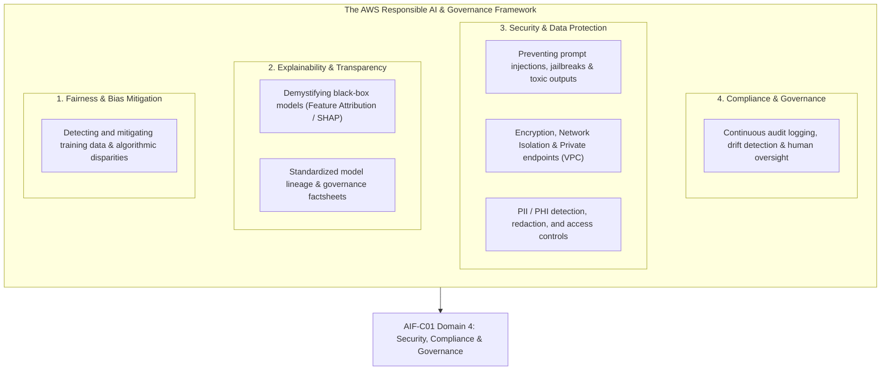
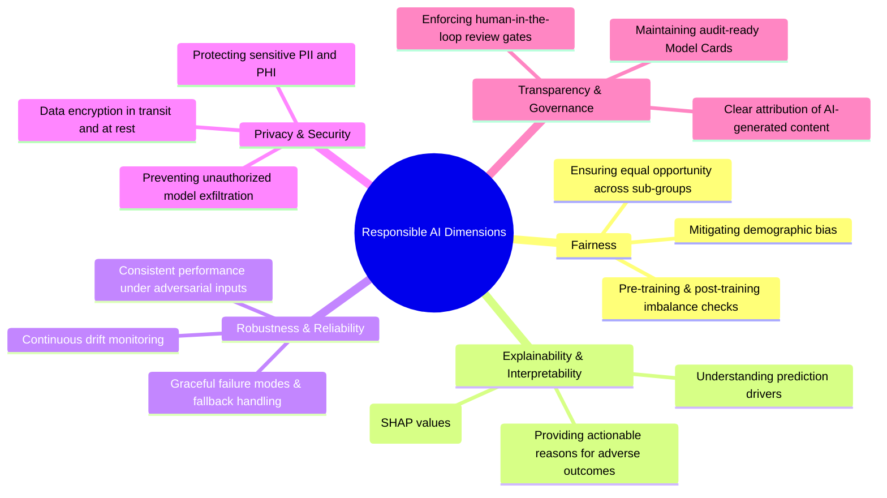
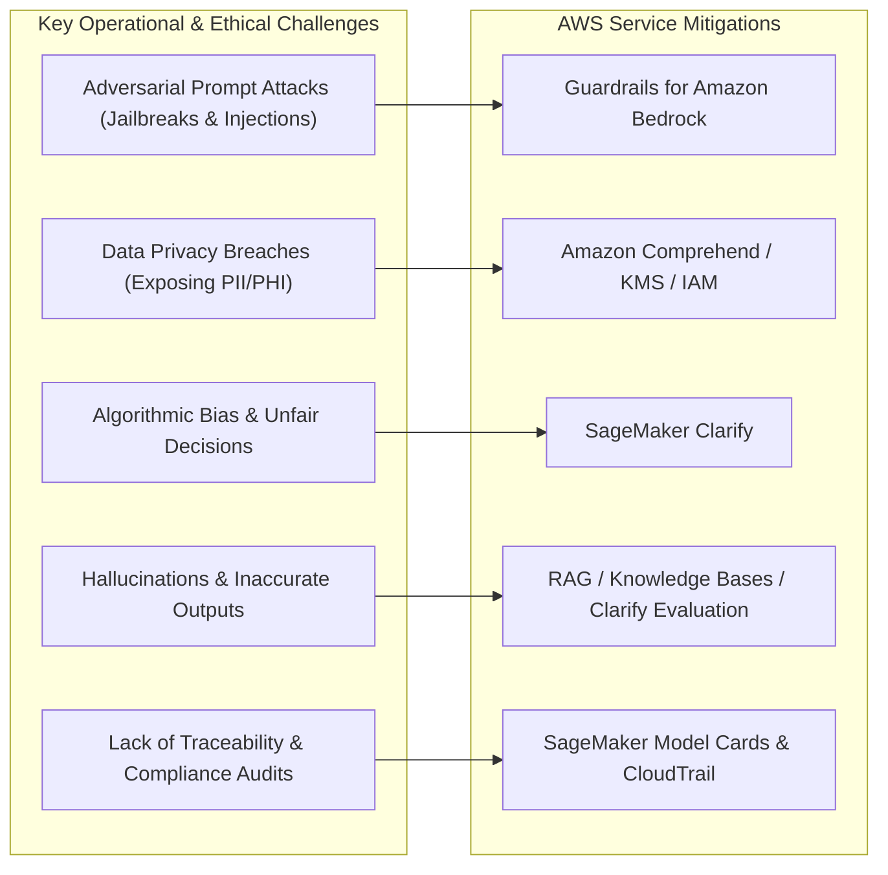

# AI Challenges & Responsibilities: Section Architecture, Responsible AI Frameworks & Governance Scope

---

## Key Takeaways

As artificial intelligence and foundation models scale across enterprise applications, organizations must establish clear boundaries to ensure deployments remain **ethical, fair, transparent, secure, and compliant**.

For the **AWS Certified AI Practitioner (AIF-C01)** exam, Domain 4 (_Security, Compliance, and Governance for AI Solutions_) and Domain 5 (_Responsible AI_) represent a major scoring weight. You must understand the core dimensions of Responsible AI, how to guard against adversarial threats (such as prompt injections and jailbreaks), how to enforce data privacy (PII/PHI masking), and which AWS governance services (Guardrails, Clarify, Model Cards, Audit Manager) enforce ethical boundaries.

---

## Main Discussion

### The Core Dimensions of Responsible AI

| Responsible AI Dimension        | Core Principle                                                                                      | Primary AWS Implementation / Tool                                                                                 |
| ------------------------------- | --------------------------------------------------------------------------------------------------- | ----------------------------------------------------------------------------------------------------------------- |
| **Fairness & Bias**             | Systems should treat all demographic and user groups equitably without systemic prejudice.          | **Amazon SageMaker Clarify** (pre-training and post-training bias metrics).                                       |
| **Explainability**              | Predictions and decisions must be interpretable and justifiable to humans.                          | **Amazon SageMaker Clarify** (SHAP feature attribution), **Amazon Bedrock Model Evaluation**.                     |
| **Safety & Controllability**    | Foundation models must prevent toxic responses, hate speech, and harmful content generation.        | **Guardrails for Amazon Bedrock**, **Amazon Rekognition Content Moderation**.                                     |
| **Privacy & Data Protection**   | User data, confidential intellectual property, and PII/PHI must be secured and redacted.            | **Amazon Comprehend / Comprehend Medical** (PII/PHI redaction), **AWS KMS** encryption, **Amazon VPC endpoints**. |
| **Robustness & Security**       | Systems must withstand adversarial attacks (e.g., prompt injections, jailbreaking, data poisoning). | **Guardrails for Amazon Bedrock** (Prompt Attack Filters), **SageMaker Network Isolation**.                       |
| **Transparency & Auditability** | Model origins, intended uses, limitations, and decision logs must be fully documented.              | **Amazon SageMaker Model Cards**, **Amazon SageMaker Model Dashboard**, **AWS CloudTrail**.                       |

---

### Key AI Challenges Addressed in this Section

1. **Adversarial Risks & Prompt Attacks:** Users attempting to override model system prompts or induce harmful outputs through jailbreaking and indirect prompt injections.
2. **Data Privacy & Leakage:** Preventing training datasets or live prompts from inadvertently exposing customer PII, Protected Health Information (PHI), or proprietary trade secrets.
3. **Model Hallucinations & Factual Inaccuracy:** Managing probabilistic models that generate plausible-sounding but factually incorrect assertions.
4. **Algorithmic Disparity & Bias:** Preventing historical societal biases present in training corpora from perpetuating unfair automated credit, hiring, or medical decisions.
5. **Regulatory Compliance & Lineage:** Meeting legal requirements (such as the EU AI Act, HIPAA, GDPR, and NIST AI Risk Management Framework) through structured documentation and operational tracking.

---

## Exam Guide

### Exam Tips

- **Domain Weighting:** Responsible AI, Governance, and Security account for significant scoring on the **AIF-C01** exam. Expect scenario questions that test your ability to balance innovation with safety, compliance, and privacy.
- **Core Terminology Disambiguation:**
  - **Fairness / Bias:** Quantified using statistical parity and disparity metrics in **SageMaker Clarify**.
  - **Explainability:** Answering _why_ a model made a decision using **SHAP values** in **SageMaker Clarify**.
  - **Safety & Guardrails:** Blocking toxic topics, hate speech, and prompt injections at runtime using **Guardrails for Amazon Bedrock**.
- **Governance Documentation:** Storing standardized metadata, intended use, and risk profiles in **SageMaker Model Cards**.
- **Responsible AI Lifecycle Integration:** Responsible AI is not an afterthought or a single post-deployment step; it must be applied across **data collection, training evaluation, inference guarding, and continuous monitoring**.

---

### Practice Test

#### Question 1

An enterprise is designing a corporate Generative AI assistant using Large Language Models on AWS. The Chief Information Security Officer (CISO) requires that the solution prevent toxic content generation, protect against prompt injection attacks, and redact customer Personally Identifiable Information (PII) before responses reach end users. Which AWS feature provides a unified mechanism to implement these safety controls?

- [ ] A. Amazon SageMaker JumpStart
- [ ] B. Guardrails for Amazon Bedrock
- [ ] C. Amazon Polly Custom Lexicons
- [ ] D. AWS HealthScribe

Correct Answer

- [x] B. Guardrails for Amazon Bedrock
  - **Explanation:** **Guardrails for Amazon Bedrock** provides comprehensive safety controls for generative AI applications, including customizable content filters for hate speech/toxicity, prompt attack filters (preventing prompt injection/jailbreaks), and automated PII masking.

---

#### Question 2

According to AWS Responsible AI principles, which dimension focuses on ensuring that machine learning models provide interpretable insights into the specific input features that influenced an algorithmic outcome?

- [ ] A. Sustainability
- [ ] B. Explainability and Interpretability
- [ ] C. Model Quantization
- [ ] D. High Availability

Correct Answer

- [x] B. Explainability and Interpretability
  - **Explanation:** **Explainability and Interpretability** is the Responsible AI dimension dedicated to understanding, explaining, and justifying algorithmic predictions (e.g., using feature attribution to understand why a loan was approved or rejected).

---
