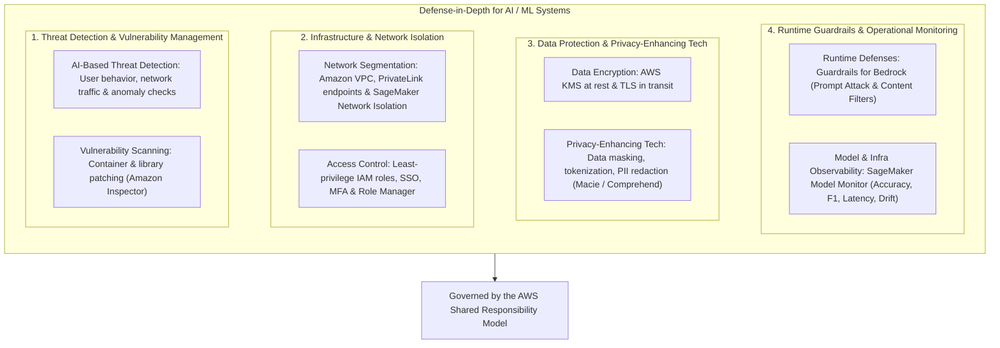
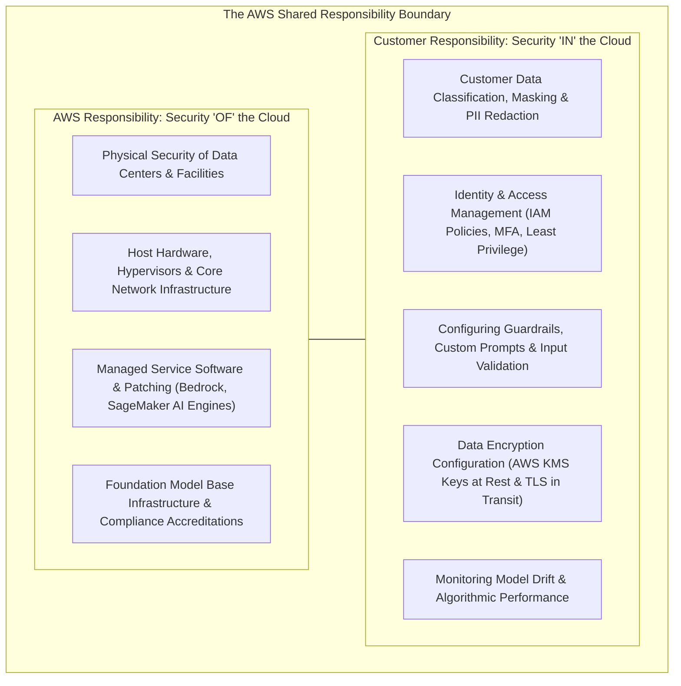
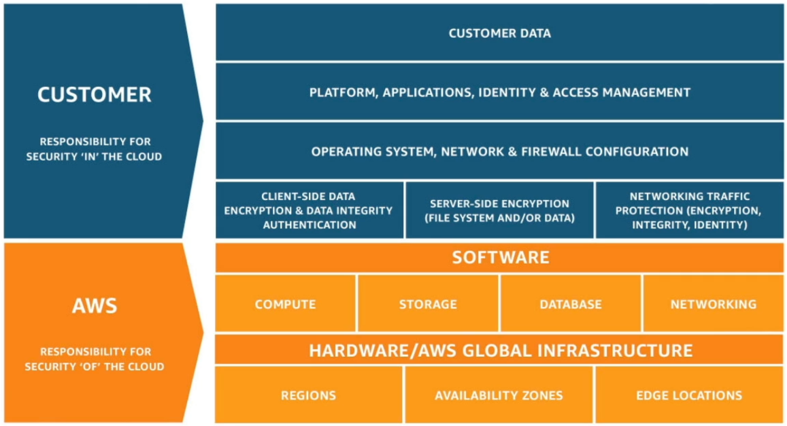
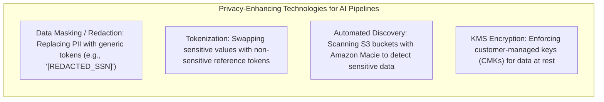
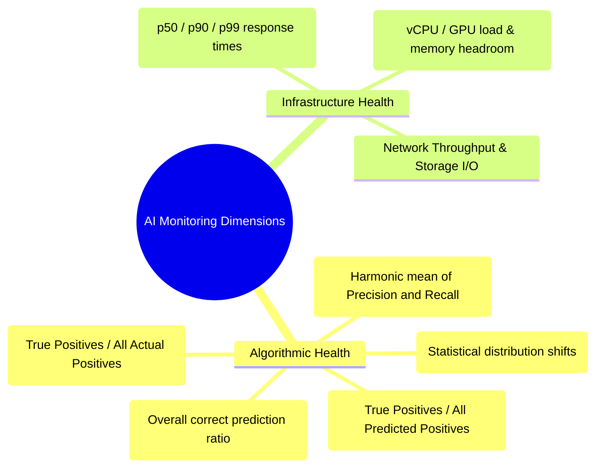
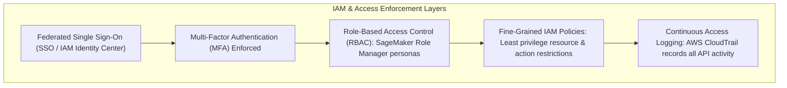

# Security & Privacy for AI: Defense-in-Depth, Shared Responsibility Model & Privacy-Enhancing Technologies

---

## Key Takeaways

Securing artificial intelligence workloads requires applying defense-in-depth principles across data, model execution, infrastructure, and runtime guardrails.

Key security controls include:

- **The AWS Shared Responsibility Model for AI:** AWS manages the security **OF** the cloud (physical data centers, managed compute, base service code), while the customer is responsible for security **IN** the cloud (data classification, IAM access policies, encryption configuration, and application guardrails).
- **Privacy-Enhancing Technologies (PETs):** Data masking, tokenization, PII discovery and sanitization (**Amazon Macie**, **Amazon Comprehend**), and least-privilege role-based access control (RBAC).
- **AI Observability:** Tracking both computational metrics (CPU/GPU utilization, latency) and algorithmic health (**Precision**, **Recall**, **F1-Score**, **Data Drift**).

---

## Main Discussion

### The AWS Shared Responsibility Model for AI & GenAI

The operational boundary between AWS and the customer depends on whether you run unmanaged infrastructure (EC2), managed ML platforms (SageMaker), or serverless Generative AI services (Amazon Bedrock).

| Component                       | AWS Responsibility ("OF" the Cloud)                                                                                             | Customer Responsibility ("IN" the Cloud)                                                                                                    |
| ------------------------------- | ------------------------------------------------------------------------------------------------------------------------------- | ------------------------------------------------------------------------------------------------------------------------------------------- |
| **Amazon EC2 (Self-Hosted AI)** | Physical hardware, facility security, host virtualization layer.                                                                | Guest OS patching, software updates, firewall rules (Security Groups), CUDA/NVIDIA driver configuration, IAM policies, and data encryption. |
| **Amazon SageMaker AI**         | Managed compute provisioning, ML execution container infrastructure, underlying OS patching, high availability.                 | Training script logic, notebook access policies, VPC/PrivateLink networking setup, training dataset classification, and Model Cards.        |
| **Amazon Bedrock (GenAI APIs)** | Foundation model API hosting, base model infrastructure maintenance, serverless scaling, physical isolation.                    | Prompt design, **Bedrock Guardrail** configuration, fine-tuning data preparation, access management, and PII handling.                      |
| **Shared Controls**             | Patch management (AWS patches cloud services; customers patch OS/applications), Configuration management, Awareness & Training. |                                                                                                                                             |

---

### Privacy-Enhancing Technologies (PETs) & Data Protection

Protecting sensitive customer data (PII, PHI, financial records) requires combining cryptographic security with automated data sanitization:

| Privacy Control                     | Mechanism                                                                                                                                        | Primary AWS Service / Feature                                           |
| ----------------------------------- | ------------------------------------------------------------------------------------------------------------------------------------------------ | ----------------------------------------------------------------------- |
| **Sensitive Data Discovery**        | ML-powered pattern matching to scan Amazon S3 storage buckets for unprotected PII, credit cards, or credentials before model training.           | **Amazon Macie**                                                        |
| **PII / PHI Redaction**             | Identifying and masking personal entities within text payloads (e.g., names, SSNs, phone numbers) during ingestion or inference.                 | **Amazon Comprehend** / **Comprehend Medical** / **Bedrock Guardrails** |
| **Data Masking & Obfuscation**      | Irreversibly altering sensitive demographic identifiers in training datasets to protect individual privacy while preserving statistical utility. | **SageMaker Canvas / Glue DataBrew**                                    |
| **Encryption at Rest & In Transit** | Encrypting training data, model checkpoints, and EBS volumes at rest; securing API payloads in transit via TLS 1.3.                              | **AWS KMS** & **Amazon VPC PrivateLink**                                |

---

### Model Performance & Operational Monitoring Metrics

Continuous production monitoring evaluates both algorithmic accuracy and compute infrastructure health:

$$\text{Precision} = \frac{\text{True Positives}}{\text{True Positives} + \text{False Positives}}$$

$$\text{Recall} = \frac{\text{True Positives}}{\text{True Positives} + \text{False Negatives}}$$

$$\text{F1-Score} = 2 \times \frac{\text{Precision} \times \text{Recall}}{\text{Precision} + \text{Recall}}$$

- **Precision:** Critical when the cost of a **False Positive** is severe (e.g., spam filtering or fraud flagging where innocent users should not be blocked).
- **Recall:** Critical when the cost of a **False Negative** is severe (e.g., medical pathology detection or airport threat detection where missing a positive case is catastrophic).
- **F1-Score:** The harmonic mean of precision and recall, providing a balanced metric on imbalanced datasets.

---

### Enterprise Access Control & Least Privilege

- **Role-Based Access Control (RBAC):** Defining distinct IAM execution roles for each persona (Data Scientists, Data Engineers, MLOps Engineers) using **SageMaker Role Manager**.
- **Least-Privilege Principle:** Granting users and services only the minimum permissions necessary to perform their specific tasks (e.g., allowing an inference endpoint to read model artifacts from S3, but prohibiting write or delete actions).
- **Private Connectivity:** Routing traffic privately through **Amazon VPC Endpoints (AWS PrivateLink)** so training and inference traffic never traverses the public internet.

---

## Exam Guide

### Exam Tips

- **Shared Responsibility Model for AI (High Frequency):**
  - **AWS Responsibility:** Security **OF** the cloud (physical infrastructure, hardware, hypervisors, foundational Bedrock model hosting, managed patching).
  - **Customer Responsibility:** Security **IN** the cloud (data classification, customer-managed KMS keys, IAM policies, Guardrail setup, training data privacy).
- **Sensitive Data Discovery vs. PII Masking:**
  - To scan S3 buckets and identify sensitive data/PII at scale $\rightarrow$ **Amazon Macie**.
  - To redact PII from real-time text or prompt inputs $\rightarrow$ **Amazon Comprehend** / **Guardrails for Amazon Bedrock**.
- **Metric Triggers:**
  - **Precision:** Use when minimizing **False Positives** is the priority.
  - **Recall:** Use when minimizing **False Negatives** (missing positive cases) is the priority.
  - **F1-Score:** The metric to optimize when evaluating imbalanced datasets where both precision and recall matter.
- **Privacy-Enhancing Technologies (PETs):** Look for keywords like **data masking**, **tokenization**, and **anonymization** to protect user privacy without degrading model training capability.
- **Network Isolation:** Training sensitive models without outbound internet or external VPC access is achieved via **SageMaker Network Isolation Mode**.

---

### Practice Test

#### Question 1

Under the AWS Shared Responsibility Model, which security task is the direct responsibility of the customer when deploying a Generative AI application using foundation models on Amazon Bedrock?

- [ ] A. Applying firmware updates to physical GPU hardware in AWS data centers
- [ ] B. Configuring Guardrails for Amazon Bedrock and managing IAM access permissions
- [ ] C. Managing the physical environmental controls of AWS facilities
- [ ] D. Patching the underlying operating system hosting the managed Bedrock API

Correct Answer

- [x] B. Configuring Guardrails for Amazon Bedrock and managing IAM access permissions
  - **Explanation:** In the AWS Shared Responsibility Model for managed services like Amazon Bedrock, the **customer** is responsible for security _in_ the cloud—including configuring application guardrails, defining IAM access policies, managing data classification, and encrypting client data. AWS manages the physical facilities, hardware, and underlying managed service software.

---

#### Question 2

A healthcare organization is preparing a large corpus of patient consultation transcripts stored in Amazon S3 for an internal machine learning training pipeline. Before training starts, the security lead must ensure that any unprotected Personally Identifiable Information (PII) stored within the S3 buckets is automatically discovered and flagged. Which AWS service should be used?

- [ ] A. AWS Trusted Advisor
- [ ] B. Amazon Macie
- [ ] C. Amazon Polly
- [ ] D. AWS HealthScribe Evidence Mapping

Correct Answer

- [x] B. Amazon Macie
  - **Explanation:** **Amazon Macie** is a fully managed data security and privacy service that uses machine learning and pattern matching to discover, monitor, and protect sensitive data (such as PII and financial records) in Amazon S3.

---
