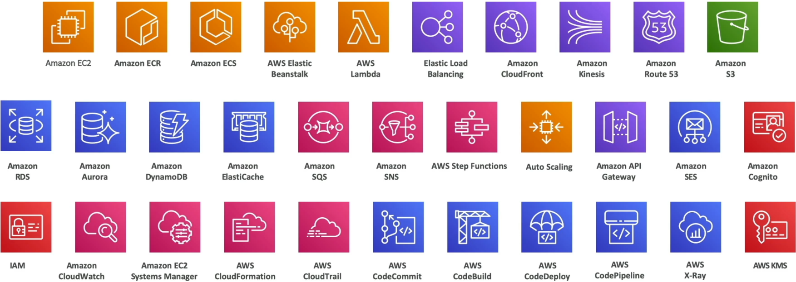

# Course Introduction - AWS Certified Developer Associate

## Key takeaways

- The course is designed to prepare the participants for the AWS Certified Developer Associate (DVA-C02) certification.
- It's structured to make the challenging content engaging and manageable through step-by-step approach.
- Over 30 AWS services will be covered, providing a comprehensive understanding of the platform.
  
- Suitable for both beginners and those with some IT or AWS experience; a coding background is beneficial but not mandatory.
- Emphasis on hands-on learning and taking the time to grasp the material.
- Previous participants of the **Certified Solution Architect** coursse are encouraged to review earlier lectures to build foundational knowledge.
- AWS is introduced as a complex yet scalable cloud provider, likened to a 'spagheti ball' for it's intricacy
  
