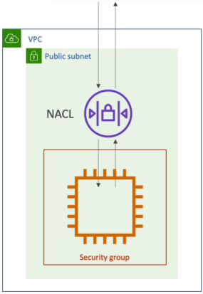

# NACL, SG, VPC Flow Logs

Network security in a VPC operated on two distinct perimeters: NACLs act as the coarse, subnet-level outer boundary firewall, while **Security Groups** act as the granular, host-level inner shield directly wrapping your EC2 instances and network interfaces. To track every single packet passing through these defensive rings, **VPC Flow Logs** record all accepted and rejected IP traffic strings, shipping the telemetry to CloudWatch or S3 for diagnostic analysis.



## Key Takeaways

### The Defensive Perimeters: NACLs vs. Security Groups

When internet traffic heads toward your EC2 instance, it must survive two independent firewall checks. if it fails either one, the packet is instantly dropped.

```
[ Incoming Internet Packet ]
             │
             ▼
┌─────────────────────────┐
│       Network ACL       │  <─── Subnet-Level Perimeter Guard
│  (Stateless / Deny Rules)│      (Evaluates First)
└────────────┬────────────┘
             │  (If ALLOWED)
             ▼
┌─────────────────────────┐
│     Security Group      │  <─── Instance-Level Inner Shield
│  (Stateful / Allow Only)│      (Evaluates Second)
└────────────┬────────────┘
             │  (If ALLOWED)
             ▼
   [ Your EC2 Application ]
```

#### 🛡️ **Network ACLs (NACLs) - The Outer Gate**

Think of NACL as the heavy security gate at the entrance of a secure facility.

- **Scope**: Attached strictly at the **Subnet Level**. Every single resource living in that subnet is bound by its rules.
- **The Rule Capability**: Support both **Allow and Deny rules**. This is your only native weapon inside a VPC to completely block a malicious IP address or botnet range from touching your network.
- **The Processing Order**: Rules are structured numerically (e.g., Rule 100, Rule 200). Route 53 and VPC routing engines evaluate them in strict ascending order. The moment a packet matches a rule, processing stops.
- **Stateless Architecture**: NACLs are completely **stateless**. They have zero memory. If you write an inbound rule allowing web traffic on port 80 to enter your subnet, **you must explicitly write an outbound rule allowing the return traffic on ephemeral ports to leave the subnet**. If you forget the outbound return path, the packet gets trapped inside.

#### 🔒 **Security Groups (SGs) - The Inner Shield**

Think of a SG as the locked door directly on your individual room inside the facility.

- **Scope**: Attached straight to an **Elastic Network Interface (ENI)** or individual EC2 instance.
- **The Rule Capability**: Supports **Allow rules only**. There is no such things as "deny rule" in a SG. By default, all inbound traffic is blocked, and you punch a precise holes for what is safe.
- **Smart Referencing**: SGs can reference raw CIDR blocks, or they can dynamically **reference other SGs**. For instance, you can tell your RDS SG: _"Only allow inbound MySQL traffic if it originates from an instance tagged with the Web-Server Security Group"_.
- **Stateful Architecture**: Security groups are completely **stateful**. If an inbound connection request is vetted and allowed through your SG rule, **the response traffic is automatically allowed to exit the instance**, completely ignoring any outbound restriction blocks.

### Deep-Dive Diagnostics: VPC Flow logs

When you are writing complex microservices loops and your code keeps throwing `Connection Timeout` exceptions, guessing is an absolute waste of engineering hours. You turn on **VPC Flow Logs**.

- **What It Tracks**: It captures raw metadata streams for all IP traffic passing through your VPC network interface. It can be turned on at three granular levels: the entire **VPC**, a specific **Subnet**, or an individual **ENI**.
- **The Core Log Metrics**: Each log line captures essential networking coordinates:
  - Source and Destination IP addresses
  - Target Ports and Protocols (TCP/UDP)
  - Packet and Byte sizes
  - **The Status Action**: It explicitly stamps whether the packet was `ACCEPT` (passed both firewalls) or `REJECT` (blocked by either your NACL or SG)
- The Telemetry Targets: You can stream these logs directly into **Amazon S3** (for long-term data compliance auditing) or **CloudWatch Logs/Kinesis Data Firehose** (to trigger real-time alerts or visualization rules).

## Exam Tips

**The Stateful vs. Stateless Diagnostic Trap**: An exam scenario states, _"You have configured a web application on an EC2 instance inside a custom VPC. The instance SG explicitly allows inbound HTTP traffic on port 80 from `0.0.0.0/0`, and its outbound rules allow all traffic. However, when users browser to you site, their browsers hand indefinitely and eventually time out. You review your VPC Flow Logs and notice that inbound packets show an `ACCEPT` status, but no return packets are being recorded. What is causing the block?"_  
**The textbook answer is a misconfigured NACL**. Because the SG is stateful, it is safely cleared the inbound packet. Because the Flow Logs registered `ACCEPT` on the way in, the inner shield passed validation. The timeout occurs because the stateless outer perimeter (NACL) is missing an outbound rule to allow the response packets back out to the internet on ephemeral ports (`1024-65535`), silently swallowing your application replies.
