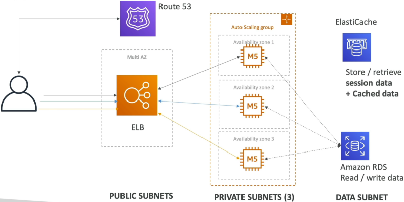
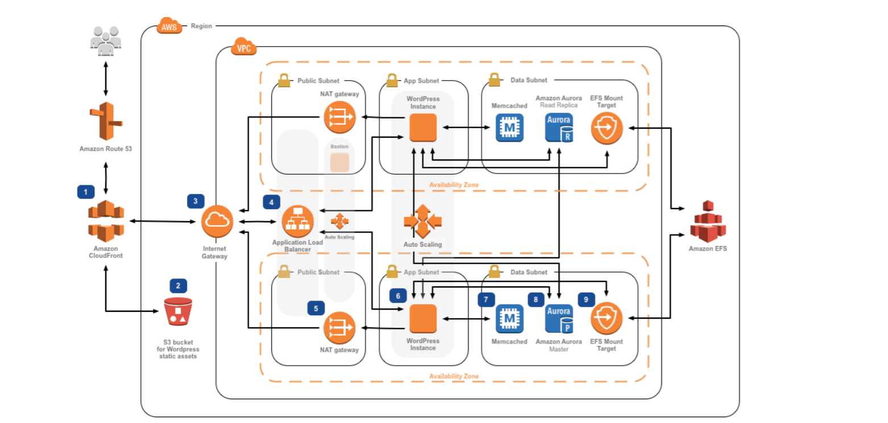

# Three Tier Architecture

Think of these of three separate security zones. If a hacker breaks nto Tier 1, they aren't "inside" your database because of the firewall boundaries we built.

## Key Takeaways

### 🏛️ Tier 1: The Web/Presentation Tier (Public Subnet)

- **The Component**: Application Load Balancer (ALB).
- **The Logic**: This is your "Front Desk". It sits in the **Public Subnet** because it needs a direct route to the **Internet Gateway (IGW)** to talk to users.
- **Security**: It only accepts traffic on Port 80/443. It acts as a shield for your servers.

### ⚙️ Tier 2: The Application/Logic Tier (Private Subnet)

- **The Component**: EC2 instances in an Auto Scaling Group (ASG).
- **The Logic**: This is the "Kitchen". It sits in a **Private Subnet**. It has no public IP and no direct route to the IGW.
- **Security**: These instances only accept traffic from te **Security Group of the ALB**. If someone tries to ping these instances from the internet, they simply won't respond.

### 🗄️ Tier 3: The Data Tier (Deep Private Subnet)

- **The Component**: Amazon RDS (Database) and Amazon ElastiCache (Caching).
- **The Logic**: This is the "Vault". It sits in its own dedicated **Data Subnet** (a private subnet even deeper in the VPC).
- **Security**: It only accepts traffic from the **Security Group of the Application Tier**.

### The Classic "Developer Stacks"

- **The LAMP Stack**: Linux (EC2 OS) + Apache (Web Server) + MySQL (RDS) + PHP (Code logic).
- **The WordPress Pattern (shared storage)**: WordPress is famous for letting users upload images (media). Since your ASG might terminate one instance and launch another, you can't store those images on local EBS drive. You use **Amazon EFS** (Elastic File System) so severy instance in every AZ can "see" and "edit" the exact same image folder simultaneously.

### Reading WordPress Best Practice Architecture Diagrams

Stephane recommends you to read the official [WordPress architecture diagram](https://aws.amazon.com/blogs/architecture/wordpress-best-practices-on-aws/) and we should have understand 90% of the components shown in the diagram:

- **User hits Route 53**: They get the DNS record.
- **Traffic hits the ALB**: Sitting in the public subnet
- **ALB sends traffic to EC2**: Sitting in the private subnet (Application Tier).
- **EC2 needs an update**: It talks out through the **NAT Gateway** (Public Subnet) to get to the internet.
- **EC2 needs a post**: It reads from RDS Aurora (Data Tier).
- **EC2 needs an image**: It pulls from EFS (Shared Storage).
- **EC2 wants to go fast**: It checks **ElastiCache (Redis)** for session data.

## Exam Tips

**The "Public IP" Red Flag"**: If an exam question says, _"You are deploying a 3-tier app. To save costs, you want your EC2 instances to be able to download patches from the internet without a NAT Gateway. How should you configure them?"_.  
**The answer is a Trap**. To do this, you'd have to put the EC2 instances in a **Public Subnet** and give them **Public IPs**. While this is cheaper (no NAT Gateway cost), it is a **Security Failure** because those instances are now directly "reachable" by the whole internet. For a Developer Associate, always prioritize the **NAT Gateway + Private Subnet** pattern for backend logic.
