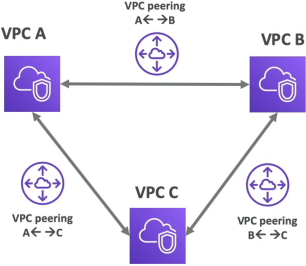
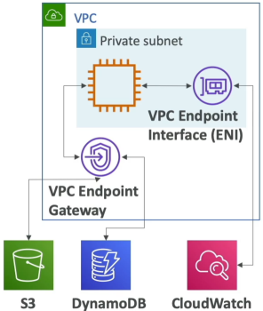
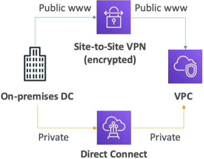

# VPC Peering, Endpoints, VPN and DX

AWS networking provides distinct pathways for structural expansion: **VPC Peering** forms a non-transitive, private mesh network between independent VPC containers. **VPC Endpoints** (Interface and Gateway styles) eliminate the need for an internet ramp entirely, cutting private access straight to public AWS resources. For hybrid-cloud data-center linkages, **Site-to-Site VPN** stands up a rapid encrypted tunnel across the public web, while **Direct Connect (DX)** installs a high-speed, dedicated physical line.

## Key Takeaways

### VPC Peering: Connecting the Networks

Imagine you have `Frontend-VPC` running in your developer account, and a `Data-Warehouse-VPC` running in completely separate corporate accounting space. You can bridge them instantly using VPC peering.

- **The Local Feel**: Peering links use AWS's own global network backplane. Instances talk to each other directly using their private internal IPs (`10.x.x.x`). Traffic never touches te public internet.
- ⚠️ **The Overlapping CIDR Guardrail**: You can only establish a peering link if your two VPCs operate on completely distinct, non-overlapping IP address pools. If VPC A is `10.0.0.0/16`, VPC B is also `10.0.0.0/16`, the routes will have no idea where to direct packets, and AWS will drop the creation request immediately.
- ❌ **The Non-Transitive Rule**: Peering is strictly a **1-to-1** connection wrapper. If VPC A is peered to VPC B, and VPC A is also peerted to VPC C, **VPC B and VPC C cannot talk to each other through VPC A**. To let B and C communicate, you must explicitly construct a brand-new independent peering pipe directly between them.

### VPC Endpoints: Bypassing the Public Web

By default, services like **Amazon S3, DynamoDB, SQS, and CloudWatch** live outside your custom VPC on the public web.

Normally, an instance needs an Internet Gateway or A NAT Gateway just to upload a file to S3. **VPC Endpoints (powered by AWS PrivateLink)** eliminates this design dependency by letting your private instances communicate with AWS services over a secure private pipeline.

| Endpoint Archetype         | Supported Target Services                                     | Implementation Mechanics                                                                                                                                     |
| -------------------------- | ------------------------------------------------------------- | ------------------------------------------------------------------------------------------------------------------------------------------------------------ |
| **1. Gateway Endpoints**   | Strictly Amazon S3 and Amazon DynamoDB                        | Acts as a virtual router target inside your Route Table. It intercepts traffic heading to S3/DynamoDB and rewrites the path internally. 100% Free to use!    |
| **2. Interface Endpoints** | The rest of AWS (SQS, SNS, CloudWatch, Secrets Manager, etc.) | Provisions a physical Elastic Network Interface (ENI) with a local private IP address straight inside your private subnet. Charges a small hourly usage fee. |

### Hybrid Core Connectivity: VPN vs. Direct Connect (DX)

When you need to hook your physical office building or corporate data center server racks up to your AWS cloud playground, you select a strategy based on cost and time.

#### 💻 **Option A: Site-to-Site VPN (Fast & Cheap)**

- **The Transit Medium**: Your data moves over the raw public internet.
- **The Security Profile**: Fully wrapped inside an encrypted IPsec cryptographic tunnel.
- **The Setup Velocity**: Blazing fast. You can provision the AWS virtual private gateway properties and configure your office router appliance in under an hour.

#### 🎛️ **Option B: Direct Connect (DX) (Premium & Physical)**

- **The Transit Medium**: An absolute **dedicated, physical network line** run from your telecom cage straight into an AWS data center facility patch panel.
- **The Security Profile**: 100% private. Your data never touches the open public web space, dropping your latency and jitter down to absolute zero.
- **The Setup Velocity**: Slow. Because telecom provider physically have to lay copper/fiber cross-connect lines, it typically takes anywhere from a few weeks to over a month to go live.

## Exam Tips

**The Isolated Lambda Secrets Fetch**: If an exam scenario says, _"You have written a serverless AWS Lambda function running inside a locked-down private custom VPC subnet to securely process database changes. The code needs to fetch a database password string from AWS Secrets Manager. The code needs to fetch a database password string from AWS Secrets Manager. However, company security compliance rules strictly forbids this private subnet from containing a route to a NAT Gateway or having any public internet access. How do you resolve this connection issue?"_  
**The definitive cloud answer is to provision an Interface VPC Endpoint for Secrets Manager inside that specific private subnet**. This drops a local, private network interface card (`10.0.x.x`) straight into your subnet block. Your Lambda function can now execute standard AWS SDK fetch commands against Secret Manager securely using the internal AWS fiber network, keeping your configuration 100% complaint and fully air-gapped from the public web!
