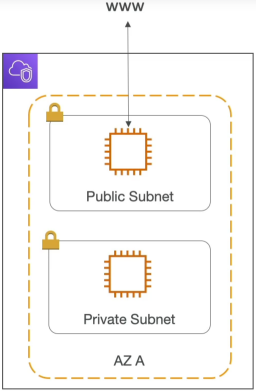
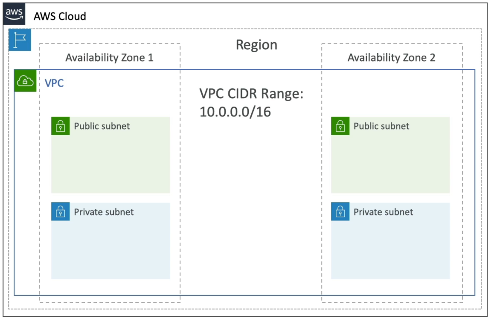
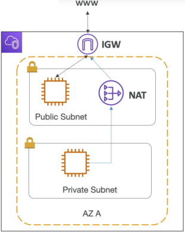

# VPC, Subnets, IGW and NAT

A **VPC** is your regional network perimeter. Inside it, you split your IP space into **Subnets** defined at the AZ level. To let traffic pass in and out of the VPC, you attach an **Internet Gateway (IGW)**. Public subnets route directly to the IGW. Private subnets stay isolated but use a **NAT Gateway** parked in the public subnet as a secure, one-way proxy to fetch internet resources without exposing themselves to inbound web attacks.



## Key Takeaways

### The Architectural Components



#### 🌐 **Subnets: The Compute Segregators**:

You slice up your VPC's primary IP range (**CIDR BLOCK**) into smaller, localized subnets.

- **Scope Constraint**: A VPC spans an entire **Region**, but a single Subnet can **never cross AZs**. It is strictly pinned to one AZ.
- **The Default VPC Reality**: Every single AWS account comes with a pre-configured **Default VPC** out of the box.
  :::note
  The default VPC only provisions **Public Subnets (one per AZ)** with a pre-attached Internet Gateway (IGW) so you can spin up resources quickly. You have to build a custom VPC to get private subnets.
  :::

#### 🔌 **Internet Gateway (IGW): The Bidirectional Door**

The IGW is a highly available, horizontally scaled VPC component. It performs **Network Address Translation (NAT)** for your public instances, mapping their private VPC IPs to their public AWS IPs. It allows **bidirectional (two-way) communication**: your instances can talk to the web, and the web can initiate a connection straight back to your public instances.

#### 🛡️ **NAT Gateway: The One-Way Proxy**

When your secure instances (like an RDS database or an internal payment API processing container) sit in a private subnet, they have no public IP and zero direct access to the outside world. But what happens when that private OS needs to pull a security patch or hit a third-party API? You deploy a **NAT Gateway**:

- **The Location Rule**: A NAT Gateway **must be physically deployed inside a Public Subnet** because it requires a public **Elastic IP (EIP)** and a direct line to the IGW.
- **The Security Profile**: It allows **unidirectional (one-way) outbound traffic only**. Your private instances can securely push requests out to the web, but hackers on the public internet cannot initiate a connection back inside to hit your private endpoints.
- **Managed vs. Self-Managed**: AWS heavily pushes **NAT Gateways** (fully managed by AWS, scales automatically up to 45 Gbps). You can deploy a **NAT Instance** (a single EC2 instance running a custom script), but it's a massive anti-pattern because it introduces a single point of failure and requires you to manually manage patching and instant sizing.



### The Traffic Routing Matrix (How Routes Actually Flow)

How does a subnet actually become "Public" or "Private"? It all comes down to **Route Tables**. Every subnet must be associated with a route table that dictates exactly where its network packets are thrown.

```
[ Public Subnet Route Table ]
Destination       │ Target
──────────────────┼───────────────────────────────────────
10.0.0.0/16       │ Local (Internal VPC Routing)
0.0.0.0/0 (Web)   │ igw-xxxxxxxx (Internet Gateway) <─── Makes it PUBLIC!

[ Private Subnet Route Table ]
Destination       │ Target
──────────────────┼───────────────────────────────────────
10.0.0.0/16       │ Local (Internal VPC Routing)
0.0.0.0/0 (Web)   │ nat-xxxxxxxx (NAT Gateway)      <─── Keeps it PRIVATE!
```

## Exam Tips

**The Lambda Internet Isolation Trap**: By default when you write a standard AWS Lambda Function, it executes inside an internal,AWS-managed secure network. Out of the box, it has 100% free access to the public internet (so it can call public endpoints, third-party APIs, or download libraries), but **it cannot touch resources inside your private custom VPC (like Amazon ElastiCache cluster or an RDS Postgres DB)**.  
To fix this, you must explicitly configure the Lambda function to run inside your custom VPC, assigning it your private Subnets and a SG. **The moment you do this, the Lambda function loses its default public internet access!** If your VPC-bound Lambda function needs to process private database records _and_ hit a public API provider, **your private subnets must contain a route pointing to an active NAT Gateway running in a public subnet**. If you forget the NAT Gateway, your Lambda function will throw connection timeouts the second it tries to speak to the outside web!
