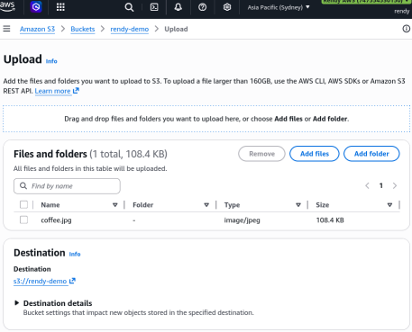
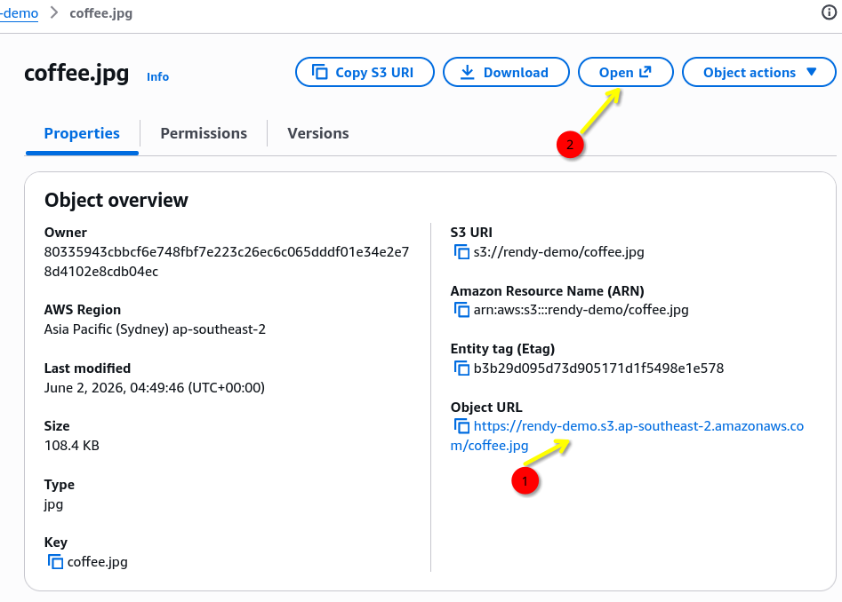

# S3 Hands-On

The lab covers the foundational lifecycle of object management inside Amazon S3 by provisioning a general-purpose storage container. Stephane demonstrates navigating the traditional global namespace pitfalls before leveraging the modern Account-Regional Namespace to claim a conflict-free bucket path. By uploading asset images, he reveals that objects are securely shielded from anonymous public traffic by default, but can be seamlessly reviewed inside the console using dynamically generated **Pre-Signed URLs.**

## Key Takeaways

### Deep Dive: Account-Reginal Namespaces

For almost two-decades, developers suffered through the "Global Namespace Trap", if someone in another AWS account claimed `test-bucket`, it was blocked globally. The upgraded **Acount-Regional Namespace** changes the engineering blueprint completely:

- **The Suffix Equation**: When you select Account-Regional Namespacing, AWS takes your desired clean prefix and automatically stamps a reserved, predictable suffix pattern to the end:

```math
\text{Bucket Name} = \text{Prefix} + \text{-[12-Digit Account ID]-[Region Code]-an}
```

- **The Production Advantage**: This allows you to write one clean, standard Infrastructure-as-Code (IaC) configuration or Terraform module using a prefix like `app-assets`. You can run that identical script across your Dev, Staging, and Production AWS accounts simultaneously without any naming collisions or code adjustments.
- **The 63-Character Guardrail**: As a Senior Dev, you have to watch your character counts!. The entire generated name string, including your custom prefix and and the appended region/account suffix - **must fit within a strict 63-char limit**.

### Public vs Pre-Signed URL



When you upload a file to S3, it is automatically assigned a unique URL path. However, the security profile of that URL depends on how you access it:

Stephane hit two completely distinct URL patterns when trying to view the `coffee.jpg` asset. Understanding why one worked and the other threw an error is a massive point on the developer exam:



#### ❌ The Object URL (`AccessDenied`)

- **The Path**: `https://rendy-demo.s3.ap-southeast-2.amazonaws.com/coffee.jpg`
- **The Security Profile**: This is a static, anonymous public web link. Because Stephane left the default **"Block Public Access"** safety switches turned **ON** when he spun up the bucket, S3 acts as a locked vault. It intercepts the anonymous incoming HTTP request, checks its Access Control List (ACL), sees no public clearance rules, and hits the caller with a hard `AccessDenied` error.

#### ✅ The "Open" Console Link (The Pre-Signed URL)

- **The Path**: A massive, unreadable text block packing a long string of query arguments like `?X-Amz-Algorithm=AWS4-HMAC-SHA256&X-Amz-Credential=...&X-Amz-Signature=...`
- **The Security Profile**: This is an **S3 Pre-Signed URL**. When you hit the "Open" button inside the AWS Console dashboard, the underlying S3 engine leverages your active browser login tokens to temporarily authorize the download. It signs the request using your own IAM user credentials and bakes a short-lived cryptographically signed token right into the URL query string. S3 reads that signature stamp, verifies that you have the right to read the file, and displays the image perfectly.

## Exam Tips

**The App-Layer Secure Asset Delivery Pattern**: Imagine an exam scenario states, _"You are writing a secure document management web application using AWS Lambda and Amazon S3. Users must log into your app to view their confidential tax forms. The files inside the S3 bucket must remain strictly private from the public web, but authenticated users need to be able to download their specific documents directly via their browsers. Do do you implement this securely"._  
**The textbook developer choice is to write an AWS SDK script inside your Lambda backend to generate an S3 Pre-Signed URL**. Your code validates that the user is logged in, calls the s3 client API, sets a hard \*\*Expiration Time (e.g., 15 mins), and streams the temporary link down to the frontend UI. The user's browser securely downloads the image or PDF, and the moment the timer ticks past 15 minutes, that URL dynamically converts into a useless, dead `AccessDenied` path, keeping your data perfectly sealed!
