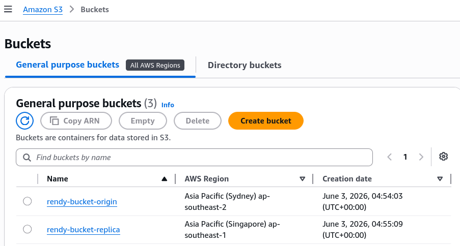
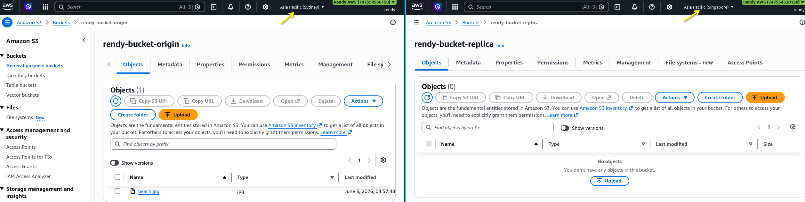
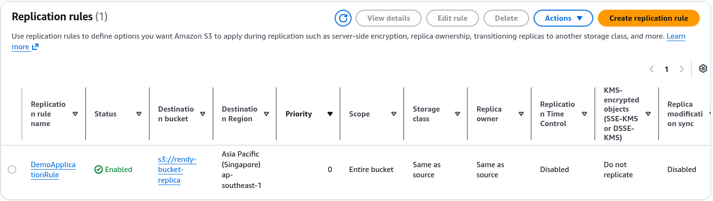
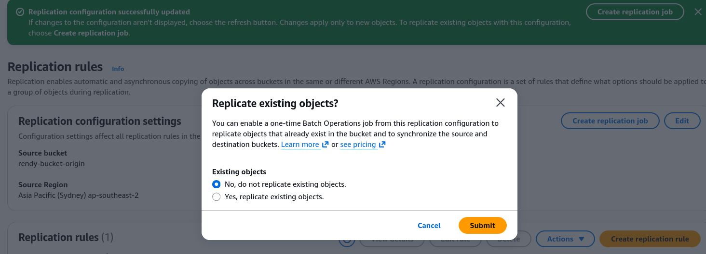
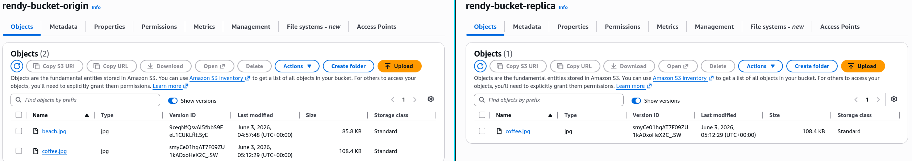
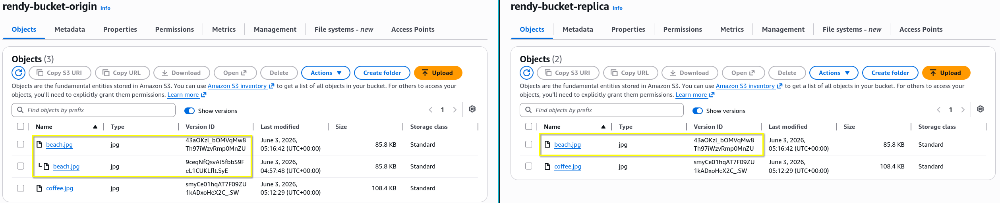
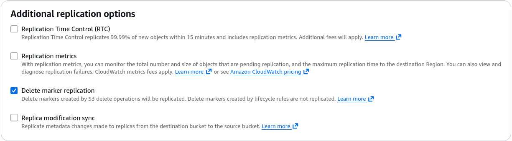
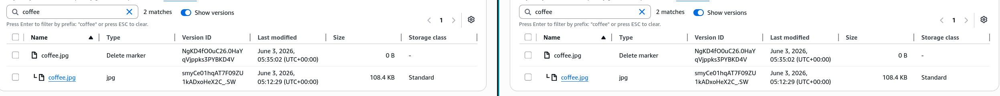
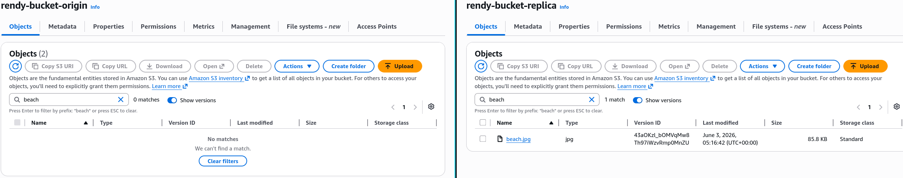

# S3 Replication

Amazon S3 Replication is a a bucket-level feature that handles the **asynchronous** background copying of objects from a source bucket to a destination bucket. To unlock this feature, **Versioning must be explicitly turned ON in both the source and target buckets**. S3 relies on an attached IAM Service Role to securely assume the permission required to read assets from the origin and write them into the destination layout.

## Key Takeaways

AWS splits replication into two distinct flavors based on your structural geographical targets:

### 🌐 Cross-Region Replication (CRR)

- **The Environment Matrix**: Your source bucket and target bucket reside in **different geographic AWS Regions (e.g., source in Sydney `ap-southeast-2` replicating over a target in Singapore `ap-southeast-1`)**.
- **The Use Cases**:
  - **Compliance & Compliance Laws**: Enterprise industries require data to be physically mirrored at least 400 km away from the primary DC to satisfy legal disaster-recovery audits.
  - **Low-Latency Global Access**: If you have an engineering team or a pool of users based in the US, pulling large media assets from a local US bucket is significantly faster than routing cross-oceanic queries back to Australia.

### 📍 Same-Region Replication (SRR)

- **The Environment Matrix**: Both your source and destination buckets are located within the **exact same AWS Region** (e.g., both bucket sit inside `ap-southeast-2`).
- **The Use Cases**:
  - **Log Aggregation**: If you have 50 different microservices throwing logs into 50 separate localized buckets, you can use SRR to automatically pipe them into a single, centralized master security audit bucket in real-time.
  - **Environment Isolation (Prod to Test)**: You can safely shadow live production uploads directly into a test/QA environment bucket within the same region so your staging apps can run integration tests against real data payloads.

## The Core Replication Rules

To pass a design review or an AWS exam, you must remember the four absolute architectural mandates that make replication function:

1. **The Versioning Law**: If you forget to enable Versioning on either the source buckets or the destination bucket, the replication configuration pipeline will fail to initialize.
2. **The Asynchronous Rule**: Replication is not synchronous. When a user execute a `PUT` request to upload `file.jpg` to the source bucket, the APi returns a successful `200 OK` instantly. S3 then duplicates the object over to the target bucket in the background. It can take anywhere from a few seconds to several minutes depending on file scale.
3. **The IAM Service Role Handshake**: S3 cannot look inside your bucket or write to to other accounts by default. You must create an **IAM Role** with a trust policy that allows the `s3.amazonaws.com` service principal to assume it. This role must pack explicit permissions:

```math
\text{Required Actions} = \text{s3:GetObjectVersion}_{\text{(Source)}} + \text{s3:ReplicateObject}_{\text{(Destination)}}
```

4. **Cross-Account Mechanics**: Yes, you can replicate completely different AWS Accounts! if Account A owns the source and Account B owns the target, Account B must modify its **S3 Bucket Policy** to explicitly allow the replication IAM role coming from Account A to drop object payloads inside it.

## Replication Notes

### 🔄 The Legacy File Fix: S3 Batch Replication

If you activate a replication rule on a live production bucket that already contains data, S3 ignores that existing footprint.

- **The Rule**: Only newly created objects trigger the background replication engine.
- **The Solution**: To mirror your historical inventory or to retry objects that failed to sync during a network blip, you must spin up an S3 Batch Replication operation job. It scans the bucket metadata and retroactively forces a sync of the legacy file array.

### No Replication "Chaining"

Imagine you want to design a multi-region distribution chain where Bucket 1 syncs to Bucket 2, and Bucket 2 syncs to Bucket 3. **Then objects created in bucket 1 are not replicated to bucket 3**. Because S3 replication is an identity-vetted service role trigger, **it will never chain or forward events**. An object dropped into Bucket 1 will arrive safely in Bucket 2, but it will stop right there. It will _never_ trigger the replication rule on Bucket 2 to push the file into Bucket 3. If you want data in Bucket 3, you must configure a direct secondary rule mapping from Bucket 1 to Bucket 3 explicitly.

### DELETE operations

The exam will test your understanding of the blast radius when files are removed from a replicated cluster.

#### 🗑️ Tactic A: Syncing Soft Deletes (Delete Markers)

If you configure your rule with **Delete Marker Replication enabled**, running a standard `aws s3 rm` command on the source bucket will place a delete market on the source and automatically mirror that exact same delete market layer onto the destination bucket.

🔒 Tactic B: Blocking Permanent Deletes

If a rogue script or compromised IAM user targets an explicit Version ID to permanently destroy a file layer from the source bucket. **S3 won't replicate this action**. The Targeted version layer is wiped out of the source bucket, but the destination bucket completely ignores this delete event, leaving the backup copy of that exact file version totally intact and safe in the target bucket.

## Hands On

This hands-on lab lab layout walks through creating an S3 lifecycle baseline for Cross-Region Replication (CRR).

### Phase 1: Provision the Source and Destination Buckets

- **Create the Source Bucket**
  - Select the `ap-southeast-2` Sydney region
  - Click **Create Bucket**
  - Name it `rendy-bucket-origin`
  - Scroll down and explicitly **Enable Bucket Versioning**
  - Complete the creation and open this bucket in a new browser tab
- ** Create the Destination Bucket**
  - Select the `ap-southeast-1` Singapore region
  - click **Create Bucket**
  - Name it `rendy-bucket-replica`
  - Scroll down and explicitly **Enable Bucket Versioning**
  - Click create



### Phase 2: The Pre-Rule Upload

- Go inside your **Origin Bucket** upload a placeholder asset file named `beach.jpg`.
- _Note_: No replication schema exist yet, this object stays entirely local to Sydney



### Phase 3: Wire Up the Automation Grid

- Inside the **Origin Bucket**, navigate to the **Management** tab.
- Scroll down to the **Replication rules** section and click **Create replication rule**.
- Configure the rule parameters:
  - **Replication rule name**: `DemoReplicationRule`
  - **Status**: Enabled
  - **Source bucket scope**: Choose "Apply to all objects in the bucket"
  - **Destination**: Select **Specify a bucket in this account**, then copy and paste the name of your target bucket (`rendy-bucket-replica`). S3 will automaticaly flag the target region code as `ap-southeast-1`.
  - **IAM Role**: Select **Create new role** from the dropdown menu to let S3 automatically write your resource access permissions.
  - Click **Save**.
- **The Batch Operation job Prompt**: When AWS asks if you want to retroactively sync historical data, select **No, do not replicate existing objects.**. Click submit.



---



### Phase 4: Validating New Upload Streams

- Check your **Replica Bucket** - confirm it is still blank (the original `beach.jpg` copy was safely ignored).
- Go to your **Origin Bucket** and upload a brand-new asset named `coffee.jpg`.
- Toggle **Show versions** on the origin bucket to view its distinct cryptographic identifier string.
- Navigate back to your **replica Bucket** and refresh the dashboard view (expect 5-10 seconds delay until the file replicated).
- Verify that `coffee.jpg` arrived safely in the Singapore and matches your origin version metadata signature exactly.
  
- To fix your initial legacy asset, re-upload `beach.jpg` into the origin pool to generate a brand-new current version layer - watch it immediately execute the sync to the replica pool.
  

### Phase 5: The Deletion Scenario

- Go to your **Origin Bucket → Management tab → Edit your replication rule**
- Scroll to additional settings, check the box to **Enable Delete Marker Replication**, and save your configuration adjustments.
  
- **Test a Soft Delete**: Turn **Show versions OFF** inside your origin bucket
  - Select `coffee.jpg` and execute a standard delete by typing `"delete"`.
  - S3 stamps a Delete Marker locally. Check your replica bucket after a few moments - confirm that a matching Delete Marker was safely mirrored to the US stack, hiding the file on both ends.
    
- **Test a Permanent Delete**:
  - Turn **Show versions ON** inside your origin bucket.
  - Select a specific, explicit Version ID layer for `beach.jpg` and execute a permanent delete by typing `"permanent delete"`.
  - Review your replica bucket - notice that the version layer **remains completely intact and safe the destination pool**. S3 successfully barricaded the permanent destruction instruction at the origin boundary!
    
