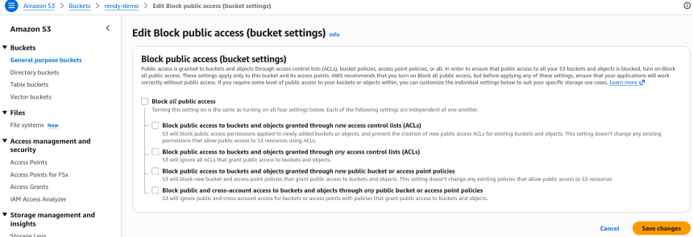
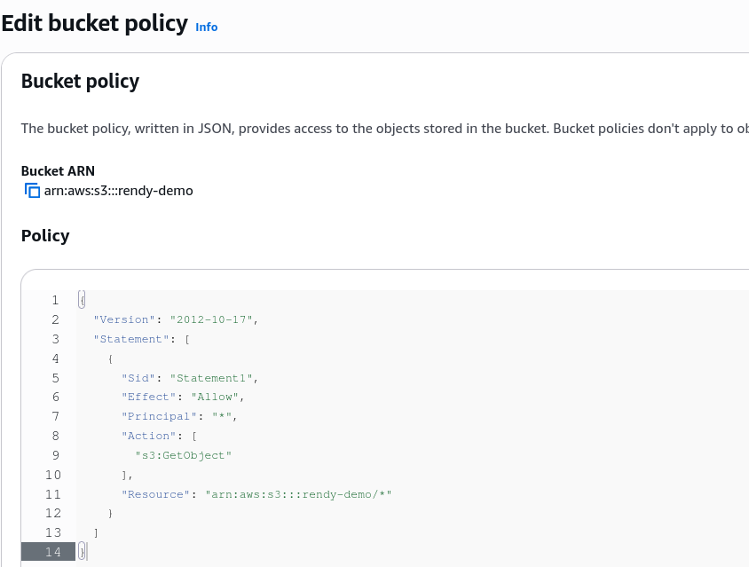
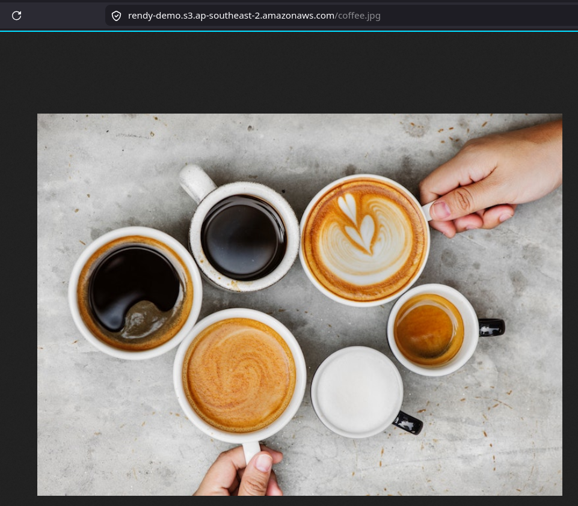

# S3 Security: Bucket Policy Hands-On

The lab demonstrates the explicit two-step handshake required to transform a private S3 bucket into a public asset hosting hub. First, the account operator must intentionally disable the **Block Public Access** safety circuit breaker. Second, the developer leverages the **AWS Policy Generator** to craft a structured JSON Resource Policy that opens up public read permissions (`s3:GetObject`) across all nested files using the wildcard (`/*`) selector string.

## Key Takeaways

### The Two-Step Public Handshake Protocol

You cannot simply upload a public JSON policy and call it a day. S3's layered security model requires you to open two distinct gates in sequential order:

```
[ Step 1: Permissions Tab ] ──> Uncheck "Block Public Access" ──> Confirms Account Override
                                                                          │
[ Step 2: Policy Generator ] ──> Generate JSON S3 Bucket Policy <─────────┘
                                         │
                                         ▼
                               Paste JSON into S3 Console
                                         │
                                         ▼
[ Step 3: Global Web Plane ] ───> The Object URL instantly changes from 403 Access Denied to a Public Asset Render!
```

- **Step 1**: Remove the Block public access guardrail at the bucket level. Navigate to the _Permissions_ tab on your bucket dashboard, edit the **Block Public Access** container, uncheck the box, and save.
  
- **Step 2**: Generate the JSON Vetting Rules. Boot up the [AWS Policy Generator](https://awspolicygen.s3.amazonaws.com/policygen.html) utility and select **S3 Bucket Policy** as the document archetype. - You set the `Effect` to **Allow** - You set the `Principal` to `*` (representing the anonymous global web pool) - You bind the `Action` to specifically to `s3:GetObject`
  

:::note
You cannot just paste the ARN of the bucket itself. The `s3:GetObject` API call does not interact with the bucket box itself, but rather with the individual files inside the box. Therefore, you must append a trailing forward slash and a wildcard character (`/*`) to the bucket ARN to indicate that this policy applies to all objects nested inside the bucket container.
:::



## Exam Tips

**The Public Web Vulnerability Scanner Trap**: Imagine an exam scenario asks, _"You have disabled Block Public Access and successfully applied a public read bucket policy to host assets for an application frontend. A security audit flags that while users can download images safely, malicious web scraping tools are using automated scripts to list and scan every single file path in your bucket. How do you stop the file enumeration while keeping the images working?"_  
**The textbook developer fix is to ensure your policy ONLY permits** `s3:GetObject`. There is a massive structural difference between `s3:GetObject` (reading a specific known file path link like `/coffee.jpg`) and `s3:ListBucket` (seeing a directory manifest of everything inside the box). `s3:ListBucket` is a bucket-level action that requires the raw ARN root (without the `/*`). As long as your bucket policy leaves `s3:ListBucket` out of the JSON block entirely, random internet tools trying to scrape your root bucket directory will get hit with a flat `403 Access Denied`, while your direct application media links continue to render properly.
