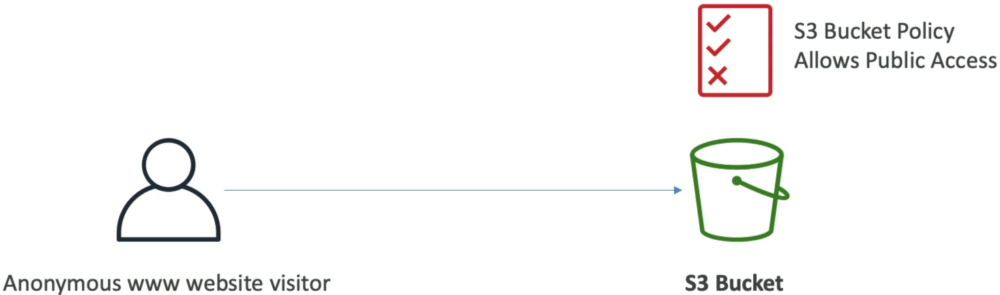
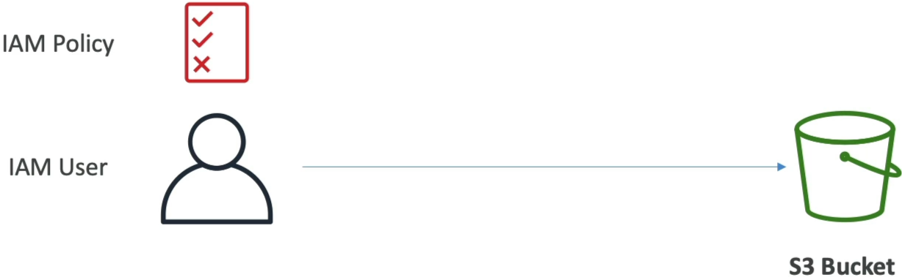
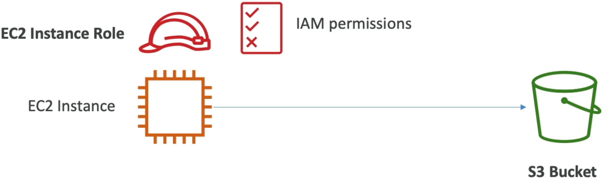
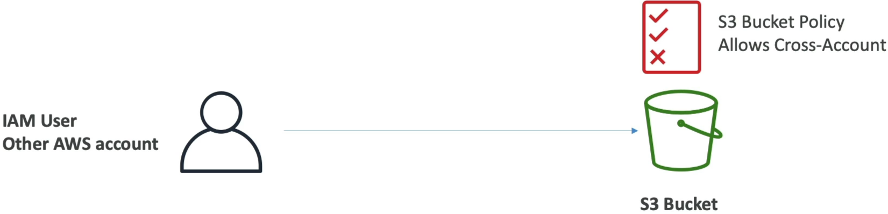

# S3 Security: Bucket Policy

S3 Security divides authorization into two core methodologies: **User-Based** (attaching IAM policies directly to an IAM user, group, or execution role) and **Resource-Based** (attaching an S3 Bucket Policy directly to the bucket container). A bucket policy is written in structured JSON and controls bucket-wide rules, handles cross-account infrastructure mapping, and enforces public-facing rules. For access to be granted, at least one layer must explicitly allow it, and there must be absolute zero **Explicit Deny** overrides in the chain.

## Key Takeaways

### JSON Bucket Policy Structure

When you write a bucket policy, you are writing a standard AWS Access Policy Language JSON block. Let's look at the exact anatomy of a public read policy:

```json
{
  "Version": "2012-10-17",
  "Statement": [
    {
      "Sid": "PublicReadGetObject",
      "Effect": "Allow",
      "Principal": "*",
      "Action": "s3:GetObject",
      "Resource": "arn:aws:s3:::example-bucket/*"
    }
  ]
}
```

- `Sid` (Statement ID): An optional, human-readable string descriptor used to label what this specific block is doing (e.g., `"PublicReadGetObject"`).
- `Effect`: (`Allow` vs `Deny`) Dictates whether the policy is opening a door or barricading it.
- `Principal`: The target identify entity the rule applies to. Setting `"Principal": "*"` means **anyone and everyone on the open internet** matches this rule statement.
- `Action`: The exact API call you are controlling. For reading object data payloads, you use `s3:GetObject`.
- `Resource`: The exact Amazon Resource Name (ARN) path. _Crucial Exam Trap_: Because `s3:GetObject` operates on individual files and files alone, you **must** append (`/*`) to the bucket ARN (e.g., `arn:aws:s3:::example-bucket/*"`). If you forget the `/*`, the policy will fail to apply because you're trying to apply an object-level action to a bucket-level root container!

### The 4 Essential Access Scenarios

#### 🌐 Scenario A: Public Web Visitors

- **The Blueprint**: You want to host image graphics for a public WordPress site.
- **The Mechanism**: You use an **S3 Bucket Policy** with a `Principal: "*"` paired with an `Effect: "Allow"` on `s3:GetObject`. This lets random web browsers bypass credentials and pull files directly.



#### 👤 Scenario B: Local Account IAM Users

- **The Blueprint**: An internal software developer inside your own AWS account needs to upload raw resource files during an automated deployment cycle.
- **The Mechanism**: You apply a standard **IAM User Policy** directly to that developer's IAM profile (User-Based). Since they reside in the same local account billing scope, S3 reads their attached IAM permission ring and validates the file execution instantly.



#### 🎛️ Scenario C: Application Compute Compute (EC2 / Lambda)

- **The Blueprint**: A fleet of backend application containers or serverless tasks need to drop logs or process transactional CSV documents.
- **The Mechanism**: Never hardcode static credentials or API keys inside your code! You attach an **IAM Execution Role** directly to your EC2 instances (via an Instance Profile) or your Lambda function configurations. S3 recognizes the temporary security credentials assumed by the machine and authorizes access cleanly.



#### 🔄 Scenario D: Cross-Account Infrastructure Links

- **The Blueprint**: A third-party data analytics team operating in an entirely separate AWS Account (Account `999999999999`) needs to read records out of your primary storage bucket.
- **The Mechanism**: **You must use an S3 Bucket Policy**. An IAM policy in Account B cannot grant access to a resource owned by Account A on its own. You write a Bucket Policy inside your account, setting the `Principal` block directly to the external account identifier string:

```math
\text{Principal ARN} = \text{arn:aws:iam::999999999999:root}
```



### The Ultimate Guardrail: S3 Block Public Access (BPA)

AWS engineered a heavy-duty master circuit breaker called \*_S3 Block Public Access_. This tool sits right on top of your bucket like a concreate vault door.

- **The Behaviour**: If Block Public Access is toggled **ON** (which is te default safety setting for all new buckets), **it completely neutralizes any public `Allow` statements inside your Bucket Policies**. Even if you accidentally paste a wide-open public JSON policy onto your bucket, the BPA safety guardrail intercepts the logic and prevents data leaks, ensuring your files remain tightly sealed.
- **The Execution Order**: To successfully make an S3 bucket host public web assets, you must physically perform a two-step handshake:
  1. Explicitly toggle Block Public Access **OFF** for that bucket.
  2. Upload your public JSON bucket policy. If you don't do step 1 first the console will block your configuration layout completely.

## Exam Tips

:::tip
Remember this absolute golden rule of AWS Evaluation Logic: **An Explicit Deny ALWAYS Wins**.
:::

**The Overlapping Policy Evaluation Trap**: An exam question states, _"An IAM User has an attached IAM policy that explicitly grants them `s3:GetObject` privileges for `bucket-alpha`. However, the security engineering team has attached an S3 Bucket Policy to `bucket-alpha` that contains a statement denying all actions to everyone if they are not coming from a specific corporate office IP range. The user attempts to read a file from their home network. What is the outcome?"_  
**The answer is an immediate Access Denied**. Even though the user's IAM policy says `Allow`, the resource-based bucket policy dropped an explicit `Deny` block for their current external home network location coordinate. In AWS, if any part of the evaluation loop outputs a `Deny`, it instantly overrules every single `Allow` block in the system, shutting down the connection on the spot.
