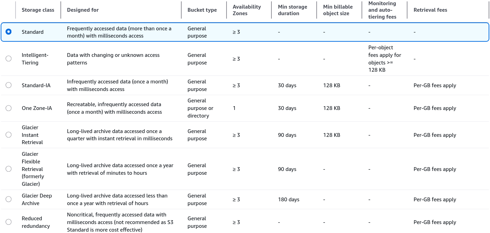
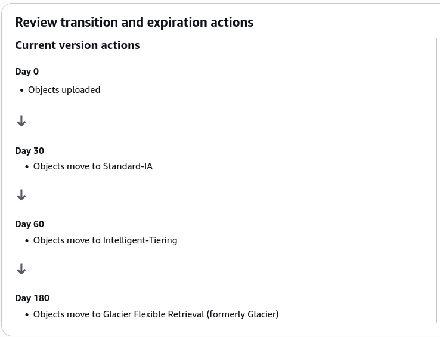

# S3 Storage Classes Hands-On

This hands-on lab walks through the operational lifecycle of S3 objects.

## Step-by-Step Lab Guide

### Phase 1: Create the Bucket Environment

- Open your AWS Management Console and navigate to **Amazon S3**
- Click on **Create Bucket**
- Name your bucket: `rendy-s3-storage-demo`
- Choose any target AWS Region that works for your deployment layout and hit **Create bucket**.

### Phase 2: Upload and Inspect the Storage Class Matrix

- Click into your newly created bucket dashboard
- Click **Upload → Add files** and select your placeholder asset (e.g., `coffee.jpg`)
- Before hitting upload, scroll down and expand the **Properties** section to view the S3 Storage Class menu layout
- Inspect the table of storage class option for each tier:
  
- Choose **Standard-IA** for this initial asset payload
- Scroll down and click **Upload**

### Phase 3: Execute a Manual Storage Class Override

- Back in your bucket object dashboard, confirm that `coffee.jpg` shows a listed storage tier profile of **Standard-IA**.
- Click on the `coffee.jpg` item name link to open its individual resource metadata panel.
- Navigate down to the **Storage class** section under the Properties tab and click **Edit**.
- Change the active radial checkbox selection frm _Standard-IA_ down to **One Zone-IA**.
- Scroll to the bottom, review the warning indicators regarding data loss if an AZ suffers a failure, and click \*Save changes\*\*
- Confirm that the file's current state metadata has successfully flipped over to **One Zone-IA**.
- You can repeat this step to shift the asset into Glacier Instant Retrieval or Intelligent Tiering on the fly.

### Phase 4: Configure an Automated S3 Lifecycle Rule

- Navigate back up to the root level of your bucket dashboard and switch over to the **Management** tab.
- Find the _Lifecycle rules_ section block and click **Create lifecycle rule**.
- Configure the automated transition criteria:
  - **Lifecycle rule name**: `DemoLifecycleRule`
  - **Choose a rule scope**: Select **Apply to all objects in the bucket** (and acknowledge the confirmation checkbox)
  - **Lifecycle rule actions**: Check the box that says **Transition current versions of objects between storage classes**.
- Define your time-phases sequential cascade transition step-by-step:
  - **Transition 1**: Choose **Standard-IA** from the dropdown matrix and set **Days after object creation** to 30.
  - Click _Add transition_
  - **Transition 2**: Choose **Intelligent-Tiering** from the dropdown matrix and set **Days after object creation** to `60`.
  - Click _Add transition_
  - **Transition 3**: Choose **Glacier Flexible Retrieval** from the dropdown matrix and set **Days after object creation** to `180`.
- Scroll down to the absolute bottom of the creation pane to inspect the clean, summarized timeline visualization graph generated by AWS.
- Click **Create rule** to deploy your automated storage optimization pipeline.
  
