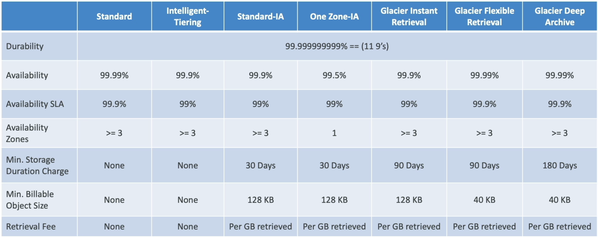
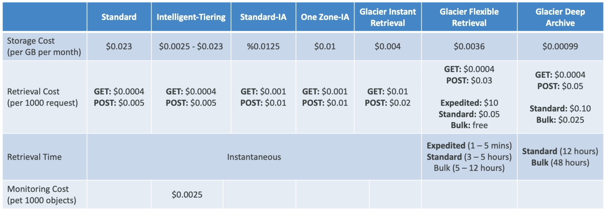

# S3 Storage Classes Overview

Amazon S3 splits storage options into distinct classes classified by accessibility, retrieval latency, and geographic redundancy. While every single class guarantees the exact same baseline data durability, they trade off Availability and Minimum Storage Durability rules to dramatically drop your raw monthly per-gigabyte costs. You can transition files across these tiers manually, automate them using S3 Lifecycle Policies, or let S3 Intelligent-Tiering dynamically shift them for you based on active usage patterns.

## Key Takeaways

### Durability vs. Availability

- **Durability** (The "Anti-Loss" Metric): Represents the probability that AWS will physically lose your bits due to hardware decay or data center destruction. Every standard class guarantees 11 Nines (99.999999999%) durability.
  - _What this means_: If you store 10,000,000 files on S3, AWS will lose exactly one single file on average once every 10,000 years. It is functionally bulletproof.
- **Availability** (The "Up-Time" Metric): Represents how readily accessible your objects are to an active API caller at any given moment without throwing an HTTP error. For example, S3 Standard offers 99.99% availability, meaning your app logic must be resilient enough to handle roughly 53 minutes of localized downtime or transient api request drops per year.

### The 7 Storage Classes Decoded

#### 🚀 1. S3 Standard - General Purpose

- **The Profile**: Hot tier for frequently accessed application assets.
- **Metrics**: 99.99% Availability. Replicated across ≥3 distinct Availability Zones.
- **Use Cases**: Active app databases, dynamic web images (`coffee.jpg`), mobile/gaming assets, and raw big data pipelines. Sustains the complete destruction of 2 concurrent AWS facilities without data loss.

#### 📉 2. S3 Standard-Infrequent Access (S3 Standard-IA)

- **The Profile**: Cold data that is rarely accessed, but requires immediate, sub-millisecond retrieval when requested.
- **The Financial Trap**: Lower raw storage cost per gigabyte than Standard, but you are charged an additional fee for every gigabyte of data you retrieve.
- **Use Cases**: Enterprise disaster recovery clusters, critical secondary backups, or long-term data logs.

#### 📍 3. S3 One Zone-Infrequent Access (S3 One Zone-IA)

- **The Profile**: Infrequent access storage that cuts costs even deeper by breaking the multi-AZ constraint.
- **The Risk**: Your data is pinned inside **one single physical Availability Zone**. If a natural disaster destroys that specific data center facility, your data is permanently gone.
- **Metrics**: Drops to 99.5% availability.
- \*_Use Cases_: Storing reproducible secondary backup copies, image thumbnail caches, or data sets you can easily rebuild from source scratch if the facility goes dark.

#### ❄️ 4. S3 Glacier Instant Retrieval

- **The Profile**: Extreme archive storage meant for files accessed maybe once a quarter, but still demands millisecond-level retrieval speeds when pulled.
- **Constraints**: Minimum storage billing duration of 90 days.

#### 🗃️ 5. S3 Glacier Flexible Retrieval

- **The Profile**: Deep archival backup where you are completely willing to wait for your files to be staged before downloading.
- **Constraints**: Minimum storage duration of 90 days. You choose between three distinct retrieval velocity paths:

```math
\text{Glacier Retrieval Speed} = \begin{cases} \text{Expedited:} & 1 - 5 \text{ minutes} \\ \text{Standard:} & 3 - 5 \text{ hours} \\ \text{Bulk:} & 5 - 12 \text{ hours (Free)} \end{cases}
```

#### 🕳️ 6.S3 Glacier Deep Archive

- **The Profile**: The absolute cheapest storage class in the entire AWS cloud. Built strictly for long-term compliance data preservation.
- **Constraints**: Minimum storage duration of 180 days.
- **Retrieval Paths**: Standard takes 12 hours, Bulk takes 48 hours. You store it here and forget it exists unless a legal audit hits your company.

#### 🧠 7. S3 Intelligent-Tiering

- **The Profile**: The ultimate "set-and-forget" automation tier for un-predictable or changing access patterns.
- **The Mechanic**: AWS charges a tiny monthly optimization fee per object. In return, S3 monitors access logs. If a file sits untouched for 30 consecutive days, S3 automatically moves it down to Infrequent Access. If it passes 90 days, it drops to Archive Instant Access. The minute a user requests that file again, it instantly pops back up to the Frequent Access hot tier with 0 retrieval surcharges!


S3 Storage Classes Comparison Table - https://aws.amazon.com/s3/storage-classes/

---


S3 Storage Classes Cost Comparison - https://aws.amazon.com/s3/pricing/

## Exam Tips

The exam will repeatedly put you in a position to choose the exact right tier based on complex application constraints. Memorize these distinct diagnostic patterns:

**The Changing Access Pattern Blueprint**: An exam scenario states, _"You are managing an analytics application where data is accessed intensely for the first 14 days after creation, accessed occasionally for the next 30 days, and after that, its usage pattern become completely unpredictable. The company mandates maximum cost savings with zero data retrieval friction or engineering overhead. Which class do you choose?"_  
**The absolute only correct choice is S3 Intelligent-Tiering**. Because the usage becomes entirely predictable after the initial month, hardcoding a static lifecycle policy will cause financial penalties if data is unexpectedly pulled from Glacier. Intelligent-Tiering absorbs the monitoring overhead and safely handles the cost scaling without any risk of performance drops or manual script maintenance.
