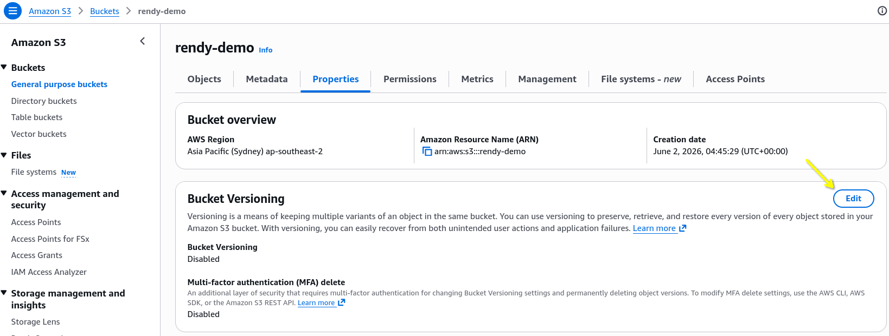
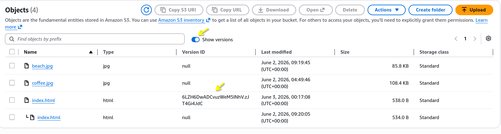
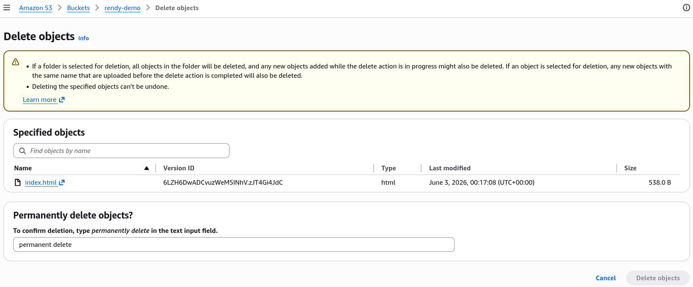
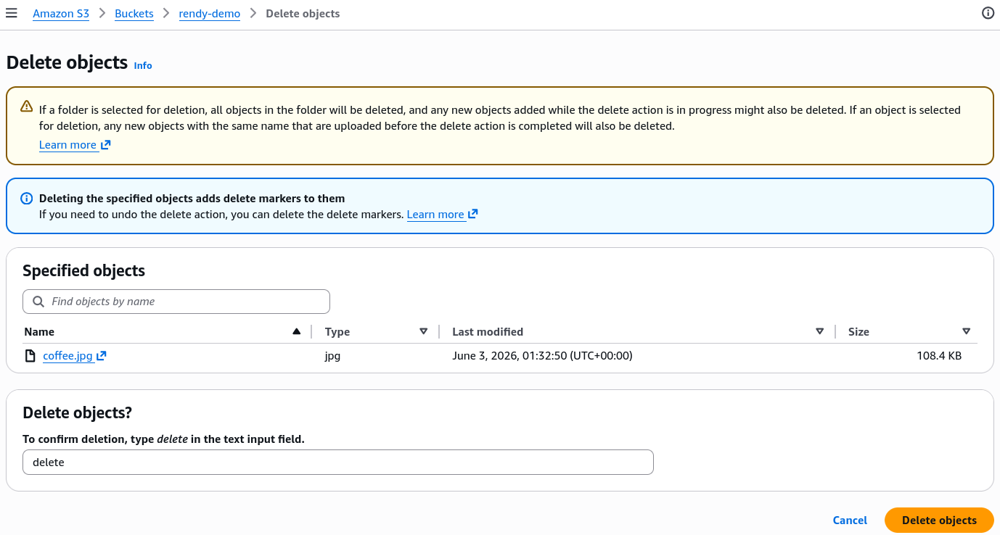
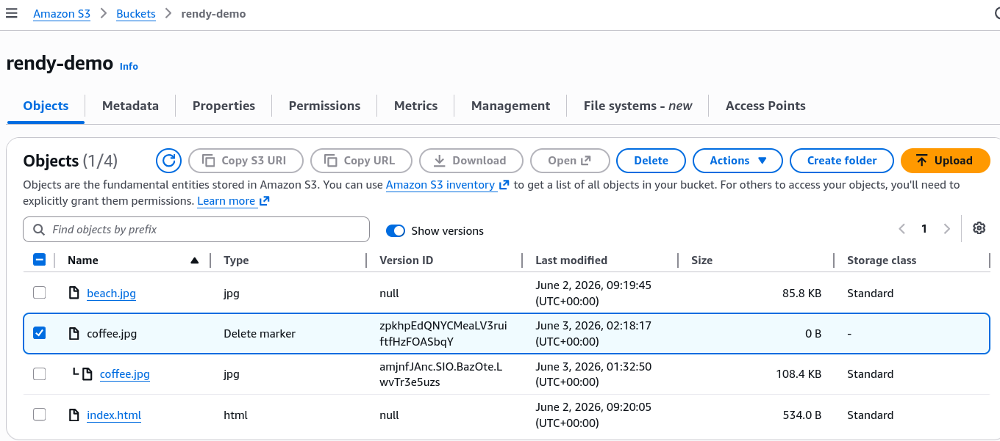

# S3 Versioning

By turning on Versioning, you force S3 to behave like a secure git history for your physical storage assets. S3 Versioning is a data-protection feature configured at the **Bucket Level**. Once activated, any `PUT` or override operation on an existing file key does not replace the old data; instead, it preserves the historical payload and assign a new, unique **Version ID** string. For standard web queries, S3 seamlessly serves up the current generation of the file, while keeping your historical iteration perfectly intact behind the scenes.

```
[ Your S3 Bucket: Versioning ENABLED ]

Key Location: s3://my-bucket/index.html

┌────────────────────────────────────────────────────────┐
│ Version ID: v3_xyz  |  [Latest / Current]              │ ──> Served on root requests
├────────────────────────────────────────────────────────┤
│ Version ID: v2_abc  |  [Noncurrent Version]            │
├────────────────────────────────────────────────────────┤
│ Version ID: v1_mno  |  [Noncurrent Version]            │
└────────────────────────────────────────────────────────┘
```

- **The Immutable Flow**: If you upload `index.html` three times in a row, S3 creates three independent object entities stacked on top of each other at that precise key path.
- **The `null` Base Variant**: If your bucket had files sitting inside it before you clicked enable versioning, those legacy objects don't get a random ID code assigned. S3 assigns them a baseline Version ID of `null`.
- **The Cost Implication**: AWS charges you for every single version stored in your bucket. If you overwrite a 2 GB database zip file 10 times, you are actively paying for 20 GB of physical S3 storage.

## Deletion Behavior

### The Delete Marker

When you issue a standard `DELETE` command (manually in the console or via the CLI) against a versioned object without specifying an ID, S3 doesn't actually wipe any blocks off the drive. Instead, it create a special object token called a **Delete Marker** and pushes it straight to the top of the version stack.

#### 🗑️ Scenario A: A Standard Un-Versioned Delete

- **The Action**: You run `aws s3 rm s3://rendy-demo-bucket/index.html`.
- **The Result**: S3 generates a Delete Marker and labels it as the `[Latest]` current version.
- **The Browser Experience**: When your public users hit your static website URL, S3 inspects the top of the stack, reads the Delete Marker, and throws a standard `HTTP 404 Not Found` error. Your file looks completely deleted to the outside world.
- **The Rollback**: Because the underlying data versions are still safely nested underneath that market, you can restore your file instantly! You simply check the "Show Versions" toggle inside the console, select the **Delete Marker itself**, and delete _just that marker_. S3 drops the marker, the previous version floats back to the top of the stack as the current generation, and your website instantly pops back online!

#### 🔒 Scenario B: A Permanent Versioned Delete

- **The Action**: You want a file completely gone from existence to free up budget or purge stale code.
- **The Result**: to execute a permanent delete you must explicitly pass the exact **Version ID** string inside your API call:

```bash
aws s3api delete-object --bucket rendy-demo-bucket --key index.html --version-id v2_abc
```

- S3 identifies that specific layer inside the stack and completely removes it from the cloud array.

## Suspending Versioning

Once you enable versioning on an S3 bucket, **you can never return that bucket back to un-versioned state**. Your only architectural path is to change the configuration status to **Suspended**.

- **The Safe State**: Suspending versioning leaves 100% of your historical file layers completely untouched and intact. S3 will not wipe your old backups or clear existing version IDs.
- **The Future Behaviour**: Any new file payloads you upload _after_ suspending the bucket will automatically be stamped with a Version Id of `null`. If you upload a file to a key that already has an existing `null` version layer inside the bucket, the new upload will cleanly overwrite that specific `null` instance while leaving the older, uniquely-ID'd histories completely safe.

## Hands On

### Enabling Versioning and Rolling Back to Previous Versions

First we enable the bucket versioning feature from specific bucket properties dashboard.



Let's try updating our `index.html` file by updating the text content from "I love Coffee" to "I Love Cappuccino". After the upload, and when you toggle the "show versions" button, you can see that S3 has preserved the old version of the file and assigned a new Version ID to the latest upload.



Let's say we want to roll back to the previous version of the file. We can simply select the latest version, and delete just that version layer. Because we targeted an _explicit ID_, AWS will prompt us to confirm the **Permanent Delete** action. Once we confirm the `null` version layer will be the `Latest` version, and the original "I love Coffee" text will pop back up on the website.



### The Delete Marker in Action

Let's turn the **Show versions** OFF and hit delete on `coffee.jpg` without specifying a version ID. S3 will generate a Delete Marker and push it to the top of the stack. When we try to access the file using the public URL, S3 will read the marker and throw a `404 Not Found` error.



To bring the coffee asset back to life, turned the **"Show Version" ON**, selected the **Delete Marker object itself**, and deleted it. By deleting the marker, the original iamge binary will float back to the top of the stack, instantly restoring the media link to the live website.



## Exam Tips

**The Version Exhaustion Cost Optimization Trap**: An exam scenario states, _"Your deployment pipeline pushes automated Webpack compilation assets to an S3 versioned bucket on every code commit. Over 6 months, your S3 bill has bloated significantly due to thousands of old noncurrent javascript asset versions remaining in storage. You need a hands-free, automated way to retain only the last3 versions of any file and permanently delete anything older than 30 days. How do you implement this?"_  
**The definitive choice is to configure an S3 Lifecycle Policy utilizing the `NewerNonCurrentVersions` parameter**. You write an automation lifecycle rule targeting the bucket that states, _"Transition noncurrent versions to S3 Glacier after 14 days, and permanently delete noncurrent versions after 30 days while ensuring the 3 newest versions are always preserved."_
