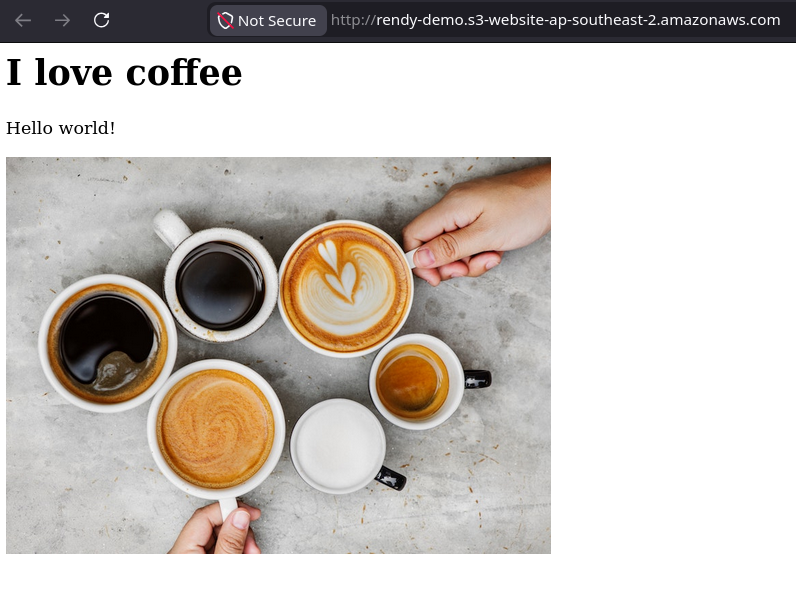

# S3 Websites: Static Hosting

Amazon S3 can natively serve web assets directly to a user's browser without any compute backend required. When you enable **Static Website Hosting**, S3 activates a dedicated, region-specific HTTP endpoint for your bucket. To make the site active, you must configure entry point files (like `index.html`), disable Block Public Access, and apply a public `s3:GetObject` bucket policy so the internet can actually render the files.

## Overview

When you flip the switch to turn a bucket into a website, S3 changes how it handles requests:

- **The Website Endpoint Structure**: S3 generates a completely separate, unique URL string specifically meant for browser traffic. It looks subtly different depending on the region's historical API generation, using either a **dash** or a **dot** before the region name:

```math
\text{Endpoint} = \text{http://} \, \langle\text{bucket-name}\rangle\text{.s3-website-} \, \langle\text{region}\rangle\text{.amazonaws.com}
```

```math
\text{Endpoint} = \text{http://} \, \langle\text{bucket-name}\rangle\text{.s3-website.} \, \langle\text{region}\rangle\text{.amazonaws.com}
```

:::note
**S3 static website endpoint strictly support HTTP only**. If you need HTTPS, the standard approach is to deploy Amazon CloudFront in front o your S3 bucket. You attach your SSL certificate (managed via AWS Certificate Manager) straight to CloudFront. CloudFront safely handles the secure HTTPS handshake with the public internet at the global Edge locations and fetches the files fro your S3 bucket backend over the internal network. Saving S3 egress traffic costs.
:::

## Hands On

The lab demonstrates the final integration steps for S3 Static Website Hosting. By uploading an entry point file (`index.html`) containing relative asset links (like ``), the bucket automatically resolves root domain requests. Because the **Block Public Access** guardrail was already down and the `s3:GetObject` public policy was active, the browser effortlessly parses the HTML structure and renders the embedded media files globally.

### How S3 Resolves Relative Links

When a user pastes your bucket website endpoint into their browser, a clean architectural handshake happens behind the scenes:

1. **The Root Request**: The browser hits
2. **The Index Delivery**: S3 matches the root path against your configured **Index Document** property and serves up the raw `index.html` file code.
3. **Relative Fetch**: The browser parses the HTML code and encounters an image tag ``.
4. **Automatic Namespace Append**: Because it's a relative link, the browser automatically prepends the current base domain name to the asset string, executing a second clean HTTP fetch directly to

```math
\text{Asset Target Path} = \text{http://} \, \langle\text{bucket-name}\rangle\text{.s3-website-} \, \langle\text{region}\rangle\text{.amazonaws.com/} \, \langle\text{asset-string}\rangle
```

5. **The Multi-Asset Render**: S3 validates the `coffee.jpg` key exists in the flat database and returns the image binary payload, perfectly assembling the web page inside the user's viewport.


