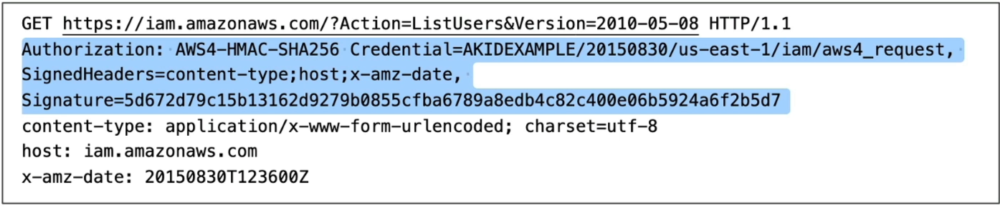
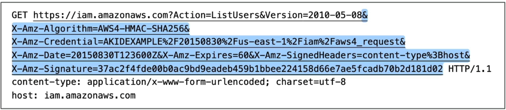

# AWS Signature Version 4 (SigV4)

Up until now, we've just been dropping commands like `aws s3 ls` or using the SDK, and everything magically worked. But underneath those clean programmatic abstracts lies a complex cryptographic handshake. Every single interaction with an AWS resource is ultimately just a standard raw HTTP packet firing over the internet. SigV4 is the cryptographic handshake that ensure no one can intercept, alter, or forge those packets.

**AWS Signature Version 4 (SigV4)** is the native cryptographic signing protocol used to authenticate inbound HTTP requests sent to all AWS service API gateways. By hashing request attributes (headers, paths, payloads) together with an IAM user's role or role's secret access key, SigV4 proves the identity of the sender and guarantees the data integrity during transit. The resulting signature string is transmitted to AWS using either an HTTP **Authorization Header** or an inline URL **Query String parameter**.

## Key Takeaways

### Why We Sign

Every time you hit an AWS API endpoint, AWS needs to verify two absolute security parameters before executing your code:

- **Authentication**: Are you genuinely who you claim to be?
- **Data Integrity**: Did a malicious actor intercept this packet in transit and secretly modify the parameters (e.g., swapping a deletion target bucket path)?

To solve this without sending your highly sensitive **Secret Access Key** across the raw internet wire where it could be sniffed, SigV4 uses a multi-step hashing process.

### The SigV4 Handshake Mechanics

1. **The Canonical Request**: The SDK collects your HTTP method (GET, POST), the target host URL path, the query strings, and your headers, organizing them into a strict, standardized text block.
2. **The String to Sign**: The SDK combines that text block with a timestamp and a specialized scope string (date, region, service name).
3. **The Signing Key Cascade**: The SDK derives a unique, temporary signing key by running sequential HMAC-SHA256 hashing operations using your Secret Access Key as the root seed.
4. **The Signature Generation**: The final String to Sign is hashed against that derived signing key to output a unique hexadecimal string signature token:

```math
\text{Final Signature Token} = \text{HMAC-SHA256}(\text{Derived Signing Key}, \text{String to Sign})
```

When the packet hits the AWS gateway, AWS replicates this exact mathematical calculation using its own backend copy of your Secret Key. If your calculated hash matches the incoming hash perfectly, AWS authorizes the request!

### 2 Methods to Transmit the Signature

#### 📥 Method A: The HTTP Authorization Header

This is the standard, out-of-the-box delivery profile used by the AWS CLI, backend SDK integrations, and automated infrastructure frameworks.


#### 🌐 Method B: The URL Query String (Pre-Signed URLs)



- The Parameters:
  - `X-Amz-Algorithm=AWS4-HMAC-SHA256`: Dictates that SigV4 cryptographic hashing logic is active.
  - `X-Amz-Credential`: Maps out your specific access key, execution date, target region, and destination service context.
  - `X-Amz-Date`: Stores the exact timestamp coordinate when the signing calculation was compiled.
  - `X-Amz-Expires`: Sets a hard-coded time-to-live countdown window (in seconds).
  - `X-Amz-Security-Token`: Houses the temporary ASIA token payload if the key was derived from an assumed IAM Role or IMDS profile.
  - `X-Amz-Signature`: The final unique cryptographic validation string that binds the entire URL string layout together.

## Exam Tips

| Transmission Vector           | Default Use Case                                                                                                           | Key Query Parameter Key                                | Target Exam Keyword Trigger                                           |
| ----------------------------- | -------------------------------------------------------------------------------------------------------------------------- | ------------------------------------------------------ | --------------------------------------------------------------------- |
| **HTTP Authorization Header** | Standard machine-to-machine communications (CLI, automated code scripts, EC2-to-S3 loops).                                 | None (Hidden inside background network header arrays). | "Standard SDK calls", "Internal background automation tasks"          |
| **URL Query String**          | Granting temporary, time-restricted read or write pathways to anonymous global users or front-end client web applications. | X-Amz-Signature                                        | "Pre-signed URLs", "Temporary download links for third-party clients" |

**The Pre-Signed Expiration Triage Trap**: Imagine an exam scenario states, _"A web application uses a backend Lambda function to generate pre-signed S3 URLs so customers can download invoice PDFs securely. The Lambda function uses an execution IAM role to sign the links with an explicit X-Amz-Expires window set to 86,400 seconds (24 hours). However, customers report that links generated late in the afternoon start throwing ExpiredToken errors after only a couple of hours. Why?"_  
**The textbook developer trap answer rests entirely on the origin of the signing keys**.  
S3 Pre-Signed URL can technically have an expiration window of up to 7 days when signed by permanent IAM User keys (`AKIA`), links signed using temporary STS credentials (like a Lambda Function's assumed IAM execution role starting with `ASIA`) are hard-constrained by the lifespan of the underlying role session itself.
