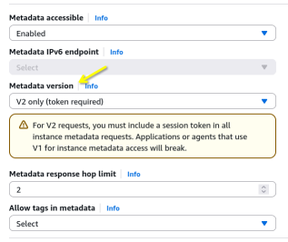
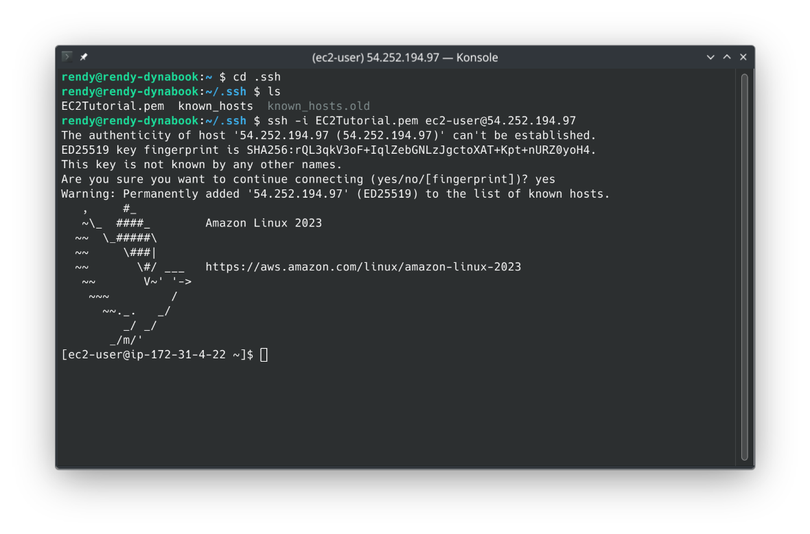
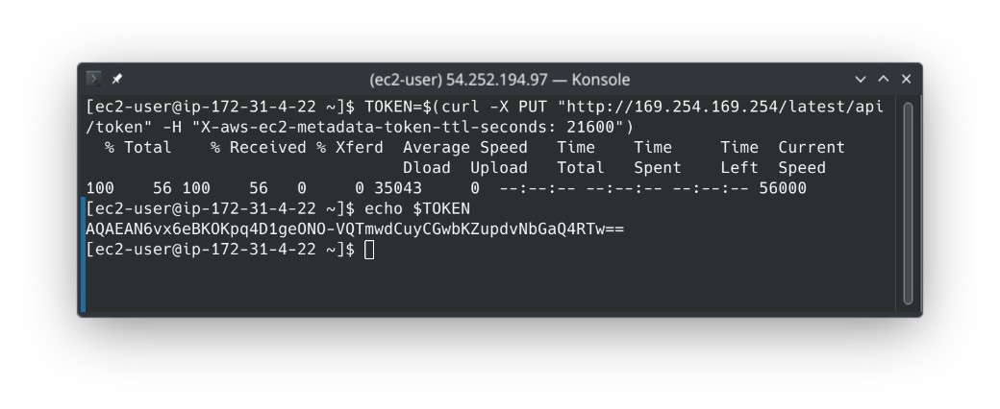
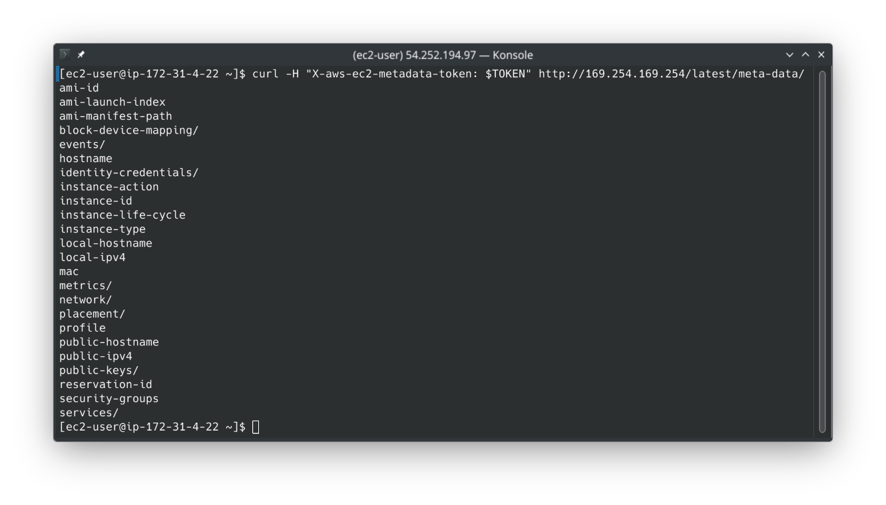
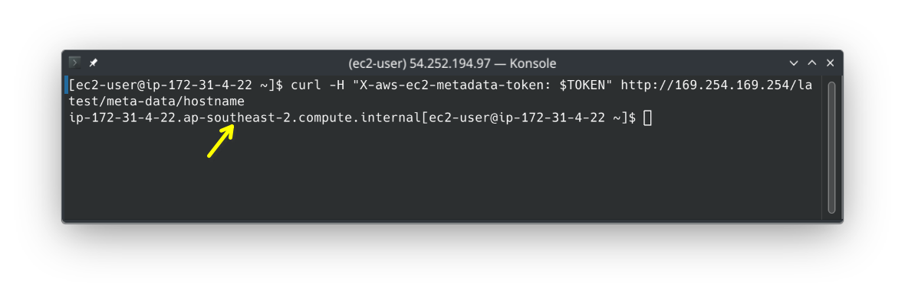
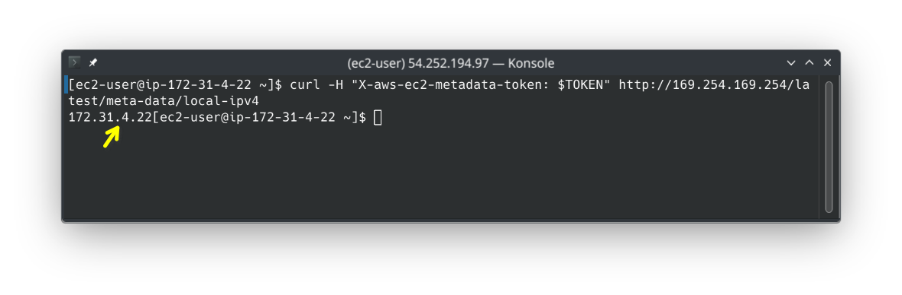
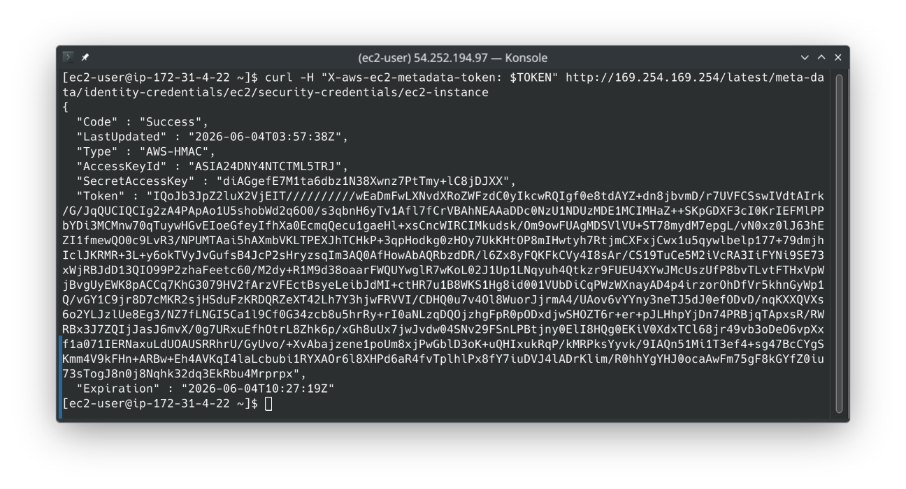

# AWS EC2 Instance Metadata - Hands-On

This hands-on lab walks through executing terminal-level IMDS queries inside an Amazon Linux 2023 environment.

## Hands-On

### Phase 1: Launch the Hardened Node

- Navigate to your **EC2 Dashboard** and click **Launch instance**.
- Instance Name: `DemoEC2`.
- **AMI**: Choose **Amazon Linux 2023 AMI**. This image has IMDSv2 enabled by default.
  
- **Key Pair**: I'll use an existing key pair, you can opt out if you don't have one and use web browser console
- **Network Settings**: Create a new SG that permits incoming **SSH** traffic from anywhere
- **IAM Instance Profile**: Leave this completely blank for now, we'll inject a role mid-lab to monitor live configuration state changes.
- Scroll to the bottom and click **Launch instance**. Connect to your instance via SSH or the web console terminal.
  

### Phase 2: The Direct Request Failure (IMDSv1 Audit)

- Once inside the terminal, test a naked, unauthenticated stateless HTTP request against the link-local IP:

```bash
curl http://169.254.169.254/latest/meta-data/
```

- **Result**: No response, this is because Amazon Linux 2023 blocks IMDSv1 requests by default.

### Phase 3: The IMDSv2 Secure Token Handshake

- **Step 1**: Mint a session token. Execute an HTTP `PUT` request and store it in a variable:

```bash
TOKEN=$(curl -X PUT "http://169.254.169.254/latest/api/token" -H "X-aws-ec2-metadata-token-ttl-seconds: 21600")
```

- **Step 2**: Inspect the active token
  

- **Step 3**: Query the Active Metadata Manifest.
  Fire your `GET` query back to the metadata root path, but this time inject your variable string inside the mandatory custom authorization header block:

```bash
curl -H "X-aws-ec2-metadata-token: $TOKEN" http://169.254.169.254/latest/meta-data/
```

- **Result**: The terminal cleanly spits out the entire base metadata directory map!
  
- _Console Directory Tip_: Trailing forward slashes inside the response string (like `network/`) indicate sub-directories packed with more keys. Raw strings without slashes (like `ami-id`) represent terminal value readouts.
- **Step 4**: Target Specific Environment Specs. Append downstream key targets to the resource query path string to extract standalone environment parameters:
  - Fetch the local server hostname
    
  - Fetch the internal private IPv4 address
    

### Phase 4: Dynamic IAM Profile Injection

- Run a deep path query targeting the local credential directory loop:

```
curl -H "X-aws-ec2-metadata-token: $TOKEN" http://169.254.169.254/latest/meta-data/identity-credentials/ec2/security-credentials/
```

- **Result**: I got a response. This is because the EC2 instance was launched with a default, auto-generated IAM Instance Profile role that AWS tucks in behind the scenes. However in the hands-on lab environment, Stephane got an error, I think in previous versions of Amazon Linux 2023, the auto-generated role was not included by default. If you don't see a response, you can create a new IAM Role with EC2 permissions and attach it to your instance mid-flight to trigger this response:
  - Open your AWS EC2 console, and select your `DemoEC2` instance.
  - CLick Actions → Security → Modify IAM Role.
  - Attach any existing valid runtime role profile from your account dropdown list and click **Update IAM Role**
- **The Terminal Output**: S3/EC2 dumps a full JSON configuration block carrying a live `AccessKeyId`, a `SecretAccessKey`, a temporary `Token` string, and an expiration timestamp indicating the key's life window (typically rotating every 1 hour).
  
- **Clean Up**: Once you are done, go ahead and **Terminate** your EC2 instance to avoid any stray billing overhead.
