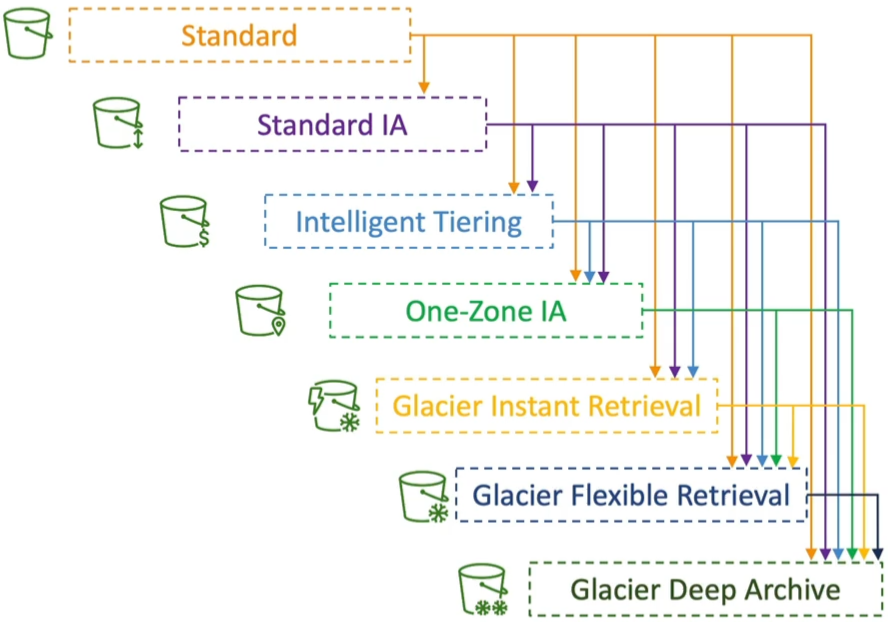
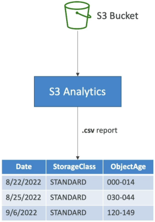

# S3 Lifecycle Rules (with S3 Analytics)

When you're dealing with high-scale cloud apps storing petabytes of user uploads, server access logs, or media files, hardcoding storage settings is a major anti-pattern. If you just lave everything in the hot S3 Standard tier forever, your monthly AWS bill will skyrocket.

**S3 Lifecycle Configuration Rules** provide an automated lifecycle framework to manage your storage footprint using two core actions: **Transition Actions** (shifting files down to colder, more cost-efficient storage tiers as they age) and **Expiration Actions** (permanently deleting objects or clean-cutting historical version clutter). To determine the exact financial sweet spot for when these transitions should trigger, engineers deploy **S3 Storage Class Analytics** to monitor real-time data access patterns and generate optimization CSV reports.

## Key Takeaways

### Transition Vs. Expiration

An S3 Lifecycle configuration is a structured XML rule schema applied directly to a bucket. Every rule you build consists of one or both of these functional action pillars:

#### 🔄 1. Transition Actions

- **The Mechanic**: Moving files from a warmer, high-availability storage class down to a lower-cost, high-latency archive tier based on an elapsed day counter from the file's creation timestamp.
- **The Allowed Cascade**: You must adhere to the hot-to-cold sequential waterfall.
  

#### 🗑️ 2. Expiration Actions

- **The Mechanic**: Telling S3 to completely purge an asset once it passes a certain threshold. S3 handles the deletion cleanly behind the scene.

- **Production Targets:**:
  - **Ephemeral Assets**: Purging application access logs or transient temporary uploads after a set period (e.g., delete raw server logs after exactly 365 days).
  - **Versioning Clean-up**: Automatically sweeping out old, hidden Non-current Versions of files that are bloating your storage budget.
  - **Multi-part Upload Safety Net**: Automatically aborting and deleting Incomplete Multi-part Uploads if they stall out for more than 14 days. This is a critical budget saver because partial chunk uploads consume physical drive space and cost you money, even if the file never finishes compiling!

:::tip
You don't have to blast a lifecycle rule across your entire bucket indiscriminately. You can restrict its target zone using:

- **Prefix Filters**: Isolating rules to specific folder paths (e.g., target only objects sitting inside the `/thumbnails/` or `/tmp/` namespace).
- **Object Tags**: Isolating rules to files matching explicit metadata key-value signatures (e.g., target only assets stamped with Department=Finance).
  :::

### Real World Use Cases

The DVA-C02 exam will test your ability to read application behaviour and map them to the correct lifecycle strategy. Here are some common scenarios:

#### 🖼️ Scenario A: The Image App Optimization (Source vs. Thumbnails)

- **The App Behavior**: An application generates image thumbnails from profile photos. Thumbnails can be easily regenerated if lost and are only needed for 60 days. Source images must be immediately available for 60 days, but afterward, users are perfectly willing to wait up to 6 hours for retrieval.
- **The Architecture Setup**:
  - **The Path Scope**: Use Prefix matching to separate the folders: `/source/` vs `/thumbnails/`.
  - **Source Image Rule**: Leave them in **S3 Standard** initially. Create a transition action to shift them to **S3 Glacier Flexible Retrieval** after 60 days (matching the 6-hour retrieval window requirement).
  - **Thumbnails Rule**: Push them directly to **S3 One-Zone IA** on upload (since they are infrequently accessed, low-criticality, and easily reproducible). Create an **Expiration Action** to permanently delete them after 60 days.

#### 🛡️ Scenario B: The Compliant Trash Bin (Soft Delete Restoration)

- **The App Behavior**: Company compliance states that deleted objects must be instantly recoverable for the first 30 days. After 30 days and up to a full year (365 days), deleted files must still be recoverable, but the business can tolerate a 48-hour data retrieval delay window.
- **The Architecture Setup**:
  - **The Storage Layer**: Enable **S3 Versioning** on the bucket so that a standard delete action simply applies a hidden Delete Marker over the files.
  - **The Lifecycle Rule for Non-Current Versions**: **At day 30**, trigger a transition action to move all **Non-Current Versions** down into **S3 Standard-IA** (providing cheap, immediate recovery capacity). **At day 90**, trigger a secondary transition action to push those non-current versions down into **S3 Glacier Deep Archive** (minimizing raw storage fees while satisfying thr 48-hour compliance retrieval requirement up to day 365). **At day 365**, trigger an expiration action to permanently delete all non-current versions.

### The Data-Driven Approach: S3 Storage Class Analytics

How do you scientifically prove to your team that a file should transition to IA at exactly day 30 instead of day 45? **You do not guess, you deploy S3 Storage Class Analytics**.

- **The Mechanic**: You toggle it on at the bucket root or at a specific prefix path level. The analytics engine continuously monitors your data retrieval logs.
- **The Output**: It compiles a comprehensive data visibility map and outputs a daily CSV report directly into a target S3 bucket of your choice.
- **The Ramp-Up Time**: It takes roughly 24 to 48 hours of active data monitoring before the first set of statistical optimization trends and transition recommendations show up in the report.
- **⚠️ Hard Exam Constraint**: S3 Storage Class Analytics **only evaluates and provides recommendations for transitions from S3 Standard to S3 Standard-IA**. It does not track patterns or generate analytics mappings for _S3 One-Zone-IA_ or any _Glacier_ archive tiers!

## Exam Tips

| Desired Business Outcome                                 | Rule Target Scope          | Primary Action Mechanism           | Target S3 Storage Tier       |
| -------------------------------------------------------- | -------------------------- | ---------------------------------- | ---------------------------- |
| **Purge dangling, broken file uploads costing money**    | Global Bucket or Prefix    | **AbortIncompleteMultipartUpload** | None (Permanently Deleted)   |
| **Retain active file backups for regulatory compliance** | Non-current Versions       | **Transition Action**              | S3 Glacier Deep Archive      |
| **Automate tier shifts based on data science metrics**   | S3 Standard to Standard-IA | **S3 Storage Class Analytics**     | Generates a daily CSV Report |
