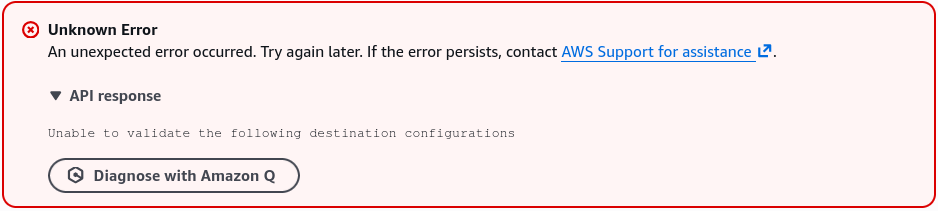
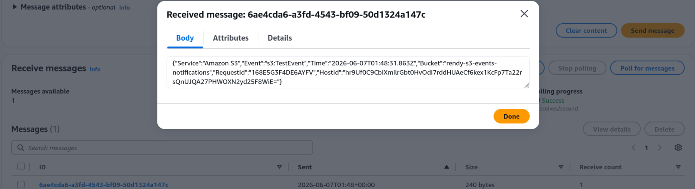

# S3 Event Notifications - Hands On

This hands-on lab walks through the infrastructure pipeline required to hook an Amazon S3 bucket's mutation events directly into an Amazon SQS storage queue. You will provision the baseline resources, configure an overly permissive SQS Resource Access Policy to satisfy the S3 security validation handshake, and verify the background data stream by parsing an automated `ObjectCreated:Put` event JSON payload using terminal messaging tools.

## Hands On

### Phase 1: Provision the Storage and Messaging Nodes

- **Create the S3 Bucket**:
  - Open the **Amazon S3 Console** and click **Create bucket**.
  - **Bucket name**: `rendy-s3-events-notifications` or any unique name of your choice.
  - **Region**: Select your preferred region (e.g., `ap-southeast-2`).
  - Leave all secondary settings as default and click **Create bucket**.
- **Create the SQS Queue**:
  - Open a new browser tab, navigate to the **Amazon SQS Console**, and click **Create queue**.
  - **Type**: Standard Queue.
  - **Name**: `DemoS3Notification`.
  - Leave all timing attributes at their default configurations and click **Create queue**.
  - 📋 **Critical Step**: Copy your queue's unique ARN (Amazon Resource Name) string from the details panel. It will match this pattern: `arn:aws:sqs:ap-southeast-2:747554530150:DemoS3Notification`.

### Phase 2: Intercepting the Validation Block (The Permission Gap)

- Return to your **S3 Bucket** tab and click into the **Properties** tab.
- Scroll down to the **Event notifications** dashboard container.
- _Note_: You will see an **Amazon EventBridge** toggle option right at the top. Flipping this to _On_ pipes all bucket mutations into an EventBridge bus instantly. For this lab, skip it and click **Create event notification** instead.
- **Configure Notification Criteria**:
  - **Event name**: `DemoEventNotification`.
  - **Prefix / Suffix**: Leave entirely blank so the rule monitors your entire bucket space.
  - **Event types**: Check the box for **All object create events** (capturing `Put`, `Post`, `Copy`, and completed multi-part uploads).
  - **Destination**: Scroll to the bottom, select SQS queue, and choose your DemoS3Notification queue from the dropdown menu wrapper.
- **Click Save Changes**: 💥 The Result: The console instantly blocks your save execution with an Unknown / Validation Error. This happens because S3 attempts to drop a test communication string into the queue right away, but the queue's default security rules are blocking unauthenticated inbound inputs!
  

### Phase 3: Patching the SQS Resource Access Policy

- Toggle back over to your **Amazon SQS Queue** tab.
- Select your queue, click on the **Access policy** sub-tab layout, and click **Edit**.
- Scroll down to the raw JSON policy box. To bypass the restriction, click on **Policy Generator** to spin up an open permission rule:
  - **Type of Policy**: SQS Queue Policy.
  - **Effect** Allow
  - **Principal**: `*` (This translates to _anyone/any_ service—very permissive for a sandbox demo, but lets S3 connect immediately).
  - **Actions**: Select **SendMessage**.
  - **Amazon Resource Name (ARN)**: Paste your copied SQS Queue ARN string.
  - **Add Condition**: Choose **ArnEquals** → `aws:SourceArn` → Paste your S3 bucket ARN (`arn:aws:s3:::rendy-s3-events-notifications`).
  - Click **Add Statement**, then click **Generate Policy**.
- Copy the output JSON configuration block, head back to your SQS Edit window, erase the old policy data block, and paste your new broad permission schema into the document field:

```json
{
  "Version": "2012-10-17",
  "Statement": [
    {
      "Sid": "Statement1",
      "Effect": "Allow",
      "Principal": "*",
      "Action": ["sqs:SendMessage"],
      "Resource": "arn:aws:sqs:ap-southeast-2:747554530150:DemoS3Notification",
      "Condition": {
        "ArnEquals": {
          "aws:SourceArn": "arn:aws:s3:::rendy-s3-events-notifications"
        }
      }
    }
  ]
}
```

- Click **Save** to apply the updated resource boundary adjustments.

### Phase 4: Deploying the Notification Loop

- Jump back to your **S3 Event Configuration** screen and click Save changes a second time.
- **The Result**: The validation path clears cleanly, and the operation completes successfully!
- **The Proof Connection Check**: Go back to your SQS tab, click Send and receive messages, and hit Poll for messages.
- You will find an immediate background diagnostic test event message waiting inside the queue array. S3 dropped this token to verify the bridge connection. Select it and click **Delete** to wipe the testing log.



### Phase 5: Executing the Live Event Trigger Test

- Navigate to your S3 bucket root folder and upload a file named `coffee.jpg`.
- The millisecond the upload progress bar completes, S3 catches the state modification and fires an asynchronous message across the AWS network wire.
- Go to your **SQS Dashboard** → **Send and receive messages** → Click **Poll for messages**.
- **The Result**: A new message appears inside your queue terminal matrix within seconds!
- Click on the message row to inspect the structural backend JSON payload layout body:

```json
{
  "Records": [
    {
      "eventVersion": "2.1",
      "eventSource": "aws:s3",
      "awsRegion": "ap-southeast-2",
      "eventName": "ObjectCreated:Put",
      "s3": {
        "s3SchemaVersion": "1.0",
        "configurationId": "DemoEventNotification",
        "bucket": {
          "name": "rendy-s3-events-notifications",
          "arn": "arn:aws:s3:::rendy-s3-events-notifications"
        },
        "object": {
          "key": "coffee.jpg",
          "size": 110985
        }
      }
    }
  ]
}
```

- Verify that your text output explicitly matches the data variables tracking your file parameters:

```math
\text{Intercepted Event} = \texttt{"eventName": "ObjectCreated:Put"} \longrightarrow \texttt{"key": "coffee.jpg"}
```

- Once you've confirmed your system successfully extracted the payload attributes, click **Delete** on the message to clear your queue terminal.

## Exam Tips

**The Least Privilege SQS Policy Blueprint**: While Stephane used a broad wildcard (`"Principal": "\*"`) to skip configuration steps during the sandbox lab, doing this in a production workspace creates a major security hole because any external resource could spoof events into your application pipeline.  
**On the exam, the correct production architecture requires least-privilege scoping**. The SQS Access Policy must restrict traffic to the explicit `s3.amazonaws.com` service principal, combined with an advanced cryptographic condition clause that isolates inputs exclusively to your source bucket ARN:

```json
"Condition": {
  "ArnEquals": {
    "aws:SourceArn": "arn:aws:s3:::rendy-s3-events-notifications"
  }
}
```
