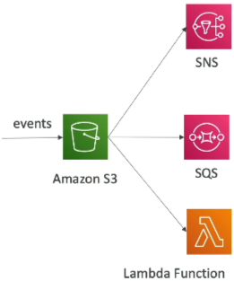
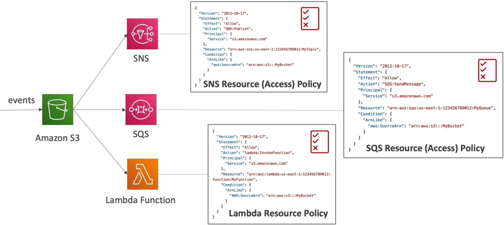
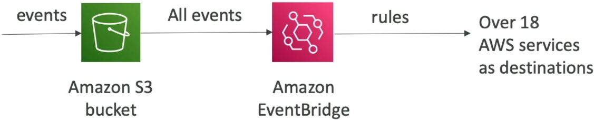

# S3 Event Notifications

In modern cloud development, your application can’t just sit around wasting CPU cycles constantly polling an S3 bucket asking, _"Did a user upload a file yet? How about now?"_ Instead, you want S3 to instantly wave a flag and alert your backend the split-second a specific file action occurs.

Amazon S3 Event Notifications allow you to programmatically react to state mutations inside a bucket, such as `s3:ObjectCreated`, `s3:ObjectRemoved`, `s3:ObjectRestore`, `s3:Replication`... These notifications can be natively filtered by filename prefixes or suffixes (e.g., `.jpg`) and fired directly into three core messaging targets: **SNS Topics**, **SQS Queues**, or **AWS Lambda Functions**. Alternatively, by enabling the **Amazon EventBridge** integration, you can stream all bucket events into a centralized bus to gain advanced filtering, event replay capabilities, and access to over 18+ downstream AWS targets.

## Key Takeaways

### The Traditional Big Three Targets & The Security Handshake

When you configure a standard event notification inside S3, you can filter the trigger using name parameters:

- **Prefix**: Target a specific directory (e.g., images/).
- **Suffix**: Target a specific file type (e.g., .jpg).

Once a file bypasses the filter, S3 drops an asynchronous JSON payload containing the bucket name, file key path, and file size within seconds to one of three classic destinations:

1. **AWS Lambda Functions**: To immediately run processing code (like resizing an uploaded beach.jpg into a thumbnail).
2. **Amazon SNS Topics**: To broadcast an alert message to multiple webhooks, emails, or mobile devices simultaneously.
3. **Amazon SQS Queues**: To buffer and queue up incoming file-processing tasks safely for background worker instances.

### The Resource (Access) Policy

Here is where developers get tripped up: **S3 does not use an IAM Execution Role to push these events**. Instead, the target destination services must actively lower their drawbridge to trust S3. You do this by applying a **Resource-Based Policy** straight to the target resource:

### The Modern Upgrade: Amazon EventBridge Integration

While the traditional setup is great, it has strict limits (like basic prefix/suffix filtering and hard caps on destination counts). Stephane highlights a massive feature drop: **The S3-to-Amazon EventBridge Pipeline**.

When you toggle the EventBridge switch on an S3 bucket, **every single object event is automatically piped straight into your account's default EventBridge bus**. This opens up a highly sophisticated architectural playground:

- **Advanced Structural Filtering**: You are no longer trapped by simple prefix/suffix text blocks. You can write custom JSON matching patterns to filter events based on exact object sizes, metadata tags, or specific API caller identities.
- **Massive Fan-Out Destination Arrays**: EventBridge rules can intercept your S3 events and split-route them to **over 18 different AWS targets** at the exact same time—including AWS Step Functions workflows, Kinesis Data Streams, or Firehose delivery lines.
- **Enterprise Resilience Tools**: EventBridge lets you Archive events inside a storage vault and Replay them weeks later. If your background compute cluster crashes during a major release deployment, you can simply spin the timeline backward and replay the exact same S3 event sequence to catch up on processing without missing a single byte!

## Exam Tips

**The Silent Delivery Drop Trap**: Imagine an exam scenario states, _"You configure an S3 bucket to drop an event notification into an Amazon SQS queue every time a user puts an item into the `/uploads/` directory folder. During your staging evaluation tests, you run `aws s3 cp` to place a file into the folder, but your background workers notice the SQS queue remains completely empty. CloudWatch metrics confirm S3 is triggering the notification, but the queue is not receiving it. How do you fix this?"_

**The textbook developer fix rests completely on the Resource Access Policy**. > Because S3 lacks a native service identity execution role, it relies completely on the destination's trust matrix. If the target SQS queue does not possess an attached **SQS Access Policy Statement** that explicitly lists the `s3.amazonaws.com` service principal inside its `Principal` configuration block and grants it the `sqs:SendMessage`action bound to your specific bucket ARN, **S3 will silently drop the event delivery on the floor**. You must update the SQS Access Policy JSON to bridge the security gap!
