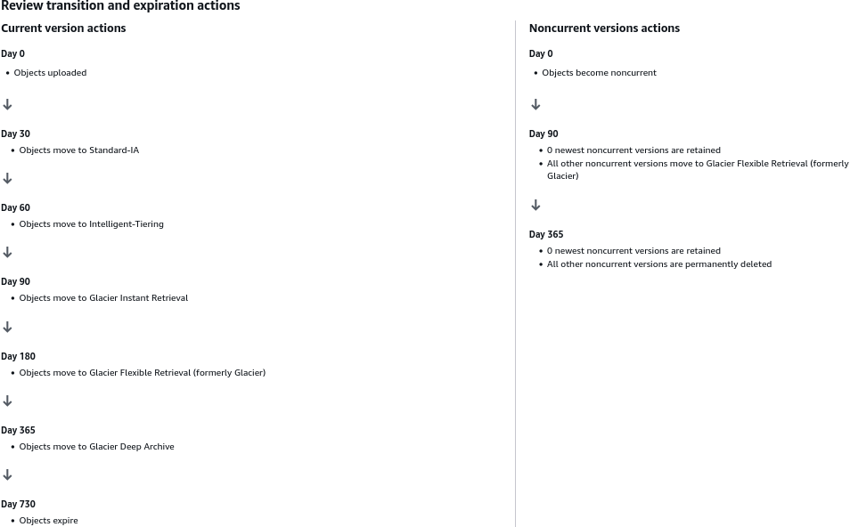

# S3 Lifecycle Rules - Hands On

This hands-on lab demonstrates how to architect a complete data lifecycle management matrix inside the S3 console.

## Hands On

### Phase 1: Initialize the Automated Rule Scope

- Open your **AWS Management Console**, navigate to **Amazon S3**, and click into your target deployment bucket.
- Switch over to the top-level **Management** tab.
- Locate the **Lifecycle rules** dashboard section container and click **Create lifecycle rule**.
- **Lifecycle rule name**: Type `DemoRule`.
- **Choose a rule scope**: Select **Apply to all objects in the bucket**.
- Check the explicit confirmation box acknowledging that this rule will apply globally across every single file asset nested inside this bucket container.

## Phase 2: Select Your Targeted Data Tracks

Scroll down to the **Lifecycle rule actions** section. Notice that AWS exposes **five distinct operational workflows**. Check the boxes for the specific behaviors you want to activate for your infrastructure:

- [x] **Transition current versions of objects between storage classes**: Targets the live, active files currently served to users during standard path queries.
- [x] **Transition noncurrent versions of objects between storage classes**: Targets the historical file layers buried beneath a newer upload or an active Delete Marker.
- [x] **Expire current versions of objects**: Triggers a time-based soft-deletion workflow for active assets.
- [x] **Permanently delete noncurrent versions of objects**: Permanently vaporizes back-end file versions to clean out digital clutter.
- [ ] **Delete expired object delete markers or incomplete multipart uploads**: (Leave unchecked for this lab, but used in production to stop partial chunk upload billing loops).
- [x] Check the mandatory acknowledgment box confirming you understand that tier transitions incur micro-billing cost shifts.

### Phase 3: Build the Current Version Cascade

Under the newly expanded **Transition current versions of objects** workspace layout panel, configure a chronological step-down sequence by choosing your tier targets and day offsets:

- Transition 1: Choose **Standard-IA** from the storage class dropdown → Set **Days after object creation** to 30.
- Click _Add transition_.
- Transition 2: Choose **Intelligent-Tiering** from the dropdown $\longrightarrow$ Set **Days after object creation** to 60
- Click _Add transition_.
- Transition 3: Choose **Glacier Instant Retrieval** from the dropdown → Set **Days after object creation** to 90.
- Click _Add transition_.
- Transition 4: Choose **Glacier Flexible Retrieval** from the dropdown → Set **Days after object creation** to 180.
- Click _Add transition_.
- Transition 5: Choose **Glacier Deep Archive** from the dropdown → Set **Days after object creation** to 365.

### Phase 4: Configure the Archival Non-Current and Expiration Boundaries

Scroll to the respective sub-panels to define your compliance retention rules and absolute deletion barriers:

- **Transition Non-Current Layers**: Under the _Transition non-current versions_ workspace layout block:
  - Choose **Glacier Flexible Retrieval** from the dropdown → Set **Days after objects become non-current** to 90.
- **Expire current versions of objects**: Under the _Expire current versions_ of objects field container:
  - Set **Days after object creation** to 730 (2 years).
  - _Note_: Once an active file hits day 700, S3 automatically places a Delete Marker on top of it, soft-deleting it from public view.
- **Permanently delete noncurrent versions of objects**: Under the Permanently delete non-current versions of objects panel:
  - Set **Days after objects become non-current** to 365 (1 year).
  - _Note_: This ensures that exactly 365 days after a historical version is replaced, its bits are permanently wiped off the drive array to freeze your storage costs.

### Phase 5: Audit and Deploy the Timeline Grid

- Scroll to the absolute bottom of the creation dashboard page.
- Review the unified Lifecycle Timeline Summary Roadmap Table generated by the console UI. Verify that your operational tracks are cleanly mapped without conflicting logic errors
  

## Exam Tips

| Specific Console Rule Action Option           | Primary Architectural Target                            | Ultimate Data Outcome                              | Gold-Standard Production Use Case                        |
| --------------------------------------------- | ------------------------------------------------------- | -------------------------------------------------- | -------------------------------------------------------- |
| **Move current versions between classes**     | Active production file assets                           | Shifted to colder, cheaper hardware tiers          | Optimizing predictable app data over a 365-day cycle.    |
| **Move non-current versions between classes** | Staged history layers beneath active files              | Shifted straight to cold archive tiers             | Compliance storage for overwritten system ledgers.       |
| **Expire current versions**                   | Active production file assets                           | Hides object by dropping a Delete Marker on top    | Automatically soft-deleting transient session media.     |
| **Permanently delete non-current versions**   | Sub-surface historical version layers                   | Permanently and destructively purged               | Hard-purging legacy code bundles to save money.          |
| **Delete expired object delete markers**      | Floating standalone markers / Stalled multi-part chunks | Cleans up marker rows and sweeps out partial files | Wiping hidden multi-part upload chunks over 14 days old. |
