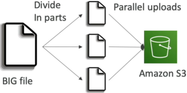
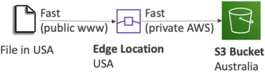
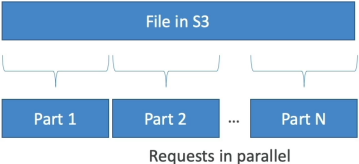

# S3 Performance

Amazon S3 scales horizontally to handle extreme request volumes with incredibly low latency ($100-200 \text{ ms to get the first byte}$). S3 performance is fundamentally anchored to **Prefix Partitioning**, enforcing a baseline cap of **3,500 write operations** and **5,500 read operations** per _second_, per _prefix_. To bypass these constraints and maximize network bandwidth, developers implement **Multi-part Uploads** for file ingress, **S3 Transfer Acceleration** for geographic latency optimization, and **Byte Range Fetches** for parallelized download delivery.

## Key Takeaways

### Demystifying the Key: Per-Second, Per-Prefix Scaling

A lot of devs mistake an S3 bucket for a traditional hard drive folder layout. In reality, **S3 is a flat key-value object store**. The forward slashes (`/`) in a file path aren't actual directories, they are just character strings inside the object's string name key.

AWS automatically shards and partitions your bucket data behind the scenes based on these strings, which are called **Prefixes**.

#### The Baseline Performance Quota Math:

Every single unique, isolated prefix partition inside your bucket can natively deliver:

- **3,500 Operations/Sec** for write mutations (`PUT`, `COPY`, `POST`, `DELETE`).
- **5,500 Operations/Sec** for read queries (`GET`, `HEAD`).

#### 🧩 Real-World Prefix Partition Mapping

Let's look at the exact directory simulation paths Stephane called out in the lecture:

- **Object A Key**: `bucket/folder1/sub1/file.jpg` → Prefix String Group: `/folder1/sub1/`
- **Object B Key**: `bucket/folder1/sub2/file.jpg` → Prefix String Group: `/folder1/sub2/`
- **Object C Key**: `bucket/folder2/file.jpg` → Prefix String Group: `/folder2/`

Because these represent three entirely distinct prefix keys, S3 provisions three parallel throughput partitions.

#### Sharded Read Throughput Formula:

```math
\text{Max Aggregated Read Capacity} = \text{Count of Unique Prefixes} \times 5,500 \text{ GET/Sec}
```

- _The Multiplier Effect_: Spreading your reads evenly across four separate sharded folder paths instantly scales your bucket capacity up to a total of $4 \times 5,500 = 22,000 \text{ GET requests per second!}$ There is completely zero limit to the number of prefixes you can map inside a bucket.

### High-Velocity Upload Optimization (Ingress)

When writing files up to the cloud, you have two primary scaling tools depending on file scale and geographic position:

#### 🧱 1. Multi-Part Uploads (Parallel Chunking)

- **The Mechanic**: Instead of streaming a massive file as a single HTTP payload, your code splits the binary mass into a matrix of smaller, individual byte chunks (parts). These parts are uploaded to S3 simultaneously over parallel network threads. Once every part lands safely, S3 automatically stitches them back together into the primary object.
- **The Rules**:
  - **Highly Recommended**: For any single object payload exceeding $100\text{ MB}$.
  - **Enforced Hard Constraint**: Absolute requirement for any single upload exceeding $5\text{ GB}$ (the maximum limit for a standard single naked `PUT` operation).
- **The Performance Value**: Maximizes your system's network bandwidth usage and builds deep failure resilience. If an internet glitch drops your connection at $99\%$ during a single $4\text{ GB}$ upload, you lose the entire file. With Multi-part, you only have to re-transmit the single, tiny failed $10\text{ MB}$ chunk!



#### 🚀 2. S3 Transfer Acceleration (Geographic Overhaul)

- **The Mechanic**: Perfect for global users dropping files into a distant home bucket (e.g., a dev in San Francisco uploading assets to a target region in Sydney, Australia).
- **The Routing Path**: Instead of routing the file payload across thousands of miles of unstable public internet routing hops, the traffic jumps straight onto the nearest localized AWS **Edge Location** (part of the global CloudFront network of 200+ global facilities). The Edge Location immediately ingests the file and pipes it across the private, fiber-optic **AWS Backbone Network** straight to the destination bucket.

```math
\text{Data Path} = \text{Client} \xrightarrow{\text{Short Public Hop}} \text{Edge Location} \xrightarrow{\text{Fast Private AWS Fiber}} \text{Target Bucket Region}
```

- **Compatibility**: Completely compatible with Multi-part uploads!



### High-Velocity Download Optimization (Egress)

When downloading data out of S3, senior developers deploy **S3 Byte Range Fetches** to parallelize the read operations.

- **The Mechanic**: Your application code passes an explicit HTTP `Range` header parameter inside the standard `GET` query request, targeting a tight, customized byte segment envelope (e.g., `Range: bytes=0-1024`).
- **The Performance Value**:
  - **Parallel Downloads**: You can spawn multiple worker threads to pull parts of a massive movie file or database layer simultaneously, accelerating the aggregate download speed.
  - **Partial Reads**: If you only need to parse metadata headers hidden inside the first $50\text{ bytes}$ of a massive data lake asset file, you can explicitly pull just those bytes—completely saving you from downloading the remaining multi-gigabyte file footprint!



## Exam Tips

**The Legacy Performance Hashing Trap**: Older AWS documentation recommended prepending random cryptographic MD5 hash values to the front of S3 file names to force random data distribution across internal drives.  
**On the modern exam**, random hash prepending is completely obsolete. S3's backend architecture has been upgraded to auto-shard prefix partitioning dynamically based on your naming paths. You can cleanly use standard date or category folders without any performance degradation!

**The KMS Throttling Wall**: Imagine an exam scenario states, _"You have configured an S3 bucket to store encrypted objects using Server-Side Encryption with AWS KMS (SSE-KMS). Your application architecture scales perfectly to hit 10,000 parallel `GET` requests across 2 separate prefixes. However, during spikes, your code throws a wave of KMS `ThrottlingException` errors while S3 CloudWatch performance metrics remain green. How do you resolve this?"_  
**The diagnostic answer rests on understanding the AWS KMS API rate limit**. > While S3 easily scales up to $2 \times 5,500 = 11,000 \text{ GET requests/sec}$, standard regional AWS KMS cryptographic actions are hard-capped at lower defaults (e.g., `10,000 requests/sec`). Every time S3 fetches an encrypted file, it has to fire a secondary background call to the KMS endpoint to decrypt the data. You are breaching your KMS limits, not S3 limits!  
**The direct architectural fix is to enable S3 Bucket Keys**. This instructs S3 to generate a temporary, reusable data key wrapper locally at the bucket level, cutting your background calls down to KMS by up to $99\%$ and instantly stopping the throttling loop.
