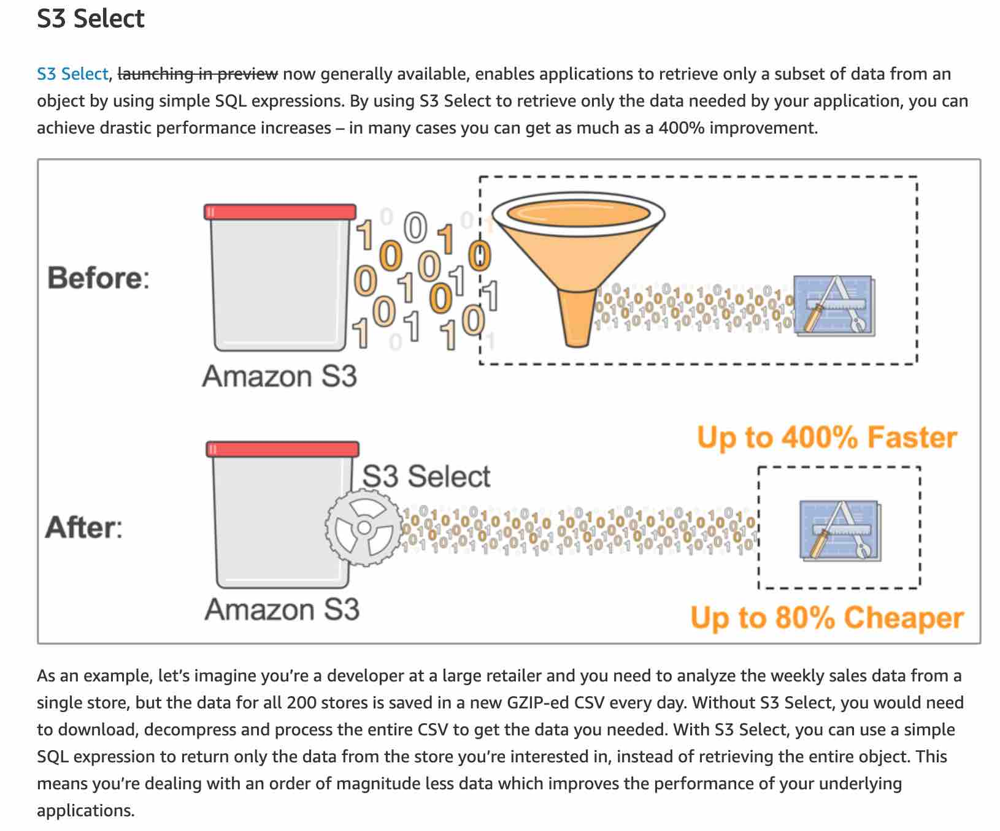

# S3 Select

**Amazon S3 Select** pushes query filtering directly down to the S3 storage layer, executing SQL expressions server-side to return only the requested subset of data. By transferring only relevant rows and columns over the network, it slashes latency, data transfer costs, and compute overhead for downstream applications.

---

## Key Takeaways

### Technical Specifications & Capabilities

| Feature                | Supported Options / Specifications                        |
| ---------------------- | --------------------------------------------------------- |
| **Input Data Formats** | CSV, JSON (Document/Lines), Apache Parquet                |
| **Output Formats**     | CSV, JSON                                                 |
| **Compression**        | GZIP, BZIP2 (CSV & JSON); Snappy, GZIP (Parquet columnar) |
| **Encoding**           | UTF-8 only                                                |
| **Encryption Support** | SSE-S3, SSE-KMS, and SSE-C                                |
| **Max Object Size**    | Up to **5 TB**                                            |
| **Query Scope**        | Single object per API request (`SelectObjectContent`)     |

---

### Key Architectural Benefits

- **Reduced Network Transfer:** Decreases payload sizes by orders of magnitude by filtering out unwanted data before it leaves S3.
- **Lower CPU & Memory Footprint:** Downstream application workers (e.g., AWS Lambda, EC2, ECS) spend less time decompressing and parsing massive files.
- **Performance Gains:** Achieves up to **400% performance improvements** and lower end-to-end processing time for large-scale log and analytical workloads.
- **Cost Savings:** Lower data egress/transfer costs and reduced compute execution time.

---

## Exam Tips

When preparing for the AWS Certified Developer Associate exam, remember:

- **Use S3 Select** when your application code needs to extract targeted records or columns from a **single specific object** (e.g., pulling a specific store's sales row out of a multi-gigabyte daily CSV/GZIP).
- **Use Amazon Athena or Redshift Spectrum** when you need to run complex SQL queries, JOINs, or aggregations across **multiple files, entire bucket prefixes, or whole data lakes**.

### Practice Test

**Question 1**: You would like to retrieve a subset of your dataset stored in S3 with the CSV format. You would like to retrieve a month of data and only 3 columns out of the 10.

You need to minimize compute and network costs for this, what should you use?

- [ ] S3 Inventory
- [ ] S3 Access Logs
- [ ] S3 Analytics
- [ ] S3 Select

Correct Answer

- [ ] S3 Inventory
  - **Explanation**: Amazon S3 inventory provides audit and reporting features on replication, encryption, and metadata status of your objects for compliance and management. It does not query object content.
- [ ] S3 Access Logs
  - **Explanation**: Server access logging records detailed requests made to an S3 bucket for auditing and tracking security/billing patterns. It cannot filter dataset contents.
- [ ] S3 Analytics
  - **Explanation**: Amazon S3 analytics analyzes storage access patterns to help determine when to transition data between storage classes (such as S3 Standard to S3 Standard-IA).
- [x] S3 Select
  - **Explanation**: S3 Select enables applications to retrieve only a subset of data from an object by using simple SQL expressions. By using S3 Select to retrieve only the data needed by your application, you can achieve drastic performance increases in many cases you can get as much as a 400% improvement.  
     

