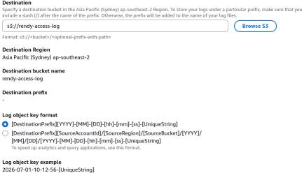

# S3 Access Logs - Hands On

This hands-on lab covers provisioning a dedicated central logging bucket, routing a source storage bucket's API telemetry into that target log bucket, auditing the console's automated bucket policy injection, and parsing raw space-delimited text access entries generated by live object file operations.

## Hands On

### Phase 1: Provision the Log Warehouse Target

- Open the **Amazon S3 Console** and click **Create bucket**.
- **Bucket name**: Type `rendy-access-log` (or append a unique alphanumeric string to clear global DNS constraints).
- **Region**: Select Sydney (`ap-southeast-2`) or any regional coordinate close to your location.
- ⚠️ _Operational Law_: Your logging bucket must reside in the exact same region as the source data buckets you intend to audit!
- Leave all secondary configuration fields at their default values and click **Create bucket**.

### Phase 2: Establish the Server Access Logging Link

- Keep your log warehouse tab open, open a secondary S3 console tab, and click into the active production data bucket you want to monitor.
- Switch over to the top-level **Properties** tab panel.
- Scroll down to locate the **Server access logging** card block, and click **Edit**.
- **Configuration Step-by-Step**:
  - Select the radial check option to **Enable**.
  - **Target bucket**: Click _Browse S3_ (or type the exact target path string) and choose your newly minted `rendy-access-log` bucket.
  - **Log object key format**: Leave this marked as the default option schema layout (retaining the standard timestamp structure).
- Click **Save changes**.



### Phase 3: Verify the Automated Security Handshake

- Toggle back into your target logging bucket container (`rendy-access-log`) and select the Permissions tab.
- Scroll down to the **Bucket policy** text window pane.
- **The Policy Audit**: Notice that the AWS console has automatically injected a production-vetted Service Principal Policy Statement. This gives the S3 log delivery subsystem permission to push files into your bucket:

```json
{
  "Version": "2012-10-17",
  "Statement": [
    {
      "Sid": "S3ServerAccessLoggingPolicy",
      "Effect": "Allow",
      "Principal": {
        "Service": "logging.s3.amazonaws.com"
      },
      "Action": "s3:PutObject",
      "Resource": "arn:aws:s3:::rendy-access-log/*"
    }
  ]
}
```

### Phase 4: Generate Traffic and Poll the Log Manifest

- Go back to your primary data bucket and execute several distinct object actions to saturate the cloud telemetry buffers:
  - Click on an existing object and hit **Open** (firing an `s3:GetObject` call).
  - Click **Upload** → **Add files**, and upload a file named `beach.jpg` (firing an `s3:PutObject` call).
- **The Asynchronous Delay Window**: Navigate over to your `rendy-access-log` bucket root directory. If you hit refresh immediately, the folder will look completely empty.
- _Don't panic_: S3 server access logging operates on an asynchronous delivery schedule. It can take anywhere from a few minutes to a couple of hours before the S3 logging system flushes its text record caches over to your destination drive array.

### Phase 5: Dissect the Raw Log Output

- Once the logging system completes its delivery run, refresh your console window. You will see a dense stack of system-generated log files matching the signature layout: `[Source-Bucket-Name][Timestamp]-[Unique-Hash]`.
- Select one of the log dump files, click **Open**, and view the raw space-delimited text line string blocks.
- While reading this dense text block line by line can be tricky to decipher manually, you can easily break down the crucial audit variables tracking your execution coordinates:

```math
\text{Audit Dimension Traces} \longrightarrow \begin{cases} \text{Identity Principal:} & \texttt{arn:aws:iam::123456789012:user/rendy} \\ \text{API Event Trigger:} & \texttt{REST.PUT.OBJECT} \\ \text{Object Key Target:} & \texttt{beach.jpg} \\ \text{HTTP Status Result:} & \texttt{200 OK} \end{cases}
```

## Exam Tips

**The Bucket Policy Destination Omission**: Imagine an exam scenario states, _"You use an automated AWS CloudFormation template script to create a primary storage bucket and enable Server Access Logging, targeting a secondary logging bucket. The stack provisions cleanly, but after 24 hours of heavy application read traffic, zero log files are delivered to the target log warehouse bucket. What is causing this failure?"_  
**The textbook diagnostic answer rests entirely on the destination bucket's resource policy configuration**. >
While the interactive AWS Management Console UI automatically handles appending the logging policy to your target bucket when you click "Save", **programmatic deployment frameworks (like CloudFormation, Terraform, or direct CLI commands like `aws s3api put-bucket-logging`) will NOT modify your target bucket's permissions for you**. >
S3 attempts to drop the log files, encounters an unconfigured destination layer, and drops the delivery metrics. To fix this, you must explicitly inject an IAM policy statement onto the destination bucket granting `"Service": "logging.s3.amazonaws.com"` full permission to execute `s3:PutObject` actions.
