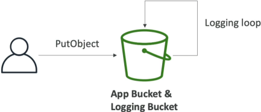

# S3 Access Logs

**Amazon S3 Server Access Logging** provides detailed, asynchronous tracking parameters of all incoming network requests fired against an S3 bucket space. Every operation—including authorized successes or `403 Access Denied` security blocks—compiles text-based rows delivered straight into an independent target logging bucket destination. Once stored, developers deploy **Amazon Athena** serverless SQL layers to parse, aggregate, and run analytical queries over the log dump files.

## Key Takeaways

### Logging Constraint

- **The Regional Law**: To minimize cross-region data transfer latency and avoid network egress billing overhead, **the Destination Target Logging Bucket must sit inside the exact same AWS Region** as the source bucket you are auditing.
- **The Access Format**: Logs are written as space-delimited text files using a standardized layout. S3 captures critical dimensions like:
  - Requester identity IDs and source IP coordinates (`remote_ip`).
  - Explicit HTTP method operations (e.g., `REST.GET.OBJECT`).
  - Handshake timestamps (`request_datetime`).
  - Return status metrics (`http_status`, like `200` or `403`) and total turnaround latencies.

### The Infinite Logging Loop

Do not set your logging bucket to be the monitored bucket. If you do, every single log file write will trigger a new log file write, the write operation of that log file will trigger another log write, and this triggers an infinite, recursive loop of log file writes that will quickly fill up your bucket and cause a major billing shock!



### Analysis: Parsing the Raw Rows with Amazon Athena

Because the data lands inside S3 as a dense stack of space-delimited text blocks, trying to read it manually via line commands is slow. The gold-standard solution pattern is to point **Amazon Athena** directly at the logging bucket path destination.

Athena is an interactive, serverless query service that allows you to run standard SQL statements straight over files sitting at rest inside S3. You simply write an external table schema mapping the log parameters:

#### The Standard Log Extraction Query Example:

If you need to quickly investigate a potential security breach, you can fire a standard SQL query in the Athena tab editor window to isolate every unauthorized attempt:

```sql
SELECT request_datetime, remote_ip, operation, key, http_status, error_code
FROM s3_access_logs
WHERE http_status IN (401, 403)
ORDER BY request_datetime DESC
LIMIT 100;
```

## Exam Tips

**The Event Tracking Triage**: An exam scenario states, _"Your security compliance officer wants to analyze all read and write interactions made against an S3 bucket by any external AWS account identity. However, they explicitly specify that the solution must minimize query overhead and record events on a best-effort, non-guaranteed delivery basis to save money. Which tool satisfies this?"_  
**The textbook answer is S3 Server Access Logs**. > Server Access Logs are built strictly as a best-effort, high-throughput delivery model where data typically lands within seconds but can occasionally take a little longer. It captures traffic from any anonymous or cross-account actor out of the box.  
**If the question shifts to demand an absolute, legally binding audit trail with an SLA guarantee tracking exactly who called the AWS APIs, you must pivot and choose AWS CloudTrail Data Events instead**. CloudTrail handles the enterprise tracking plane, while Server Access Logs provide high-volume, cost-efficient request monitoring!
