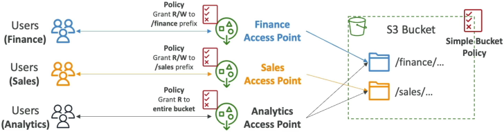
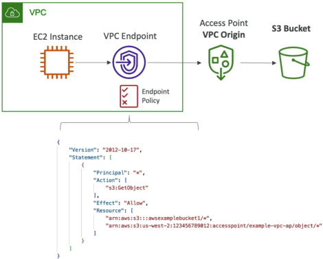

# S3 Access Points

**Amazon S3 Access Points** are named, dedicated network endpoints pinned to an S3 bucket that contain localized resource-based access policies tailored to specific application workloads or business groups. By shifting the complex access control logic from one global bucket policy down into separate, isolated **Access Point Policies**, developers can scale data storage access cleanly. Each access point exposes its own unique **DNS hostname** and can be explicitly configured to accept public internet routing or restrict incoming requests to a private Virtual Private Cloud (**VPC**) network.

## Key Takeaways

### Shifting the Security Plane: Modular Scaling

Instead of maintaining a massive monolithic bucket policy block, you break out the folder prefixes and map them onto dedicated data windows:

#### 🧩 Real-World Shared Bucket Breakdown

Imagine an enterprise S3 bucket `company-shared-data-lake` storing multiple cross-department assets. With Access Points, you map your architecture out into clean, independent streams:

- **The Finance Access Point**: Target: `/finance/*` data prefix folder.
  - _Policy_: Grants Read/Write permissions exclusively to the corporate `Finance-IAM-Group`.
- **The Sales Access Point**: Target: `/sales/*` data prefix folder.
  - _Policy_: Grants Read/Write permissions exclusively to the corporate `Sales-IAM-Group`.
- **The Analytics Access Point**: Target: Joins both `/finance/*` and `/sales/*` paths together.
  - _Policy_: Grants strict **Read-Only** access parameters across both prefix blocks to the `Data-Science-Role`.



#### 🔑 The Architectural Win

By handing the individual Access Point Amazon Resource Names (**ARNs**) down to the respective development teams, **the primary S3 bucket policy remains exceptionally lightweight and static**. It simply delegates authorization control down to the access point sub-resources. You can spawn hundreds of unique access points per bucket without ever worrying about breaking your core baseline storage rules!

### Network Isolation: Internet vs. VPC-Only Origins

When you provision an S3 Access Point, you must specify its **Network Access Type**. This sets the hard network perimeter boundary for that specific data window:

#### 🌐 1. Internet-Facing Access Points

Accepts authorized, cryptographically signed API calls originating from anywhere on the public web wire, provided the identity passes the access point policy rules.

#### 🏢 2. VPC-Only Access Points (Private Isolation)

This is an absolute lock-down configuration. You explicitly tie the Access Point to an internal **VPC ID**. S3 will completely drop any inbound network packet hitting that endpoint unless it originates from inside that exact private network boundary block!

### Deep Dive: The VPC Private Access Handshake

To route private data traffic from an internal **Amazon EC2 Instance** inside a private subnet out to an S3 VPC-Only Access Point without traversing the public internet, you must construct a three-tier security authorization pipeline.

#### The 3-Part Policy Enforcement Matrix

To clear the network routing paths cleanly, your security team must balance three structural resource policies:

1. **The S3 Bucket Policy**: Must permit operations coming through the access point layers.
2. **The Access Point Policy**: Must explicitly authorize your EC2 instance's IAM Execution Role to perform the target `s3:GetObject` or `s3:PutObject` action.
3. **The VPC Endpoint Policy**: Because traffic stays inside the private AWS framework, you must map a VPC Endpoint for S3 (using PrivateLink Interface Endpoints or Gateway Endpoints). The VPC Endpoint policy document must explicitly whitelist both the target Access Point ARN and the parent S3 Bucket ARN inside its resource array statement!



```math
\text{Clear Connection Connection} = \text{Bucket Policy Approved} \ + \ \text{Access Point Policy Approved} \ + \ \text{VPC Endpoint Policy Approved}
```

### The Unique DNS Address Pattern

Every access point you create automatically spins up its own distinct network coordinate address endpoint. When your code uses the SDK, you reference the access point directly via its unique DNS schema rather than using the parent bucket name:

```
[AccessPointName]-[AccountID].s3-accesspoint.[Region].amazonaws.com
```

## Exam Tips

| Architectural Hurdle                                                   | Anti-Pattern Choice                                      | Gold-Standard Solution Option | Primary Exam Trigger Keywords                                                           |
| ---------------------------------------------------------------------- | -------------------------------------------------------- | ----------------------------- | --------------------------------------------------------------------------------------- |
| **Bucket policy JSON hitting size limits due to high team scaling**    | Splitting data into dozens of separate physical buckets. | **Create S3 Access Points**   | "Shared dataset", "Complex bucket policy sizing limits", "Independent team permissions" |
| **Firewalling cloud data lake storage to a corporate private network** | Managing complex public `aws:SourceIp` whitelist arrays. | **VPC-Only S3 Access Points** | "Restrict storage access to a VPC", "Private connection from EC2 nodes"                 |

**The Cross-Account Access Point Delegation Trap**: Imagine an exam scenario states, _"Your company hosts a multi-terabyte data lake in Account A. You create an S3 Access Point on the bucket to give an analytics application running in Account B secure, isolated access to the /processed/ data folder prefix. The user in Account B attempts to read an object via the Access Point ARN, but receives an Access Denied error block. Both the Access Point Policy and the Account B IAM user policy are configured correctly. What is causing the failure?"_  
**The diagnostic answer rests on understanding Cross-Account Ownership Laws**. >
When an external account identity uploads an object into your bucket, that external account still retains legal owner rights over that specific object file by default (Object Ownership). S3 Access Points can only delegate permissions across files owned by the parent bucket host account!  
To resolve the cross-account Access Denied wall, you must navigate back to the parent bucket settings, enable S3 Object Ownership, and set it to Bucket Owner Enforced. This instantly strips away legacy Access Control Lists (ACLs), automatically forces all inbound cross-account uploads to transfer full ownership to your bucket account, and allows your Access Point policies to manage the entire data layout cleanly!
