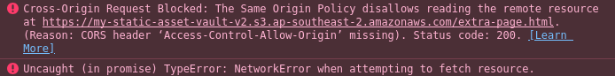
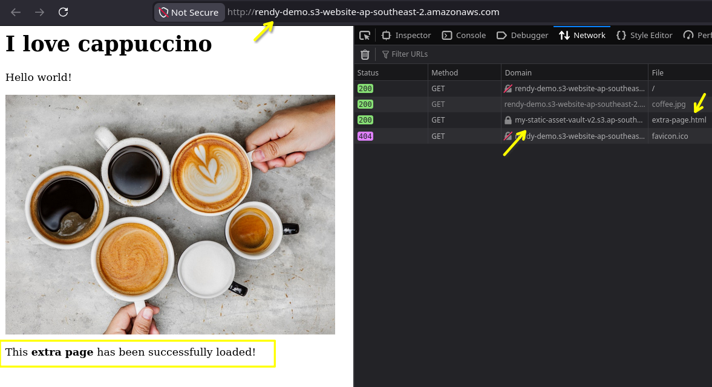

# S3 CORS Hands On

This hands-on lab layout walks through diagnosing and breaking down a browser-enforced Cross-Origin Resource Sharing (CORS) block. You will simulate a decoupled application architecture across two separate S3 buckets, observe how a completely public S3 Bucket Policy still fails to clear browser-level script restrictions, and deploy a custom **JSON CORS Configuration Rule** to explicitly open up the data pipeline.

## Hands On

### Phase 1: Simulate a Cross-Origin Script Block

- **Bucket 1: The Frontend Web Host**
  - Open your Amazon S3 Console and click Create bucket.
  - Name it something unique like `my-frontend-web-app-v2`.
  - Scroll down, select **Enable Static Website Hosting** under properties, and upload your baseline `index.html` file code layout.
  - 📋 _Copy its endpoint URL_: `http://my-frontend-web-app-v2.s3-website.ap-southeast-2.amazonaws.com`.
- **Bucket 2: The Secondary Asset Vault**
  - Create a separate bucket named `my-static-asset-vault-v2`.
  - Upload your font files, icon sets, or generic media assets (like `coffee.jpg` or `icons.json`) into this container.
  - Navigate to the **Permissions** tab and apply a standard public read S3 Bucket Policy so the files are open to the global internet wire:
  ```json
  {
    "Version": "2012-10-17",
    "Statement": [
      {
        "Sid": "PublicReadAccess",
        "Effect": "Allow",
        "Principal": "*",
        "Action": "s3:GetObject",
        "Resource": "arn:aws:s3:::my-static-asset-vault-v2/*"
      }
    ]
  }
  ```

### Phase 2: Auditing the Browser's Security Interception

- Open your browser, fire up the inspector tools (F12 or Right Click -> Inspect), and switch over to the **Console** tab layout window.
- Navigate to your Frontend Web Host URL endpoint.
- When your JavaScript library attempts an asynchronous script load or font fetch to grab data straight out of the Asset Vault bucket domain, the render will snap and freeze.
- **The Error Readout**: Your console screen will instantly throw a bright red execution exception error block matching this exact signature:



### Phase 3: Deploying the JSON CORS Patch

- To drop this browser fence, toggle back over to your AWS S3 Console management window.
- Click into your **Secondary Asset Vault** bucket (`my-static-asset-vault-v2`)—_do not edit the frontend bucket!_ S3 CORS configurations must always be applied straight to the resource that _holds_ the assets being requested.
- Jump into the top-level **Permissions** tab panel.
- Scroll all the way past the Bucket Policy editor block to locate the **Cross-origin resource sharing (CORS)** text editor workspace container, and click **Edit**.
- Paste the following optimized, least-privilege production JSON rule array block directly into the document container:

```
[
  {
    "AllowedHeaders": ["*"],
    "AllowedMethods": ["GET", "HEAD"],
    "AllowedOrigins": ["http://my-frontend-web-app-v2.s3-website.ap-southeast-2.amazonaws.com"],
    "ExposeHeaders": ["ETag"],
    "MaxAgeSeconds": 3000
  }
]
```

- Click **Save changes** to push the rule live across the AWS API gateway control plane.

### Phase 4: Verifying the Pre-flight Handshake Success

- Return to your active frontend web application tab and hard-refresh the page payload (`Ctrl + F12` or `Cmd + Shift + R`).
- Open your browser's inspector panel and switch to the **Network** tab tracking utilities.
- **The Network Trace Breakdown**:
  - You will witness a background HTTP `OPTIONS` pre-flight query packet fire over the wire to check validation parameters against S3.
  - S3 scans your attached JSON array document, matches your calling origin domain string parameters perfectly, and responds with a successful `HTTP 200 OK` carrying the mandatory authorization headers:

  ```math
  \text{S3 CORS Response Header} \longrightarrow \texttt{Access-Control-Allow-Origin: http://my-frontend-web-app-v2...}
  ```

  - The browser browser-cop immediately steps aside, clears the gate lock, executes the real data payload delivery stream, and cleanly renders your font icons onto the UI screen. The console error is officially wiped out!



## Exam Tips

**The Separation of Controls Law**: Always separate resource access permissions from browser scripting runtime rules inside your architectural thinking:

- **S3 Bucket Policies dictate** whether a cloud account or a network identity is legally permitted to read or mutate a storage key. They execute entirely inside the **AWS Cloud Framework Layer**.
- **S3 CORS Configuration Documents dictate** whether a local desktop client browser engine is legally permitted to read cross-domain responses. They execute entirely inside the **Client Browser Layer**.

If a test question mentions an application using JavaScript (`fetch`, `XMLHttpRequest`, `AJAX`, or `Axios`) failing to pull public files across different endpoint domains, **it is 100% of the time a CORS rule issue**. Changing bucket policies or modifying ACL rules won't help. The absolute only valid architectural answer choice is to attach a JSON CORS policy directly onto the target asset bucket!
