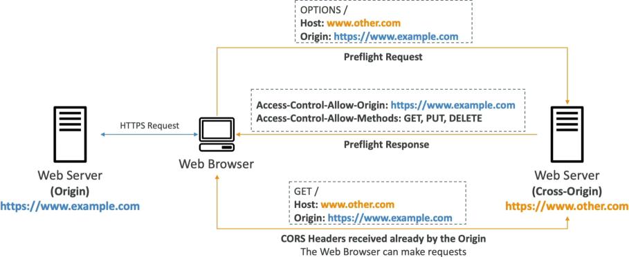
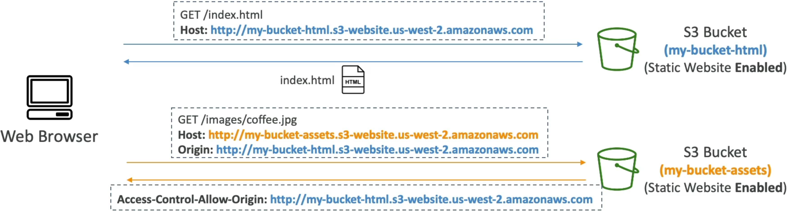

# S3 CORS

Cross-Origin Resource Sharing (CORS) is a native **browser-enforced security mechanism** that restricts web clients from executing cross-domain HTTP script requests (like `fetch` or `Axios` calls) unless the destination target server explicitly returns the appropriate `Access-Control-Allow-Origin` authorization headers. When assets are isolated inside separate Amazon S3 bucket containers, developers deploy a **JSON CORS Configuration** document directly to the asset bucket to whitelist the calling origin website's URL.

## Key Takeaways

Before looking at the cross-domain handshake, you have to memorize exactly how a web browser calculates a distinct **Origin**. An origin is an absolute, immutable cryptographic triplet made of three parameters: **Protocol (Scheme) + Host (Domain) + Port**.

- **Baseline Site**: `https://www.example.com` (Implicit HTTPS Port is 443)
- **Comparison A**: `http://www.example.com` $\longrightarrow$ ❌ Different Origin (Protocol switched from HTTPS to HTTP).
- **Comparison B**: `https://other.example.com` $\longrightarrow$ ❌ Different Origin (Subdomain host modified).
- **Comparison C**: `https://www.example.com:8080` $\longrightarrow$ ❌ Different Origin (Network port mutated).
- **Comparison D**: `https://www.example.com/images/coffee.jpg` $\longrightarrow$ ✅ Same Origin (Only the subfolder asset path changed; the root triplet matches perfectly).

### The Pre-flight Handshake: How the Browser Intercepts

When JavaScript scripts try to send an asynchronous request (like a `PUT` or a custom-header `GET`) across different origins, the web browser stops the payload from executing immediately. Instead, it fires a hidden exploratory scout packet ahead of time called a **Pre-flight Request**.



- **The `OPTIONS` Probe**: The browser issues a background HTTP `OPTIONS` method call to the destination cross-origin server. It passes headers stating: _"Hey, I'm coming from https://www.example.com. Do you allow me to run a PUT action against you?"_
- **The Server Verdict**: If the target server supports CORS, it checks its local rules and answers back with a dedicated header block: `Access-Control-Allow-Origin: https://www.example.com`.
- **The Data Release**: If the browser receives a matching header, it clears the gate, fires the real data transaction payload request, and passes the contents safely to your frontend code. If the header is missing, the browser drops a major red console error block and freezes your app!

### Configuring CORS on Amazon S3 Buckets

If you split your frontend static host architecture away from your media assets, your app will fail without an explicit S3 CORS setup. For example:

- **Frontend Web Bucket**: `http://my-app.s3-website.ap-southeast-2.amazonaws.com`
- **Static Assets Bucket**: `https://my-bucket-assets.s3.ap-southeast-2.amazonaws.com`



Because the domain endpoints don't match, scripts pulling images or web fonts from the assets bucket will get blocked by the browser. To bridge this, you navigate to the **Permissions tab** of the **Assets Bucket**, scroll to the **Cross-origin resource sharing (CORS)** text window, and paste a valid **JSON CORS Policy Document**:

```json
[
  {
    "AllowedHeaders": ["*"],
    "AllowedMethods": ["GET", "HEAD"],
    "AllowedOrigins": ["http://my-app.s3-website.ap-southeast-2.amazonaws.com"],
    "ExposeHeaders": ["ETag"],
    "MaxAgeSeconds": 3000
  }
]
```

#### 🛠️ Key Blueprint Parameters Decoded:

- **AllowedOrigins**: An array whitelisting the exact calling domain triplets allowed to pull assets. For public development sandboxes, you can pass a generic wildcard string (`"*"`) to allow any global domain access, though it's an anti-pattern for production hardening.
- **AllowedMethods**: Restricts which HTTP verbs the origin can use against your bucket keys (e.g., allow `GET` but block destructive `DELETE` actions).
- **AllowedHeaders**: Whitelists which custom HTTP metadata client headers can be safely sent during the pre-flight check.
- **MaxAgeSeconds**: Tells the browser how many seconds it is legally allowed to cache the successful pre-flight OPTIONS response, saving your app from hitting S3 with scout packets on every single mouse click.

## Exam Tips

**The Bucket Policy vs. CORS Trap**: Imagine an exam scenario states, _"You have hosted a frontend web application on an S3 static website bucket. The application relies on a JavaScript library to fetch font icons out of a secondary public S3 bucket. You have verified that the secondary bucket's S3 Bucket Policy is correctly set to allow Public Read Access (`s3:GetObject` to `\*`). However, when users visit your site, the font icons fail to render, and the web browser console throws an explicit access exception error. How do you resolve this?"_  
**The textbook developer fix rests on recognizing that Bucket Policies CANNOT fix browser-level CORS walls.**

- Even if an S3 bucket is completely 100% public to the entire internet, **a web browser will still refuse to allow its local JavaScript engine to ingest cross-origin assets if the target S3 bucket does not actively return the Access-Control-Allow-Origin HTTP headers!**
- To clear the error block, you must go into the asset bucket's properties and attach a valid JSON Cross-Origin Resource Sharing document whitelisting the web application's origin domain layout.
