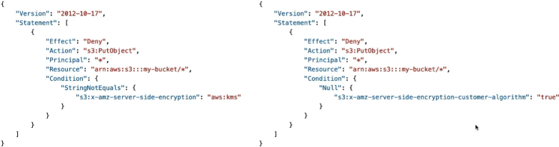

# S3 Default Encryption

While S3 automatically applies a fallback encryption state of **SSE-S3** to every single inbound object out of the box, developers utilize **S3 Bucket Policies** to preemptively intercept and strictly reject requests that do not specify an explicit, mandated cryptographic encryption header (such as `aws:kms` or `SSE-C` parameters). Because **Bucket Policies are evaluated before Default Encryption settings**, a policy-driven `Deny` statement overrides everything else, serving as a hard automated compliance gate.

## Key Takeaways

### The Core Security Law

Write this down inside your memory logs, because the DVA-C02 exam tests this exact logical execution sequence. When a client throws a `PutObject` HTTP request over the wire at your bucket, S3 evaluates the request context using a strict sequential hierarchy:

```
[ Inbound PutObject Request ]
                 │
                 ▼
 ┌──────────────────────────────┐
 │   1. Evaluate Bucket Policy  │  ◄─── Intercepts headers BEFORE default settings apply!
 └──────────────┬───────────────┘
                │
         (Is there a DENY?)
        ├──► YES ──► 🛑 [ 403 Access Denied ] (Request Dropped Immediately)
        └──► NO
                │
                ▼
 ┌──────────────────────────────┐
 │ 2. Check for Request Headers │
 └──────────────┬───────────────┘
                │
     (Are encryption headers present?)
        ├──► YES ──► 🔐 Encrypt using the request's specified cipher header.
        └──► NO
                │
                ▼
 ┌──────────────────────────────┐
 │ 3. Apply Default Encryption  │  ◄─── Server-side fallback safety net activates.
 └──────────────┬───────────────┘
                │
                ▼
   🔐 Encrypt using fallback bucket defaults (SSE-S3 or SSE-KMS).
```

Because **Bucket Policies sit at Step 1**, they can preemptively audit the incoming request headers _before_ S3 ever gets a chance to apply its internal default encryption fallback logic. If a client attempts an upload that breaches your policy rules, S3 cuts the wire instantly.

### Forcing Strict Compliance via Bucket Policies

If your corporate security mandate states that data-at-rest must be protected by SSE-KMS for tracking and key rotation audits, relying on default encryption alone is a risk. Why? Because an external developer could explicitly pass the `x-amz-server-side-encryption: AES256` header, which would override your bucket's default setting and force an unvetted SSE-S3 encryption layer instead!

To block this loophole, you write an explicit Deny Bucket Policy Statement:

```math
\text{Security Filter} = \text{If Request Action is } \texttt{s3:PutObject} \ \mathbf{AND} \ \texttt{s3:x-amz-server-side-encryption} \neq \texttt{"aws:kms"} \longrightarrow \text{Execute Explicit DENY}
```



## Exam Tips

**The Silent Client-Side Deny Trap**: Imagine an exam scenario states, _"You configure a secure S3 bucket with default encryption set to SSE-KMS. To guarantee maximum compliance, you attach a bucket policy that explicitly `DENIES` any `s3:PutObject` request if the `s3:x-amz-server-side-encryption` condition key is missing or not equal to `aws:kms`.
A developer on your team tries to run a standard upload script without any encryption flags: `aws s3 cp file.txt s3://my-bucket/`. They expect the bucket's default SSE-KMS setting to catch it safely, but the command throws an Access Denied error instead. Why?"_  
**The textbook developer answer rests entirely on the evaluation sequence**. > Since the developer fired a standard raw upload command without flags, the request carried **no encryption headers**.
When the request hit Step 1, your bucket policy evaluated the missing header against the Deny condition block. Because the request failed to explicitly pass `aws:kms` inside the HTTP payload headers, the policy triggered a hard Deny override immediately.  
S3 never even reached Step 3 to apply its internal default encryption fallback! To fix this script, the developer must explicitly append the encryption flag modifier straight to their terminal payload request command:

```math
\text{Corrected Command Line} = \text{\texttt{aws s3 cp file.txt s3://my-bucket/ --server-side-encryption aws:kms}}
```
