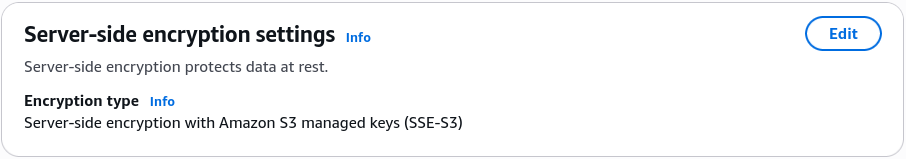
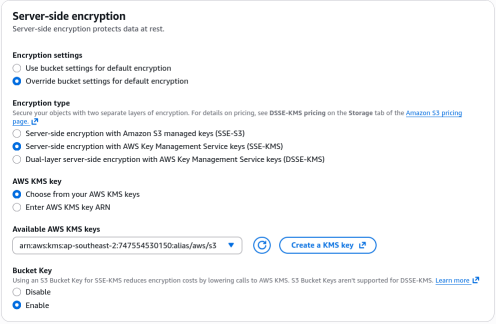
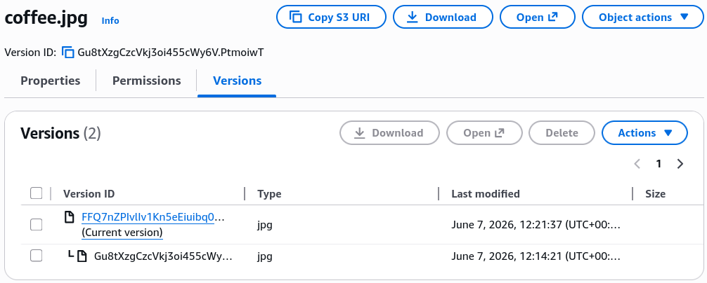

# S3 Encryption Hands On

This hands-on lab maps out how to implement, verify, and override server-side encryption states using the AWS S3 Console dashboard. You will learn how to initialize a bucket under default **SSE-S3** protection, trigger a dynamic encryption shift over to an identity-tracked **SSE-KMS** tier, examine how S3 versioning safely isolates cryptographic modifications, and verify the structural limits of console-driven encryption overrides.

## Hands On

### Phase 1: Initialize the Default Storage Layer

- Open your **Amazon S3 Console** dashboard and click **Create bucket**.
- **Bucket name**: Type `demo-encryption-rendy` (or append a unique numeric identifier string).
- **Region**: Select Sydney (`ap-southeast-2`) or any regional coordinate close to your location.
- Scroll to the **Bucket Versioning** container block and explicitly select **Enable**.
- **Default encryption matrix**: Verify that **Server-side encryption with Amazon S3 managed keys (SSE-S3)** is actively selected as your default out-of-the-box protection layout.
- Scroll to the absolute bottom of the creation pane and click **Create bucket**.

### Phase 2: Upload and Inspect the Baseline Cipher State

- Click into your newly generated bucket workspace and click **Upload → Add files**.
- Choose your standard testing asset file (e.g., `coffee.jpg`) and click **Upload**.
- Once the progress bar clears, click on the `coffee.jpg` name link to jump into its private resource properties dashboard page.
- Scroll down to the **Server-side encryption settings** property field block.
- **Verify the State**: Confirm that the metadata row displays an active security layer of **SSE-S3 (AES-256)**, proving S3 automatically wrapped the bits using its own managed master keys.



### Phase 3: Execute a Live Crypto State Override

- Inside the object's property page, scroll right back down to the _Server-side encryption_ settings block and click **Edit**.
- Check the radial button to override the bucket settings and switch your encryption type wrapper over to **SSE-KMS**.
- **Select the Key**: Under the _AWS KMS_ key configuration section, select **Choose from your AWS KMS keys**.
- From the dropdown list wrapper, select the system default managed key named `aws/s3`.
- _Financial Tip_: Using the default service-managed `aws/s3` key profile is completely free, whereas provisioning a customized Customer Managed Key (CMK) inside the KMS console will incur a base monthly fee.
- Click **Save changes** and close the completion window overlay.



### Phase 4: Audit the Cryptographic Version History Stack

- Return to your main bucket object catalog list workspace.
- Locate the **List View Controls** and flip the **Show versions** toggle switch to **On**.
- **Inspect the Array Matrix**: Notice that `coffee.jpg` now contains **two distinct, parallel historical version entries** inside the storage table index!
- **The Historical Lineage**:
  - Click the **Older Non-Current** Version row metadata properties $\longrightarrow$ Notice it still holds its original baseline **SSE-S3** encryption layer header.
  - Click the **New Current** Version row metadata properties $\longrightarrow$ Confirm it successfully holds your fresh **SSE-KMS** wrapper header bound to your default `aws/s3` cryptographic key!



### Phase 5: Inline Upload Overrides and Bucket Key Audits

- Click Upload → Add files, and drop a secondary asset like `beach.jpg` into the upload container.
- Before executing the file transfer, scroll down to the bottom of the active wizard page and expand the **Properties** panel link.
- Locate the internal _Server-side encryption_ workspace and note that you can manually select an alternate encryption key target before the item ever hits the storage drive array!
- Close the wizard and click over to your global bucket **Properties** tab.
- Locate your root **Default encryption** management card and click **Edit**.
- Switch the global option check box over to _SSE-KMS_ and note the appearance of the **Bucket Key** optimization switch:

```math
\text{Bucket Key Target} = \text{Enabled} \longrightarrow \text{KMS API Calls Reduced By Up To } 99\%
```

- Leave the rule configuration screen and close your tabs.

## Exam Tips

| Encryption Protocol Type | Console Management Available | S3 Bucket Key Support | Crucial Architecture Execution Rule                                                                                   |
| ------------------------ | ---------------------------- | --------------------- | --------------------------------------------------------------------------------------------------------------------- |
| **SSE-S3**               | Yes (Enabled by default)     | No (Not needed)       | Zero infrastructure configuration or key-rotation management required.                                                |
| **SSE-KMS**              | Yes                          | Yes                   | Generates auditable CloudTrail trails; requires S3 Bucket Keys to prevent scaling throttling limits.                  |
| **DSSE-KMS**             | Yes                          | No                    | Applies two separate layers of CNSA FIPS-compliant encryption at the server side layer.                               |
| **SSE-C**                | ❌ No                        | No                    | Completely hidden from the AWS Console. Can only be initiated programmatically via custom SDK headers or the AWS CLI. |

**The DSSE-KMS Compliance Blueprint**: Notice that the console exposes an advanced option named **DSSE-KMS (Dual-Layer Server-Side Encryption)**. If you hit an exam scenario where a high-compliance federal defense department client mandates that data-at-rest must be enveloped within two distinct, isolated layers of cryptographic 256-bit Advanced Encryption Standard (AES-GCM) implementations to meet rigorous FIPS frameworks, DSSE-KMS is the textbook managed answer. It eliminates the heavy engineering debt of writing custom client-side encryption blocks while fulfilling the multi-layer security mandate out-of-the-box!
