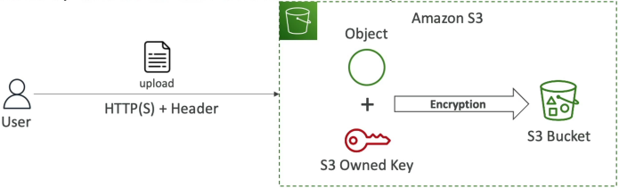
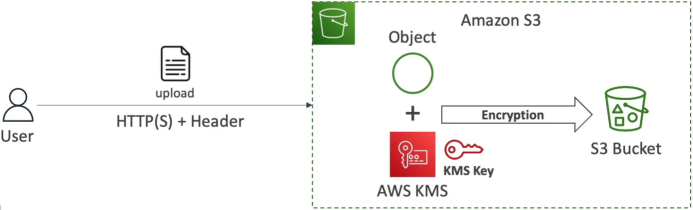
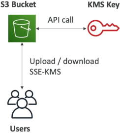
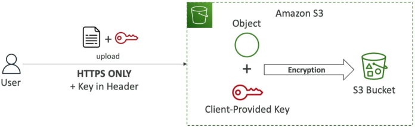
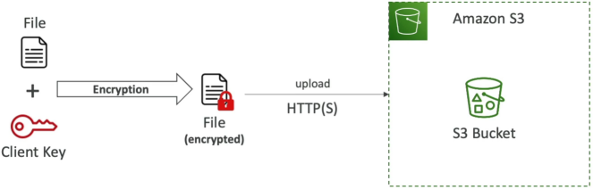
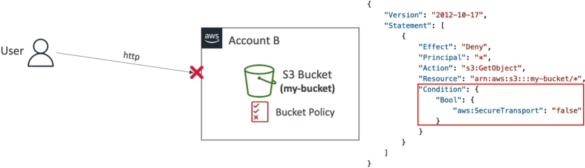

# S3 Encryption

Amazon S3 splits object encryption into two primary models: **Server-Side Encryption (SSE)**, where S3 intercepts raw data and handles the mathematical cipher loops right before writing it to disk; and **Client-Side Encryption**, where data is fully blinded before it ever leaves your local memory space. To protect data flying across the network wire, engineers deploy S3 Bucket Policies to hard-deny any unencrypted HTTP traffic using the `aws:SecureTransport` condition gate.

## Key Takeaways

### The 4 Server & Client-Side Encryption Flavors

#### ☁️ 1. SSE-S3 (Amazon S3-Managed Keys)

- **The Profile**: Automatic, zero-overhead baseline encryption. This is enabled by default for all new buckets and objects.
- **Key Ownership**: The encryption keys are handled, rotated, and completely owned by AWS. You never see or touch the raw key bits.
- **The Cipher**: Uses Advanced Encryption Standard 256-bit (AES-256) symmetric keys.
- **The Header Trigger**: If you are forcing this via an API payload or checking it in code, your HTTP request must pass this explicit header signature: **`x-amz-server-side-encryption: AES256`**.
  

#### 🔑 2. SSE-KMS (AWS Key Management Service Keys)

- **The Profile**: High-security enterprise tracking. You leverage AWS KMS to create and manage the cryptographic key wrapping.
- **The Superpower**: Gives you granular user control access over who can use the key, plus an absolute CloudTrail audit log trail. Every single time an object is encrypted or decrypted, CloudTrail logs exactly who fired the request.
- **The Header Trigger**: Your HTTP headers must flag the KMS engine: **`x-amz-server-side-encryption: aws:kms`**.
  

  :::warning
  **The Scaling Bottleneck (Exam Favorite)**: Because S3 must call the KMS APIs (`GenerateDataKey` on upload, `Decrypt` on download) for _every single file handle_, your S3 throughput hits your regional **KMS API Rate Limit Quotas** (ranging between 5,000 to 30,000 requests/sec depending on the region). High-velocity S3 data lakes using KMS keys will throttle out unless you enable **S3 Bucket Keys** to reuse local key wrappers!
  
  :::

#### 🏢 3. SSE-C (Customer-Provided Keys)

- **The Profile**: You want AWS to do the heavy mathematical lifting of encrypting the data server-side, but you refuse to store your encryption keys anywhere inside the AWS cloud control plane.
- **Key Ownership**: You manage and store the keys completely outside of AWS.
- **The Mechanic**: You pass the raw encryption key inside the custom HTTP header block of **every single API request**. S3 takes the key, encrypts the file in memory, drops the ciphertext to disk, and **instantly vaporizes your key from its volatile runtime memory**.
- _Hard Requirement_: Because you are transmitting raw key vectors up to the cloud, **HTTPS (SSL/TLS) is 100% mandatory**.
  

#### 💻 4. Client-Side Encryption

- **The Profile**: Absolute zero-trust confidentiality. You encrypt the data locally on your own client servers before uploading it across the network wire.
- **The Mechanic**: You run libraries like the _Amazon S3 Encryption Client_ inside your application code. S3 receives nothing but an unreadable, pre-blinded binary blob. S3 has no idea what the file is, and has zero capability to decrypt it because the keys never leave your backend environment.  
  

### Securing Data In Transit (In-Flight Enforcements)

By default, S3 buckets expose two API endpoints: an unencrypted `http://` channel and a secure, encrypted `https://` (SSL/TLS) connection channel.

To achieve standard industry compliance, you must block the unencrypted pipe entirely. You do this by writing a strict **S3 Bucket Policy** that leverages a specialized boolean condition block called `aws:SecureTransport`:

#### The Security Logic Pattern:

```math
\text{Traffic Policy Rule} = \text{If } \texttt{"aws:SecureTransport"} = \text{false} \longrightarrow \text{Execute Explicit DENY}
```

#### The Policy Template:

```json
{
  "Version": "2012-10-17",
  "Statement": [
    {
      "Sid": "EnforceHTTPSOnly",
      "Effect": "Deny",
      "Principal": "*",
      "Action": "s3:*",
      "Resource": [
        "arn:aws:s3:::your-bucket-name-here",
        "arn:aws:s3:::your-bucket-name-here/*"
      ],
      "Condition": {
        "Bool": {
          "aws:SecureTransport": "false"
        }
      }
    }
  ]
}
```

- _How it works_: The moment a rogue script tries to pull a file or list objects over a flat, unencrypted http:// line, aws:SecureTransport evaluates to false. The policy rule catches the match, triggers the override Deny, and cuts the connection instantly before any data leaks out.



## Exam Tips

**The Compliance Audit Blueprint**: An exam scenario states, _"Your company handles highly sensitive medical data and mandates that all files saved to S3 must be encrypted at rest. Furthermore, every single data decryption access event must be systematically audited for compliance tracking. If an unvetted user attempts to view a file, the system must log an unauthorized attempt. Which encryption model satisfies this requirement with minimal engineering overhead?"_  
**The absolute, definitive answer on test day is to choose SSE-KMS**. Because the question specifically demands auditing capability for decryption events, standard SSE-S3 falls short (it provides no user-level audit stream). SSE-KMS natively ties your file access straight into **AWS CloudTrail**, giving the compliance team a full, automated ledger tracking exactly who invoked the keys.
