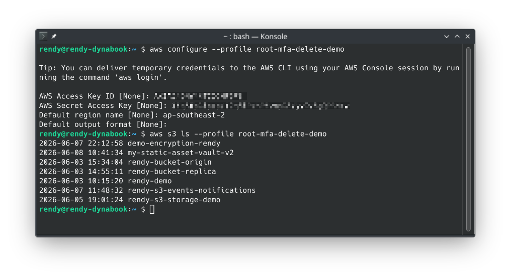
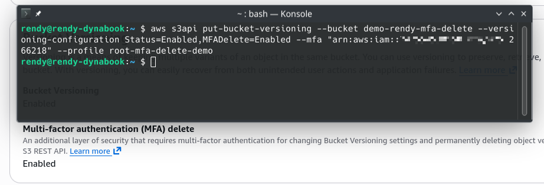
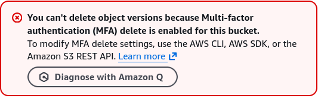
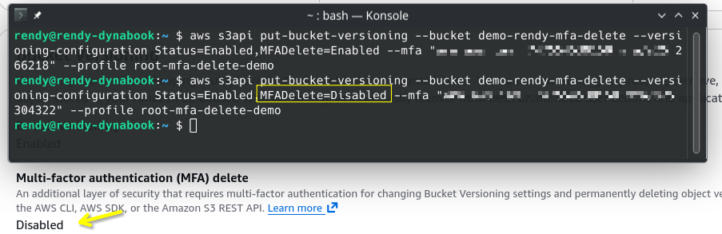

# S3 MFA Delete Hands On

This hands-on lab walks through the lifecycle of enabling, testing, and disabling **S3 MFA Delete** protection via the AWS CLI using the Account Root User. You will configure an isolated root-level profile context, authorize an `s3api` structural bucket state change using live MFA timed codes, verify that the active security gate successfully drops unauthenticated version purges, and safely roll back the layout before hard-deactivating your root security tokens.

## Hands On

### Phase 1: Establish the Identity Prerequisites

- **Create the Target Bucket**:
  - Open the **Amazon S3 Console** and click **Create bucket**.
  - **Bucket name**: `demo-rendy-mfa-delete` (or append a unique numeric identifier string).
  - **Region**: Select Sydney (`ap-southeast-2`) or any regional coordinate close to your location.
  - Scroll to the **Bucket Versioning** container block and explicitly select **Enable**. Click **Create bucket**.
- **Locate the Root MFA ARN**
  - Log into your console explicitly as the **AWS Account Root User**.
  - Click your profile name dropdown in the top right and select **Security Credentials**.
  - Under the Multi-factor authentication (MFA) block, locate your active device and copy its unique structural identifier string (the MFA Serial ARN):
  ```math
  \text{Root MFA Serial ARN} = \text{arn:aws:iam::123456789012:mfa/root-account-mfa-device}
  ```
- **Provision the Dangerous Root Access Token Keys**
  - Scroll down to the **Access keys** section panel and click **Create access key**.
  - Immediately download the key file (`.csv`) or copy the unique `Access Key ID` and `Secret Access Key` strings to a temporary secure workspace.
  - ⚠️ _Security Warning_: Never share or upload these root credentials anywhere!

### Phase 2: Build The Local Root Profile Environment

- Open your local machine terminal window and configure an isolated, named profile blueprint to handle the root credentials without breaking your standard daily developer setups:

```bash
aws configure --profile root-mfa-delete-demo
```

- **Map the Local Input Prompt Array**
  - **AWS Access Key ID**: Paste your raw temporary Root Access Key.
  - **AWS Secret Access Key**: Paste your raw temporary Root Secret Key.
  - **Default region name**: Type `ap-southeast-2` (or your chosen bucket region).
  - **Default output format**: Hit Enter to accept the standard default (json).
- **Execute a Baseline Security Validation Check**: Verify your local profile is successfully talking to the AWS cloud control plane by listing your account inventory:

```bash
aws s3 ls --profile root-mfa-delete-demo
```



### Phase 3: Programmatically Enable S3 MFA Delete

- To flip the bucket security property wrapper, invoke the low-level `s3api` configuration utility script tool.
- Paste the following command payload structure, replacing the placeholder arguments with your exact bucket name, your copied Root MFA ARN, and a live 6-digit passcode directly pulsing from your authenticator app (e.g., Authy/Google Authenticator):

```bash
aws s3api put-bucket-versioning --bucket demo-rendy-mfa-delete --versioning-configuration Status=Enabled,MFADelete=Enabled --mfa "arn-of-mfa-device mfa-code" --profile root-mfa-delete-demo
```

- _Syntax Note_: Ensure your `--mfa` parameter is wrapped in clean quotation marks, structured strictly as: `"<MFA_ARN>[Space]<6_DIGIT_CODE>"`.
- **Verify the State Change**: Jump back to your S3 Console tab, hard-refresh the page, and open your bucket's Properties tab. Under the Bucket Versioning card, verify it now proudly reads: `Multi-factor authentication (MFA) delete: Enabled`.



### Phase 4: Put the Security Gate to the Test

- Go to the _Objects_ tab panel inside your bucket and upload a sample file named `coffee.jpg`.
- **Test Case A (The Standard Soft Delete)**: Select `coffee.jpg` and click Delete. Type `delete` to confirm. S3 will process the request cleanly!
  - _Why did this work?_ Because a regular delete operation on a versioned bucket does not destroy data—it simply rolls a zero-byte **Delete Marker** onto the top of the stack. This is non-destructive, so MFA is not invoked.
- **Test Case B (The Destructive Permanent Purge)**: Click the **Show versions** toggle switch to reveal the background historical data layers. Select your original `coffee.jpg` file row (the one displaying a physical file size version ID, not the Delete Marker row) and click **Delete**.
- **The Interception Result**: S3 intercepts the deletion protocol and throws an explicit permission roadblock directly onto your screen:  
  .

### Phase 5: Execute the Teardown Rollback & Key Destruction

- To clear out the file or reset the architecture, you must issue an updated `s3api` script call to programmatically return the bucket property to a `Disabled` configuration state:

```bash
aws s3api put-bucket-versioning --bucket demo-rendy-mfa-delete --versioning-configuration Status=Enabled,MFADelete=Disabled --mfa "arn-of-mfa-device mfa-code" --profile root-mfa-delete-demo
```

- **Verify the Rollback**: Refresh your S3 Console Properties pane to ensure the attribute has flipped back to `Disabled`. You can now cleanly click and delete any historical file version or delete marker rows straight inside the UI table layout grid.



## Exam Tips

```math
\text{Enable Action Header} \longrightarrow \texttt{--versioning-configuration Status=Enabled,MFADelete=Enabled}
```

```math
\text{Disable Action Header} \longrightarrow \texttt{--versioning-configuration Status=Enabled,MFADelete=Disabled}
```

**The Status Argument Pitfall**: Imagine a test scenario states, _"You are attempting to disable MFA Delete on a secure asset bucket via the AWS CLI using your Root Account tokens. You fire the `aws s3api put-bucket-versioning` command passing `MFADelete=Disabled,Status=Disabled`. The CLI outputs a validation structural error and fails to execute. How do you resolve this?"_  
**The definitive diagnostic answer is that Status=Disabled is an invalid structural parameter.** > S3 Versioning has a strict one-way state machine progression law. Once versioning is switched on, it can never be disabled; it can only be suspended. >
Therefore, when rolling back or adjusting your security configurations, you must pass `Status=Enabled` (to keep versioning tracking active while turning off the MFA fence) or `Status=Suspended` (to pause version tracking entirely). Passing `Status=Disabled` will cause the API compiler to drop the network thread immediately!
