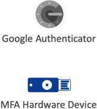

# S3 MFA Delete

**S3 MFA Delete** is a specialized security configuration that forces the execution environment to supply a valid Multi-Factor Authentication token passcode before completing destructive bucket mutations. It acts as an operational lock specifically preventing the **permanent erasure of object versions** or the **suspension of S3 Versioning** state machines. Crucially, this feature cannot be configured via the AWS Management Console and can only be enabled or disabled by utilizing the AWS Account Root User identity via the CLI or SDK APIs.

## Key Takeaways

### 🛑 Operations That MANDATE an Active MFA Token

1. **Permanently Deleting an Object Version**: When you pass an explicit `versionId` string to a `DeleteObject` API call to completely erase an underlying file layer from disk.
2. **Suspended Versioning on the Bucket**: When a script fires a `PutBucketVersioning` request to change the bucket’s versioning parameter status from Enabled to Suspended.

### 🔓 Operations That DO NOT Require MFA (Standard IAM Only)

1. **Enabling Versioning Initially**: Flipping a fresh bucket's state from unversioned to `Enabled`.
2. **Standard File Overwrites / Soft Deletions**: Ingesting a new file or firing a standard `DeleteObject` call without specifying a version ID. (This is safe because S3 just drops a non-destructive Delete Marker on the stack, which is easily reversible).
3. **Listing Deleted Versions**: Querying the bucket metadata history registry table to trace historical file vectors.

### The Root User & CLI Rule

#### Rule 1: S3 Versioning must be enabled

You cannot activate MFA Delete on a naked, standard bucket. Because the entire feature maps directly to version protection, S3 Versioning must be turned on first (or toggled on in parallel with the MFA activation script call)

#### Rule 2: The Console Layout Limit

You will find completely zero buttons, checkboxes, or panels inside the visual AWS Management Console to turn on MFA Delete. If you look at a bucket's properties in the web UI, it will simply display Multi-factor authentication (MFA) delete: Disabled. To toggle it, you must interact programmatically with the AWS CLI or the raw S3 REST API.

#### Rule 3: The Root User Ownership Only

Even if an IAM User profile is granted full `AdministratorAccess` or has a global `Allow * on *` policy statement, **they are completely blocked from modifying MFA Delete**.

## Exam Tips

**The S3 Object Lock vs. MFA Delete Trap**: Imagine an exam scenario states, _"A financial application stores transaction data inside an S3 bucket with Versioning enabled. The compliance team mandates a security control where once a file version is written, absolutely nobody—including the AWS Account Root User—should be able to delete it for a strict duration of 5 years. Which feature should you implement?"_  
**The textbook trap choice here is MFA Delete. The correct answer is S3 Object Lock in Compliance/Governance Mode**. >
While MFA Delete creates an extreme barrier by requiring the root account device token, the root user can still ultimately provide that token and permanently destroy the file version. >
If a business requirement demands an absolute, legally binding lock where literally zero identities (including root) can bypass the data retention timer, you must deploy S3 Object Lock with a defined retention period. Save MFA Delete for situations where you want to protect active, fluid developer workspaces from catastrophic structural accidents!
